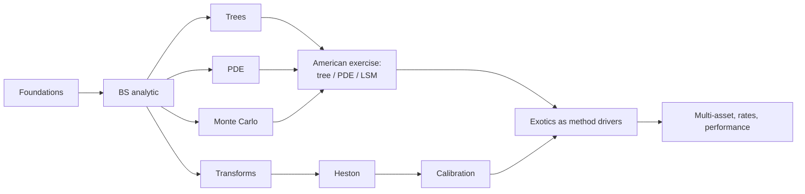

# Curriculum

`qpl` is built by Textbook-Driven Development (TDD): a textbook or literature
result is re-derived independently, turned into an executable pricing case,
cross-checked by an independent method, backed by convergence or statistical
evidence, and only then becomes a package capability. This page is the
truthful map of that process: the loop, the spine, the dependency order, the
evidence rules, the phase plan, and what each slice has actually delivered.

See also `docs/notes/` for short public derivation notes and
`docs/curriculum_provenance.md` for the per-chapter lab -> `src/` -> tests
mapping.

## The TDD loop

1. **Derive**: re-derive the result independently in a private lab notebook
   under `labs/` (gitignored, never published), citing source/page/equation
   for load-bearing formulas.
2. **Case**: turn it into an executable pricing case in `qpl.cases`, paraphrased
   in this repo's own words and data.
3. **Cross-check**: validate against an independent method (closed form,
   another engine, a published table, or an identity that must hold exactly).
4. **Evidence**: back the claim with convergence-order or statistical evidence
   using `qpl.validation`, tagged with an `EvidenceClass`.
5. **Capability**: only then does it become public `src/` surface with tests
   and, where a plot teaches better than an assertion, a notebook.

Labs are the private *drivers*; `src/`, `tests/`, `qpl.cases`, and
`docs/notes/` are the public *cargo*. No human gating on derivations (D6):
the loop above is the check, not a review queue.

## Identity decision

The project's tie-breaker (D1, 2026-09-13): `qpl` is a numerical-methods lab
with textbook provenance. Correctness and measured convergence beat
instrument breadth, API polish, and performance. Recruiting/portfolio
considerations do not reorder the curriculum (D2).

## Literature spine

| Role | Source |
|---|---|
| Heavy spine (cases) | Fusai & Roncoroni (2008), *Quantitative Finance*, Part II |
| Heavy spine (Monte Carlo) | Glasserman (2003), *Monte Carlo Methods in Financial Engineering* |
| Derivation authority | Shreve, *Stochastic Calculus for Finance II* |
| PDE rigor | Pooley, Forsyth & Vetzal papers; Tavella & Randall / Duffy |
| Instrument/concept map only | Hull, *Options, Futures, and Other Derivatives* |
| Volatility and transforms | Gatheral; Heston (1993); Lewis; Lord & Kahl; Carr & Madan |
| Rates (only if rates become serious) | Andersen & Piterbarg |
| Independent oracle (optional, `[oracle]` extra, never sole evidence) | QuantLib-Python (BSD-3) |

## Method dependency graph

Compact list form: foundations -> BS analytic -> {trees, PDE, MC} -> American
exercise (via tree / PDE / LSM) -> {transforms -> Heston -> calibration} ->
exotics as method drivers -> {multi-asset, rates, performance}.

## Evidence classes

Defined in `qpl.validation.EvidenceClass`:

- **exact identity** — a relation that holds exactly in the model (e.g. put-call
  parity); tolerance is floating-point round-off, not model error.
- **closed form** — compared against a closed-form formula evaluated in this
  repository.
- **published benchmark** — compared against a number published in a cited
  source.
- **independent engine** — compared against a different engine or library
  computing the same quantity by a different route.
- **convergence order** — the claim is about the measured rate at which error
  decays under refinement, not about a single price.
- **statistical** — the estimate carries sampling error; the tolerance is a
  stated multiple of the reported standard error.
- **negative finding** — a documented failure mode, pinned by a test so it
  cannot silently change or be mistaken for a bug elsewhere.

A fitted slope is never a theorem; Monte Carlo agreement within noise is
never exact; engine agreement is never evidence that shared assumptions are
realistic.

## Provenance rules

- Cite source/page/equation for load-bearing formulas.
- Derive independently; do not copy book code, prose, tables, or a book's
  example sequence.
- Paraphrase problem statements in this repository's own words.
- Published numbers may be used as fixtures, but only with a citation.

## Phase plan

Candidate slices, re-planned as cases expose problems. Each is phrased as "a
user can X by running Y, correct because Z" where that is already known;
unknowns stay unknown.

### Phase 1 — Discrete time (trees)
- ~~A user will be able to price a European call/put via a CRR binomial tree,
  correct because its measured convergence order to the Black-Scholes closed
  form is order 1, with the odd/even node-count oscillation documented rather
  than hidden.~~ **Delivered in Slice 1** (see below).
- ~~American exercise becomes an instrument property; CRR American call/put
  with dividends is checked by early-exercise premium >= 0 and American >=
  European.~~ **Delivered in Slice 2** (see below).
- ~~Tree Greeks are read from the lattice.~~ **Delivered in Slice 1** for
  European payoffs and **Slice 2** for American ones.
- ~~Leisen-Reimer smoothing is checked by measured order 2.~~ **Delivered in
  Slice 3** (see below): measured 1.9840 at the money and 1.9709-1.9842 off
  it, with no odd/even oscillation. The Slice 2 motivation held up -- and the
  slice also measured that Leisen-Reimer does *not* rescue the American order
  or the lattice Greeks, for reasons that are now written down.
- A Bermudan exercise schedule, if a case needs one. Slice 2 found that the
  Longstaff-Schwartz Table 1 benchmark is a 50-exercise-date Bermudan value,
  and reproduced it with a restriction applied in the test rather than by
  adding an instrument; if a second case wants it, that is when the instrument
  earns its place. Still open; no second case yet.
- **Trinomial trees: deferred, not scheduled.** Leisen-Reimer reaches order 2
  for European payoffs with no extra machinery, and a trinomial lattice would
  be a third parameterisation with no case demanding it. It comes back onto
  the plan only if a case forces it -- a barrier that needs a node on the
  barrier, most likely.

**Phase 1 is complete** apart from those two deferred items.
- ~~Forces ADR-0005: an engine registry keyed by `(instrument, model, method)`
  replacing the `isinstance` ladder in `qpl.pricing`.~~ **Delivered in
  Slice 1**; ADR-0005 accepted.

### Phase 2 — PDE rigor
- ~~Rannacher start-up, with Greeks read from the grid at measured order.~~
  **Delivered in Slice 4** (see below): `PDEConfig(time_stepping="rannacher")`
  and `greeks_method="grid"`, with delta, gamma and theta measured at order
  ~2 and the plain-Crank-Nicolson gamma divergence pinned as a negative
  finding and confirmed independently in QuantLib.
- A non-uniform grid concentrated at the strike, as the second standard
  remedy for the strike-kink pathology documented in
  `docs/notes/pde_strike_alignment.md`. Still open, and now motivated twice
  over. Slice 4: strike alignment improves the undamped gamma error by a factor
  of nine but leaves its fitted order negative, so the two remedies address
  different halves of the problem and a grid concentrated at the strike is not
  a substitute for damping either. Slice 5 adds a second reason -- the American
  price order is 1.85 and falling toward 1 because the free boundary is located
  only to the node spacing, and nodes concentrated where the boundary actually
  travels are the obvious way to buy that back. It would also let the PSOR
  sweep count be traded against accuracy rather than against `dt / ds**2`.
- ~~PSOR for American exercise, cross-checked against the Phase 1 trees.~~
  **Delivered in Slice 5** (see below): the LCP solved by red-black projected
  SOR inside each time step, measured order 1.85 against the lattice-bracketed
  limit, and three-way agreement with the CRR and Leisen-Reimer lattices and
  with QuantLib's American finite differences.
- ~~A digital (discontinuous-payoff) option, showing the pathology and the
  remedies rather than only the smooth-payoff case.~~ **Delivered in Slice 6**
  (see below). The prediction held: a jump is one derivative worse than a kink
  and the pathology does reach the *price* -- plain Crank-Nicolson on an
  unaligned grid is order 1.0012 in the price, against order 2 for a vanilla on
  the same grid. Four written expectations did not hold, and each is encoded
  rather than quietly dropped.

**Phase 2 has one item left, and it is now deferred rather than next**: the
non-uniform grid. Slice 6 added a third motivation for it -- the digital's
price error on an unaligned grid is `O(cash * ds)` near the strike, so nodes
concentrated there buy the constant back directly, and
`payoff_projection="cell_average"` is the cheap substitute that a non-uniform
grid would make unnecessary.

**Deferred until the barrier case forces it** (decision by the orchestrator,
2026-09-13). All three motivations so far are *accuracy constants* on problems
that already have a working remedy: strike alignment, the cell-average
projection and Rannacher between them cover every measured pathology, and a
non-uniform grid would improve numbers that are already at the measured order.
A barrier is different in kind -- the grid has to place a node on a boundary
that is not the strike, and where the payoff is not merely kinked but cut off
-- so it forces the mesh rather than merely rewarding it. Building the
mesh-refinement machinery against a case that needs it produces a better
design than building it against three cases that would only be a little more
accurate with it. Slice 7 (Monte Carlo variance reduction) went first for the
same reason: Phase 3 had a case waiting and Phase 2's last item did not.
- ~~`qpl.numerics.linear_systems` used where it earns its place, or a recorded
  reason why not.~~ **Answered, in two halves.** For the European theta scheme
  a direct tridiagonal solve is needed and Slice 4 measured LAPACK's banded
  solver at 7.4x-28.7x the in-repo Python loop with round-off-equal results, so
  an iterative solver would be strictly worse there. For the American LCP,
  Slice 5 could not call `sor_solve` -- it takes a dense `(n, n)` matrix, so one
  sweep is `O(n**2)` against a tridiagonal `O(n)`, and it has no hook at which
  to project an iterate onto a constraint set. What was reused is its shape (the
  relaxation update, the `0 < omega < 2` validation with the same message,
  reporting iterations and convergence) and, more usefully, its *role as the
  reference*: with the obstacle removed, the new red-black sweep reproduces
  `sor_solve` and the banded solve to 3.2e-13. That is the recorded reason why
  not, and the place it did earn.

### Phase 3 — Monte Carlo (Glasserman)
- Explicit stderr/CI discipline throughout.
- ~~Variance reduction — antithetic variates, a control variate, and
  stratification — each checked by a measured variance ratio.~~ **Delivered in
  Slice 7** (see below) for European vanillas and digitals under Black-Scholes:
  `MCConfig(variance_reduction=...)` over {`none`, `antithetic`,
  `control_variate`, `stratified`} and the combinations that compose, each with
  the standard error that belongs to it and each measured over 50 seeds at
  equal normal draws. The control variate used is the discounted terminal spot,
  a martingale with a known mean; the Kemna-Vorst geometric Asian control named
  in the original plan waits for the arithmetic Asian, which is a later slice
  and a different instrument. Stratified sampling is terminal-only;
  Brownian-bridge stratification for multi-step paths is refused with a message
  naming it.
- ~~Asian options (arithmetic and geometric averaging) with the Kemna-Vorst
  geometric control variate.~~ **Delivered in Slice 8** (see below):
  `AsianOption(kind, strike, expiry, fixing_times, averaging)` priced in closed
  form for the geometric average and by Monte Carlo for both, with the
  geometric-average payoff and its exact discrete closed form as the control.
  Measured control-variate variance factor **1433** (10 fixings) and **1196**
  (52), against `1/(1-rho^2)` predictions of 1277 and 1262 from an independent
  pilot at `rho = 0.9996` -- three orders of magnitude, against the 7.6 the
  discounted terminal spot buys on a vanilla in Slice 7. This is the control
  variate the Slice 7 entry said was waiting for the arithmetic Asian.
- Euler vs Milstein strong/weak order measured against exact GBM.
- Pathwise and likelihood-ratio Greeks checked against the analytic engine.
- Longstaff-Schwartz American put validated against Longstaff & Schwartz
  (2001) Table 1 and against the Phase 1/2 engines — the first three-way
  cross-method case. Note the Slice 2 finding before writing that test: the
  Table 1 options are exercisable 50 times per year, so an LSM estimator that
  uses 50 exercise dates should be compared to 4.478 and one that approximates
  continuous exercise should not.
- Barrier monitoring bias checked against the Reiner-Rubinstein closed form.
- QMC only if a case motivates it.

### Phase 4 — Transforms and volatility
- Fourier pricing of Black-Scholes as a sanity check.
- The Heston characteristic function in the branch-cut-safe (Lewis / Lord-Kahl)
  form.
- Lewis and Carr-Madan pricing validated against published reference values
  and, optionally, QuantLib.
- Heston Monte Carlo with the QE scheme and a bias study.
- Implied-vol surface utilities.
- Synthetic-recovery calibration with identifiability diagnostics.
- Fusai & Roncoroni Ch. 15 Laplace approach to arithmetic Asians, reusing
  `qpl.transforms`.

### Phase 5+ — only when forced by a case
- Multi-asset (correlated Brownian motion, baskets via existing copulas).
- Rates (Vasicek/CIR/Hull-White).
- Performance: profiling, vectorized kernels, and a benchmark harness with
  reproducibility metadata (instrument, model, engine, grid/paths, tolerance,
  hardware, seed, wall time, error vs reference) — only after reference paths
  exist to benchmark against.

## Delivered

### Slice 0
- Public branch without `labs/`; extras split into `dev`/`data`/`oracle`
  (`pyproject.toml`).
- `qpl.validation`: `fit_convergence_order` (least-squares slope of
  `log(err)` on `log(h)`), `refinement_errors`, and the `EvidenceClass` /
  `BenchmarkRow` taxonomy above.
- `PDEConfig(strike_alignment="midpoint")`, resolving the strike-on-a-node
  pathology. Measured on `S=K=100, r=5%, q=0, sigma=20%, T=1`, European call,
  Crank-Nicolson, `n_s = n_t = n` for `n` in `{50, 100, 200, 400, 800}`:
  - Aligned: fitted order **1.997**, log-space RMS residual **0.022**.
  - Unaligned: fitted order **1.126**, log-space RMS residual **0.860** (the
    high residual reflects a non-monotone error sequence, not just noise —
    refining `n=50 -> 100` makes the unaligned error five times worse because
    the strike lands exactly on a node at `n=100`).
  - Implicit-Euler temporal order, isolated on a fixed aligned spatial grid
    (`n_s=800`): fitted order **0.997**, residual **3e-04**.
  - Full tables and the derivation: `docs/notes/pde_strike_alignment.md`.
- `qpl.cases.european_black_scholes`: parity, degenerate-limit, closed-form
  reference-value, and comparative-statics cases, each carrying a
  `BenchmarkRow` with an explicit `EvidenceClass`; exercised by a cross-engine
  test (`tests/cases/test_european_black_scholes_cases.py`).

### Slice 1
- `qpl.engines.registry`: the `qpl.pricing` `isinstance` ladder replaced by a
  registry keyed by `(instrument type, model type, method)` plus a per-method
  `MethodSpec` holding the keyword contract (ADR-0005). Public signatures,
  error types and error messages unchanged; pinned by
  `tests/test_engine_registry.py`.
- `qpl.engines.tree`: CRR binomial lattice (`crr_parameters`,
  `crr_spot_level`, `build_recombining_spot_tree`) plus
  `TreeConfig(n_steps=200, scheme="crr")`, `price_european` and
  `greeks_european`, wired into the dispatcher as `method="tree"`. The
  American-put DP engine in `qpl.engines.dp` now consumes the same lattice
  builder; its prices are bit-identical across 45 configurations.
- **Measured** on `S = K = 100, r = 5%, q = 0, sigma = 20%, T = 1`, European
  call (and put, whose signed errors are identical because parity holds on the
  tree to round-off):
  - Odd `n` in `{25, 51, 101, 201, 401, 801}`: fitted order **1.0010**,
    log-space RMS residual **0.0005**; the tree is **above** Black-Scholes at
    every one of them, scaled constant `n·|err|` settling at **1.7529**.
  - Even `n` in `{26, 50, 100, 200, 400, 800}`: fitted order **0.9987**,
    residual **0.0007**; **below** Black-Scholes at every one, constant
    **1.9994**. The two subsequences therefore bracket the true value. At the
    money an even `n` puts a terminal node exactly on the strike; an odd `n`
    puts the strike exactly midway between two nodes.
  - Richardson extrapolation of consecutive odd pairs: fitted order **1.9590**
    (residual 0.0224) — close to 2 but not 2, because the pairs are
    `(n, 2n+1)` and the within-parity second-order coefficient is only
    asymptotically constant. Error at `n₁ = 401` falls from 4.372e-03 to
    5.710e-07.
  - Lattice Greeks: delta/gamma/theta at order **1.004 / 1.002 / 1.001** (odd)
    and **0.999 / 1.010 / 1.010** (even). Vega and rho are bump-and-revalue
    and carry the oscillation.
  - Away from the money the order-1 constant is **erratic**, not two-valued
    (fitted order 1.21-1.48 with log residuals 0.37-1.52 over even `n`);
    QuantLib's binomial engine behaves identically, so this is the scheme and
    not the implementation. Pinned as a negative finding.
  - Full tables and the derivation: `docs/notes/crr_tree_convergence.md`.
- Oracle: the expected 1e-10 agreement with QuantLib's
  `BinomialVanillaEngine<CoxRossRubinstein>` **does not exist**. QuantLib's
  `CoxRossRubinstein` uses the log-space probability
  `1/2 + (r−q−σ²/2)dt/(2σ√dt)` on the same lattice, which differs from the
  forward-matching `p = (e^{(r−q)dt}−d)/(u−d)` at `O(dt^{1.5})` per step and
  `O(1/n)` in price: `n·(qpl − QuantLib)` is constant to better than 1% over
  `n` in `{50, 200, 800}`. A twelve-line reimplementation of QuantLib's
  probability reproduces its engine to 8.3e-11, which identifies the mechanism
  rather than merely observing the gap. Where 1e-10 *is* available: our
  closed form matches `AnalyticEuropeanEngine` to 1.1e-14.
- `qpl.cases`: two `CONVERGENCE_ORDER` rows for the odd/even claims, plus
  `TREE_REFERENCE_N_STEPS = 2000` and `TREE_KNOWN_VALUE_TOLERANCE = 2.5e-3`
  (derived from the measured even-`n` constant: predicted error 1.00e-3,
  measured 9.998e-04). The cross-engine test now prices each known-value row
  four ways: analytic, PDE, Monte Carlo, tree.
- `examples/tree_convergence.py`: deterministic table plus the fitted orders;
  `--plot` for the log-log error picture.

### Slice 2
- **American exercise is an instrument property.** `qpl.instruments` gains
  `VanillaOption` (validation only) with `EuropeanOption` and `AmericanOption`
  as *siblings* under it -- deliberately not parent and child, because registry
  lookup walks the MRO and a subclass would resolve to the European closed form
  and return a plausible wrong number. The tree engine registers a second key,
  `(AmericanOption, BlackScholesModel, "tree")`, for price and Greeks; the
  analytic, MC and PDE engines stay European-only and refuse an
  `AmericanOption` through the ordinary registry lookup. No change to the
  ADR-0005 contract, so no new ADR.
- `qpl.engines.tree.price_american` / `greeks_american`: calls and puts,
  continuous dividend yield, `meta["exercise_boundary"]` per time level and
  `meta["early_exercise_node_count"]`, lattice delta/gamma/theta sharing one
  estimator with the European path and vega/rho by bump. The Slice 1
  keyword-based `engines.dp.price_american_put_binomial` is now a thin
  deprecated wrapper over it; five pinned Slice 1 values still hold with a
  **zero** tolerance.
- **Measured** on `S = K = 100, r = 5%, q = 0, sigma = 20%, T = 1`, American
  put, against this engine at `n = 8001`:
  - Odd `n` in `{25, ..., 801}`: fitted order **1.0141** (residual 0.0174),
    above the reference at every level. Even `n`: **0.9722** (0.0242), below at
    every level. The odd/even **bracketing survives early exercise**. Same
    picture for an American call with `q = 6%`: **1.0232** / **0.9674**.
  - The scaled constants do **not** settle the way the European tree's 1.7529 /
    1.9994 do; they drift (odd 1.391 -> 1.313, even 0.822 -> 0.924), partly
    because the reference carries its own 1.80e-04 error and partly because the
    exercise boundary is resolved only to the node spacing, an error with no
    parity structure.
  - **Richardson extrapolation does not restore order 2** for the American put:
    fitted order **0.2960** (residual 0.2712) on odd pairs and **0.6447**
    (0.3562) on even, with the extrapolated error flattening at ~1.5e-04
    instead of continuing to fall. It still cuts the error by a factor of 10 to
    220; both halves are asserted. Checked against a 64000/64001 reference so
    the floor is not merely the reference's own accuracy.
  - Lattice Greeks at order ~1: delta/gamma/theta **1.164/1.185/1.259** (odd)
    and **1.074/1.079/1.076** (even).
  - Full tables and the derivation: `docs/notes/american_exercise_on_trees.md`.
- **Contradicted expectation, and the most useful result of the slice.** The
  slice was specified to check that this engine's American put at the
  Longstaff & Schwartz (2001) Table 1 row-1 specification lands within 2e-03 of
  the published **4.478**. It does not: the measured value is **4.486710** at
  `n = 5000`, 8.71e-03 away, and QuantLib's finite-difference and binomial
  American engines land at ~4.4867 too. The reason is the instrument -- those
  options are exercisable **50 times per year**. Restricting exercise to 50
  dates on the same CRR lattice gives **4.477922** at `n = 5000` and 4.477826
  at `n = 40000`. Both numbers are right; they price different things. Carried
  as two rows, `PUBLISHED_BENCHMARK` (tolerance 5e-04, the published figure's
  own quoting precision) and `NEGATIVE_FINDING` (asserting the gap *exceeds*
  2e-03, pinned at 8.71e-03).
- Two further contradictions, both encoded rather than smoothed over:
  - At `sigma = 0` an American put is **not** always
    `max(intrinsic now, discounted forward intrinsic)`. That holds for
    `r >= q`; for `q > r` the objective has an interior maximum at
    `t* = log(rK/(qS0))/(r-q)`. Measured at `S0 = K = 100, r = 2%, q = 50%,
    T = 10`: 83.9506 against 81.1993 for an endpoints-only rule.
  - The extracted exercise boundary is **not** monotone level by level: it is
    monotone within each node-grid parity and zigzags between the two
    interleaved grids by at most one grid offset (measured worst drop 1.3845
    against an offset of 1.4043 at `n = 200`). At expiry it is the in-the-money
    node adjacent to `K` -- `K/u^2 = 97.2112` for the put, `K u^2 = 102.8688`
    for the call.
- Exact identities pinned with **zero** tolerance: an American call on a
  non-dividend-paying stock equals the European call bit for bit at every `n`
  (all five Greeks too), and at `r = 0` the American put equals the European
  put.
- Oracle: QuantLib's `FdBlackScholesVanillaEngine` on a fine grid agrees with
  the tree to **3.71e-04** (ATM put), 1.20e-04 (L&S row 1) and 3.10e-04 (call
  with `q = 6%`), inside a 1e-03 tolerance derived from both engines' measured
  refinements -- they approach from opposite sides, so the gap is the sum of
  their errors, not a cancellation. QuantLib's FD order, fitted on successive
  differences so no reference value is needed: **1.0856**. The Slice 1 negative
  finding survives early exercise: `n * (qpl - QuantLib CRR)` is constant to
  better than 0.5% over `n` in `{200, 800, 3200}` at -0.0264 (ATM put),
  -0.0133 (L&S row 1), +0.0071 (call with yield).
- `qpl.cases.american_black_scholes`: nine rows across the published benchmark
  and its negative twin, two exact identities, three premium bounds/orderings,
  and the in-repo reference value 6.0905564143067235 at `n = 8001` (whose
  `source` says in as many words that it is **not** a published table value).

### Slice 3
- `TreeConfig(scheme="leisen-reimer")` prices European and American vanillas,
  and their Greeks, through the same `method="tree"` dispatch. The lattice
  builder is the only place that knows the scheme; `qpl.engines.tree.lattice`
  gains `peizer_pratt_inversion`, `leisen_reimer_parameters` and the
  `lattice_parameters(scheme=...)` dispatcher, and `CRRLattice` becomes
  `BinomialLattice` with a `spot_centred` flag. CRR is **bit-for-bit
  unchanged** (168 prices and Greek tuples diffed against the previous commit).
- The construction, derived and cited rather than copied: `p = h(d2, n)`,
  `p' = h(d1, n)` from the **Peizer-Pratt method-2** inversion (the variant
  carrying the `0.1/(n+1)` term), then `u = e^{(r−q)dt} p'/p` and
  `d = (e^{(r−q)dt} − p u)/(1 − p)`. The second form is chosen so the one-step
  forward is repriced to round-off, which is what makes parity exact
  (residual <= 9.7e-12 at `n = 2001`). No-arbitrage is automatic: `d1 > d2`
  and `h` increasing give `p' > p`, which *is* `d < e^{(r−q)dt} < u`.
- **Even `n` is rejected**, with `InvalidInputError`, not rounded up. The
  binomial tail `P(Bin(n,p) > n/2)` counts a whole number of outcomes only for
  odd `n`. The decision is backed by measurement, not taste: QuantLib rounds
  up inside the tree but not inside the engine's time grid, and its even-`n`
  price is an **order-1** approximation -- ATM call error −1.330e-02 at
  `n = 800` against −5.518e-07 at `n = 801`, a factor of 24 000.
- **Measured**, European, `S = K = 100, r = 5%, q = 0, sigma = 20%, T = 1`,
  odd `n` in `{25, 51, 101, 201, 401, 801}`:
  - Fitted order **1.9840**, log-space RMS residual **0.0087**; `n²·|err|`
    settles at **0.354**. Error at `n = 801`: **5.52e-07** against CRR's
    2.188e-03, a factor of **3966** (507x at `n = 101`).
  - Off the money, at the two points where CRR's constant is erratic in both
    engines: **1.9842** (residual 0.0086) and **1.9709** (0.0154). Order 2
    survives where CRR's fit was 1.21-1.48 with residuals 0.37-1.52.
  - The orders sit consistently just *below* 2, and the residuals an order of
    magnitude above CRR's, because the Peizer-Pratt tail match is high but
    finite order. Recorded rather than rounded away.
  - **No oscillation, measured directly**: over `n = 101…121` the CRR error
    changes sign 20 times; the Leisen-Reimer error on the odd counts in the
    same range is one-signed and monotone.
  - Richardson with `n²` weights: fitted **2.9577**, error 1.465e-09 at the
    (401, 801) pair.
- **Measured**, American put, same point, against the bracketed limit
  6.090376463020103: order **1.0641** (residual 0.0176) against CRR's 0.9872.
  **Order 1, as expected** -- the dominant error is the early-exercise
  boundary, resolved only to the node spacing, which does not care how the
  terminal grid was chosen. What the scheme buys is a constant 3.79x-4.97x
  better and the *opposite sign*: Leisen-Reimer approaches from below at every
  `n`, CRR from above, so the two bracket the value at a shared `n`.
  Richardson re-measured and **still fails**: 1.3423 with residual 0.7187 and
  non-monotone extrapolated errors.
- **Three contradicted expectations, all encoded:**
  - The slice expected lattice **delta at about order 2** at the money.
    Measured **1.00** (0.996-1.000 across three points and both kinds), and so
    are gamma and theta. Delta, gamma and theta are read at time levels 1 and
    2 and used at time 0; that `O(dt)` substitution dominates the `O(1/n²)`
    price error and no lattice can fix it.
  - The fallback -- "at least the Greek *constants* improve" -- is false for
    two of the five. The Leisen-Reimer delta and gamma errors sit **between**
    CRR's odd and even errors, beating one parity and losing to the other.
    Theta improves 4x-14x, vega 3x-32x, rho 190x-5000x (vega and rho because
    they are bump-and-revalue and CRR's oscillation does not cancel between
    the two bumped prices).
  - The Leisen-Reimer **vega error is flat** at 3.06e-03 across
    `n` in {101 … 801}: it has stopped being discretisation error, and what is
    left is the `O(h²)` bias of `VEGA_BUMP = 1e-2`, previously invisible under
    CRR's oscillation.
- **One real bug, found because `u d != 1`.** The shared lattice Greek
  estimator read theta as `(V(2,1) − V(0,0))/(2 dt)`, which is a pure time
  difference only when `S(2,1) = S0`. On a Leisen-Reimer lattice the offset is
  4.6e-02 at `S=100, K=120, n=801`, and the uncorrected theta error is
  **5.235** with a fitted order of **−0.002** -- it does not converge, while
  returning a plausible number. Subtracting the second-order Taylor expansion
  in spot restores order **1.000**. Applied only when the lattice is not
  spot-centred, so CRR's theta is unchanged.
- Oracle: the expectation that QuantLib would agree "near round-off" **holds**
  this time -- worst European residual **2.71e-11** over `n` in {51, 201, 801}
  at two points and both kinds, and **7.3e-12** for the American put. Against
  `FdBlackScholesVanillaEngine(3200, 3200)` the gap is **1.52e-04**, less than
  half Slice 2's 3.71e-04 for CRR at the same `n`. Two QuantLib quirks pinned
  as negative findings: the even-`n` behaviour above, and isolated `n`
  (501, 1601, 8001) at which its American Leisen-Reimer leaves its own
  convergence curve by up to 9.5e-03 while this package's value stays on it.
- `qpl.cases`: three `CONVERGENCE_ORDER` rows for the European order-2 claim
  (ATM plus the two erratic-CRR points), three American rows (order, the
  bracketing, and the Richardson negative finding), the exported
  `AMERICAN_BRACKETED_LIMIT`, and `TREE_LR_REFERENCE_N_STEPS = 2001` with
  `TREE_LR_KNOWN_VALUE_TOLERANCE = 2.5e-7`. The cross-engine test now prices
  each known-value row **five** ways and asserts the order gap: at 2001 steps
  against CRR's 2000, the Leisen-Reimer error must be at least 1000x smaller
  (measured 11 000x).
- `examples/tree_convergence.py --scheme {crr,leisen-reimer}`; the default
  output is byte-for-byte unchanged, and the smoke harness now carries
  `(script, args, keys)` triples so one example can have several curated
  invocations.
- Full tables and the derivation: `docs/notes/leisen_reimer.md`.

### Slice 4
- `PDEConfig(time_stepping="rannacher")` replaces the first **two** nominal
  time steps by **four fully implicit steps of `dt/2`** and then continues with
  `theta`. Halving is exact in binary floating point, so the four half steps
  cover `2 dt` to the last bit and total time stays `n_t dt`; `n_t + 2` steps
  are taken and `n_t >= 2` is required. Default `"theta"` was bit-for-bit the
  previous engine when it landed (288 configurations diffed).
- `PDEConfig(greeks_method="grid")`, the new default, returns **all five**
  Greeks from `qpl.pricing.greeks(..., method="pde")`: delta and gamma from
  second-order central stencils on the finished grid, theta from the PDE
  identity `V_t = -(1/2 sigma^2 S^2 V_SS + (r-q) S V_S - r V)`, vega and rho by
  bump-and-revalue on the same grid. `meta` names the source of each. The old
  path is kept as `greeks_method="bump"`, NaN vega/theta/rho included.
- The spot is usually **not** a node -- with `strike_alignment="midpoint"` and
  `S = K` it sits exactly halfway between two, the worst case -- so the
  *Greeks* are interpolated between the two nearest nodes, not the price.
  Linear interpolation of a smooth function adds `O(ds^2)`, so second order
  survives; interpolating the price and differencing there would divide that
  error by `ds^2`.
- **Measured**, `S = K = 100, r = 5%, q = 0, sigma = 20%, T = 1`, aligned,
  `n_s = n_t = n` over `(50 ... 800)`: delta **2.001**, gamma **2.064**,
  theta **2.024** with plain Crank-Nicolson, and 2.001 / 2.067 / 2.024 with
  Rannacher (log-space residuals 0.018-0.036). Price order 1.9972 and 1.9973;
  Rannacher costs a flat **5.4%** on the price error constant (`n^2 |err|`
  19.61 -> 20.66 at `n = 800`) and nothing on the order.
- **Four contradicted expectations, all encoded:**
  1. The slice expected the gamma pathology to show at `n_s = n_t = n` and
     Rannacher to repair it there. **It does not appear on that path at all**:
     `dt` shrinks as fast as `ds`, `lambda dt` at the strike stays near one,
     and Crank-Nicolson damps the stiff modes fine. It needs `dt` large
     relative to `ds^2`. On `n_s = 80 n_t`, `T = 0.05`, unaligned, plain
     Crank-Nicolson fits gamma at order **-1.043** (residual 0.018) --
     refinement makes it *worse* -- with relative errors -25.9%, +55.7%,
     +113.4%, +227.7%; Rannacher fits **1.933**. Aligned: -0.915 against
     1.888, so alignment buys a factor of nine and not the order.
  2. **QuantLib's `FdBlackScholesVanillaEngine` does not use Rannacher damping
     by default.** The slice said it did. Its default is
     `FdmSchemeDesc.Douglas()` with `dampingSteps = 0`, bit-for-bit, and on the
     same stressed grids its gamma is wrong by factors of 180 to **1353** --
     two to three orders of magnitude worse than this package's undamped
     result, because its log-spot mesher packs more nodes near the strike and
     is therefore stiffer. `dampingSteps = 2` fixes it. Both undamped engines
     diverging is what proves the pathology is the scheme's and not ours.
  3. **Theta from the last two time levels is first order**, measured 1.054
     (residual 0.0020) with the spatial grid held fixed, 20x-200x worse than
     the identity at every level. The identity is what is reported; the
     difference is kept in `meta["theta_backward_difference"]`.
  4. "Replace the first time step by four steps of `dt/2`" does not add up:
     four half steps cover `2 dt`, i.e. the first *two* steps. That is the
     standard construction and what Giles and Carter call two half steps twice.
- **The old bump path stalls.** Delta error -8.248e-05, -8.509e-05, -8.574e-05
  at `n = 400, 800, 1600` against the grid path's -1.430e-04, -3.594e-05,
  -9.007e-06; fitted orders **0.418** (residual 0.563) against **2.001**
  (0.021). Two causes, not one: the fixed `O(h^2)` bias of the 1% bump, and the
  fact that `s_max = multiplier * spot` puts the three solves on three
  differently-aligned grids -- which is why its gamma sequence is not a power
  law at all (residual 0.73 against 0.04, three sign changes).
- **The price does not warn you.** At `n_s = 1600, n_t = 20, T = 0.05`
  unaligned, plain Crank-Nicolson's price is 0.12% out while its gamma is 113%
  out, a factor of ~900; theta, built from gamma through the identity, is 99%
  out.
- `qpl.cases`: ten `CLOSED_FORM` rows, five Greeks at the reference ATM call
  and put, on one fixed grid (Rannacher, aligned, `n_s = n_t = 400`), each
  tolerance derived from a measured error with a factor of 3.5-4.1 of headroom.
  Plus `test_pde_grid_greeks_beat_the_bump_path_on_delta`, which pins the
  *crossing*: at `n = 400` the bump path is ahead, by `n = 1600` it is 9.5x
  behind.
- Oracle: `tests/oracle/test_pde_vs_quantlib.py` (13 tests, 3.0 s). Agreement
  at `n = 800` over three points and both kinds within 6e-04 on price, 1.5e-04
  on delta and 4e-06 on gamma -- tolerances derived from both engines' measured
  errors, with each engine's own residual against the closed form asserted
  separately. Both fit order two on price and delta. Gamma is deliberately not
  fitted off the money: this package's error there is already 5.7e-09 with sign
  changes, and a slope through that measures nothing.
- `perf(pde)`: the Thomas solve moved from a Python loop to
  `scipy.linalg.solve_banded`. 7.4x to 28.7x on a price call, `pytest -q`
  109.1 s -> 60.6 s, worst price difference **7.2e-13** over 160
  configurations. Round-off, not zero: prices moved in the last bits.
- `examples/pde_greeks_demo.py` was a legacy printout; it now prints the two
  tables above with fitted orders, `--case smooth` and `--case startup`, both
  under a second and both in the curated smoke list.
- Full tables and the derivation: `docs/notes/pde_greeks_and_rannacher.md`.

### Slice 5
- **A user can price an American call or put by finite differences**:
  `qpl.pricing.price(AmericanOption(...), model, market, method="pde",
  cfg=PDEConfig(...))`, with grid Greeks and the exercise boundary. The engine
  is `qpl.engines.pde.american`, registered for `(AmericanOption,
  BlackScholesModel, "pde")` for price and Greeks; `method="pde"` no longer
  raises `NotSupportedError` for early exercise.
- The problem solved is the **linear complementarity problem** `V - g >= 0`,
  `V_t + L V <= 0`, `(V - g)(V_t + L V) = 0`, discretised with the same theta
  scheme and the same operator the European engine uses (extracted and shared,
  not copied -- European prices and Greeks are **bit-for-bit unchanged** over
  160 configurations x 6 quantities). Each step is solved by **projected SOR**:
  an SOR sweep with every updated component clipped against the payoff.
- The sweep is **red-black** (even indices, then odd), which on a tridiagonal
  matrix is exactly a Gauss-Seidel sweep in a permuted order and costs two
  vectorised numpy expressions instead of a Python loop over nodes. A
  tridiagonal matrix is consistently ordered under both orderings, so they
  share a spectral radius and a limit; the test checks against a lexicographic
  PSOR written out as a loop.
- `PSORConfig(omega=1.2, tol=1e-8, max_iter=10_000, on_max_iter="raise")`, on
  `PDEConfig.psor`. `omega = 1.2` is **measured**, not taken from a reference:
  it is the flattest column of the sweep-count table over `n_s = n_t = n` from
  100 to 1600 (11.33, 11.17, 10.65, 10.18, 12.75), where the per-grid optimum
  drifts from 1.00 to 1.30 and `omega = 1.0` degrades 3.5x. `tol` is absolute
  on the max update; at the default the price given up is 2.3e-08 to 1.5e-07
  against discretisation errors 2.1e-02 to 1.2e-04. An exhausted `max_iter`
  raises or is recorded in `meta`, never silently returned.
- **Measured price order 1.8502** (log-space residual 0.0265) over
  `n = 50 ... 800` and **1.8506** (0.0261) over the disjoint window
  `100 ... 1600`, against `AMERICAN_BRACKETED_LIMIT`. The band asserted is
  `1.85 +- 0.12`, justified by the two error terms present -- an `O(1/n^2)`
  scheme term and an `O(ds)` free-boundary term -- and backed by the measured
  local orders 1.739, 1.888, 1.895, 1.837, 1.766, 1.476, which are already
  falling toward 1. Every error is negative: the PDE approaches from below and
  the CRR lattice from above, so they bracket.
- **The LCP is checked, not assumed.** The engine measures, over the whole
  march, the constraint slack (**exactly 0.0** -- the projection assigns the
  obstacle value itself), the operator residual (down to -1.1e-07) and
  `min(slack, |residual|)` (at most 1.1e-07 at the default `tol`, and it falls
  by three orders of magnitude when `tol` falls by four).
- **Three-way agreement.** `qpl.cases` gains two INDEPENDENT_ENGINE rows: CRR,
  Leisen-Reimer and PDE/PSOR agree to 6.040e-04 at the ATM put (a *sum* of
  opposite-signed errors, tolerance 1.5e-03) and to 1.624e-04 at the
  Longstaff-Schwartz row-1 point (all three below the limit, tolerance 5e-04).
  New constant `LS2001_BRACKETED_LIMIT = 4.4866721476`.
- **Five contradicted expectations, all encoded:**
  1. The slice suggested `omega` around 1.2-1.5. The measured optimum is
     **1.00 at `n = 100`** and only reaches 1.30 by `n = 1600`; on a stiff grid
     (`n_s = 80 n_t`) it is 1.8 or beyond. There is no single optimal `omega`,
     because what sets it is `dt / ds**2`, not the grid size.
  2. The slice expected PSOR sweep counts to grow with refinement (Forsyth &
     Vetzal). On `n_s = n_t = n` they are **flat** from 100 to 1600 -- the
     stiffer matrix and the better starting iterate cancel -- and the fit is
     not a power law (residual 0.195). Isolating the stiffness on `n_s = 8 n_t`
     recovers a clean power law: exponent **0.787**, residual 0.0018.
  3. **The projection makes PSOR faster, not slower.** The no-dividend American
     call has an empty active set, so the iteration must converge the whole
     linear system: 12, 12, 16, 33, 59 sweeps over `n = 50 ... 800`, against
     11-12 flat for the put.
  4. The slice asked for the boundary to be monotone "in the sense established
     in Slice 2 (each parity/level subsequence)". On a grid there are **no
     parities**: the node set is the same at every time level, so the whole
     sequence is monotone with zero tolerance. The grid also has no NaN prefix
     -- the lattice's boundary is NaN for its first 47 of 2000 levels -- because
     it reaches `S = 0` at every level.
  5. **QuantLib's American FD engine is first order where this one is 1.85.**
     Fitted 1.0328 (residual 0.0220) against 1.8502 on a joint `tGrid = xGrid`
     refinement, so this engine at `n = 800` is within 12% of QuantLib's 1600
     error and at `n = 1600` is ahead of its 3200. `dampingSteps` is not the
     cause (1.5e-05 at grid 3200, and in the wrong direction); the candidates
     are the unaligned log-spot mesher and `FdmAmericanStepCondition`, which
     projects *between* steps rather than solving complementarity inside them.
     Slice 5 did not separate the two and says so.
- **Theta inside the exercise region** is reported as exactly 0, not from the
  PDE identity: there the PDE is a strict inequality and `V = g(S)` is constant
  in time, while the identity would return `rK - qS` (`+5.0` at `S = 40,
  K = 100`). Delta and gamma need no correction; the stencils return -1 and
  4.3e-15 of their own accord.
- **Degenerate limits are re-derived, not cross-checked.** The `sigma = 0`
  answer is imported from `qpl.engines.tree.american` because it is a fact
  about the model, so the test scans 200001 exercise dates instead of comparing
  the two engines -- including the Slice 2 `q > r` interior turning point
  (83.9505861332, 2.75 above the better endpoint).
- Oracle: `tests/oracle/test_pde_american_vs_quantlib.py` (11 tests, 5.5 s),
  `T = 1.0` with `Actual365Fixed`. Gaps 2.331e-04, 4.209e-05, 1.215e-04 against
  a budget of 8e-04 derived as the sum of both engines' measured errors.
- `examples/american_put_cross_method.py` (0.42 s, curated smoke): both
  engines' values, each one's signed error, the premium, the sweep count, the
  LCP residuals, and the boundary from both engines next to the node spacing
  that limits it.
- Suite: 679 tests, 72.6 s (from 597 / 62.2 s).
- Full tables and the derivation: `docs/notes/pde_american_psor.md`.

### Slice 6
- **A user can price a cash-or-nothing digital call or put** via
  `DigitalOption(kind, strike, expiry, cash=1.0)` with `method` in
  {`analytic`, `tree`, `pde`, `mc`}. `DigitalOption` is a new frozen dataclass
  *outside* the `VanillaOption` hierarchy -- registry lookup walks the MRO, and
  a step payoff must not resolve to the vanilla engines -- sharing validation
  through a module-level helper rather than an inheritance edge. Payoff helper:
  `qpl.instruments.payoffs.digital_payoff`, with **strict** inequalities on both
  sides, matching QuantLib's `CashOrNothingPayoff`.
- **Analytic**: `cash e^{-rT} N(+-d2)` derived from the risk-neutral probability
  in the engine docstring, citing Reiner & Rubinstein (1991), *Unscrambling the
  binary code*, Risk 4(9), with all five Greeks differentiated by hand. Evidence:
  call + put = `cash e^{-rT}` to 1e-15 (EXACT_IDENTITY, stronger than parity --
  no dependence on S, K or sigma); the digital equals `-dC/dK` of the vanilla by
  central difference, residual **1.375e-08** at `h = 1e-2` against a 5e-08 budget;
  the price equals the discounted lognormal probability from
  `scipy.integrate.quad` (INDEPENDENT_ENGINE); every Greek against central
  differences, worst relative residual 1.4e-06.
- **Trees: both halves of the written expectation were wrong.**
  Leisen-Reimer is **order 2** on a digital at all three points (1.9844, 1.9839,
  1.9836), one-signed and monotone, and the mechanism is exact rather than
  asymptotic: the strike always falls strictly between the two central terminal
  nodes, so the lattice price **is** `cash e^{-rT} P(Bin(n, p) > n/2)` (asserted
  to 1e-13 against `scipy.stats.binom.sf`), and Peizer-Pratt chose `p` to make
  that `N(d2)`. A digital is the contract that construction is *best* at.
  CRR is order 1 **only at the money on odd n** (1.0014, residual 0.0008), where
  `u d = 1` freezes the strike at the geometric mean of the two central nodes;
  off the money it is **order 1/2** (block-RMS fits 0.5020 and 0.5037 over every
  odd n from 25 to 801) with a sawtooth error -- 10 and 19 sign changes, errors
  spanning 5.11e-02 to 3.35e-06. Error ratio CRR/LR at n = 801: 4.55e+03 to
  6.34e+05.
- **PDE**: new `PDEConfig(payoff_projection="cell_average")`, read only by the
  digital engine (the arrangement `psor` has with the American one); default
  `"none"` and vanilla output bit-for-bit unchanged. `_solve_grid` gained
  `payoff`/`dirichlet` hooks so the digital marches the same grid, operator and
  banded solve. Measured at the reference ATM point, `n_s = n_t` in
  (100, 200, 400, 800):

  | configuration | price | delta | gamma |
  |---|---:|---:|---:|
  | plain CN, unaligned, no projection | 1.0012 | 0.8632 | 1.0153 |
  | CN, unaligned, `cell_average` | 2.0153 | 2.0059 | 1.9979 |
  | Rannacher, unaligned, `cell_average` | 2.0154 | 2.0061 | 1.9980 |
  | plain CN, midpoint-aligned | 1.9291 | 2.0353 | 2.0313 |
  | Rannacher, midpoint-aligned | 1.9248 | 2.0360 | 2.0315 |

- **MC**: price only, and the one method the discontinuity does not hurt --
  stderr order **0.49990** (residual 1.59e-04) over N in
  (5k, 20k, 80k, 320k), agreement within 4 stderr at 200k (|z| = 1.218), the
  reported stderr matching the closed-form Bernoulli one to 0.06%, and
  call + put exact *path by path*. `greeks` raises `NotSupportedError` naming
  the Phase 3 likelihood-ratio estimator.
- **Four contradicted expectations, all encoded:**
  1. Leisen-Reimer does **not** fail on a digital; it is the best method here,
     for a reason that is an exact identity rather than a rate.
  2. Midpoint alignment makes the cell-average projection a **no-op** (agreement
     1e-16 at n = 100, bit-for-bit at 200/400/800): alignment already puts the
     jump on a cell face, so the two are one remedy reached two ways and cannot
     be stacked. The projection is for grids that cannot be aligned.
  3. The two remedies that *do* stack are orthogonal ones. On `n_s = n_t`
     Rannacher is nearly cosmetic (2.4e-06 correction against a 3.8e-02 error).
     On `n_s = 80 n_t` plain Crank-Nicolson **diverges** whatever the jump
     representation (delta order -1.00, gamma -2.00, gamma error reaching 52.19
     against a true gamma of -3.283e-04), and only Rannacher **plus** a
     consistent jump representation reaches 2.004 / 2.058 / 2.059.
  4. On an unaligned, unprojected grid the call + put identity breaks by **3.8%**
     of the riskless value, because a node sits exactly on the strike and the
     strict convention pays nothing there in either leg. Cell averaging repairs
     it exactly. The surviving residual is the time scheme's own discounting
     error (-6.193e-10 for CN, +7.370e-08 for Rannacher's implicit half steps),
     not round-off.
- **Gamma, reported rather than claimed**: order 2.0315 at the money; at the
  sign-change spot (`d1 = 0`, true gamma -2.97e-19) the absolute error still
  falls at order 2.1226 but relative accuracy is undefined there. Both pinned.
- **Cases**: `qpl.cases.digital_black_scholes` -- `DigitalBSSpec`,
  `DigitalBSCase` and nineteen rows over three points, a third id space asserted
  disjoint from the European and American ones. Cross-engine budgets, all
  derived: Leisen-Reimer at n = 2001 within **2e-08** (worst 5.284e-09), PDE at
  n = 800 aligned + Rannacher within **8e-05** (worst 2.331e-05), MC at 200k
  within 4 stderr. The two order-2 deterministic engines are three decimal
  orders apart, and that gap is asserted, not glossed.
- **Oracle**: `tests/oracle/test_digital_vs_quantlib.py`, `T = 1.0` with
  `Actual365Fixed`. `ql.CashOrNothingPayoff` through `AnalyticEuropeanEngine`
  agrees to **2.220e-16** on the price and 3.5e-18 or better on all five
  Greeks. QuantLib's FD engine agrees at n = 800 to 3.514e-05 / 1.056e-06 /
  9.922e-08 on price/delta/gamma, but its error sequence is **not a power law**
  (residual 0.85 against this engine's 0.023, with sign changes and a
  meaningless fitted 4.85); it is *ahead* at the money at n = 800 (1.80e-07
  against 2.23e-07) and 755x behind at n = 100. The claim asserted is
  predictability under refinement, not accuracy.
- `examples/digital_option_cross_method.py` (0.52 s, curated smoke, also
  `--case pde`): all four engines, the PDE table with and without each remedy,
  and the CRR sawtooth at consecutive odd `n` off the money.
- Suite: 903 tests, 80.6 s (from 679 / 72.9 s); the six new digital files run in
  5.7 s.
- Full tables and the derivation:
  `docs/notes/digital_options_discontinuous_payoffs.md`.

### Slice 7
- **A user can select an estimator.** `MCConfig(variance_reduction=...)` takes
  `"none"` (default, and bit-for-bit the pre-slice engine), `"antithetic"`,
  `"control_variate"`, `"stratified"`, or a tuple combining a sampler with the
  control variate; `MCConfig(n_strata=64)` sets the strata. It works on
  European vanillas and on digitals through one shared entry point
  (`qpl.engines.mc.variance_reduction.price_with_variance_reduction`), the two
  differing only by the payoff callable. `PriceResult.meta` records the
  estimator, the **normal draws actually spent** (the cost axis every ratio is
  measured on), the strata and paths per stratum, and for the control variate
  the fitted beta, the sample correlation, the known mean and the predicted
  `1/(1-rho^2)`.
- **Each estimator ships with its own standard error**, recomputed from the
  realised sample in the tests and compared with `==`: the `ddof=1` one over
  antithetic *pairs* (the naive all-paths version is over 1.4x larger, so this
  is not a rounding matter), the `ddof=2` regression-residual one for the
  control variate, and the strata-weighted `sqrt(sum_i s_i^2/(K^2 m))`.
  Coverage of the reported 95% interval over 30 seeds x 5 120 draws is 519/540
  = 0.961 with a worst cell of 26/30, against a binomial floor of 24
  (`P(X <= 23) = 5.7e-04`). `|z|` against the closed form at 200 000 draws runs
  0.05 to 1.58 over all eighteen cells.
- **Measured variance factors**, 50 seeds, 20 480 normal draws, `K = 64`
  (predictions in brackets, computed from correlations measured on an
  independent 400 000-draw pilot):

  | point | antithetic | control | stratified | anti+ctrl | strat+ctrl |
  |---|---:|---:|---:|---:|---:|
  | ATM call | 4.59 (4.01) | 7.58 (6.89) | 110.40 | 90.80 | 577.80 |
  | OTM call K=120 | 3.04 (2.33) | 2.71 (2.30) | 42.41 | 92.35 | 84.61 |
  | ATM digital | 9.32 (9.38) | 2.11 (2.45) | 101.26 | 9.73 | 82.32 |

- **The same-sample control coefficient is measured, not excused.**
  `|b_same - b_pilot|` falls 0.017186 -> 0.001061 from N = 1 000 to 256 000,
  fitted order **0.4952**; the price difference it causes falls -4.830e-03 ->
  -5.848e-05 from N = 2 000 to 128 000, fitted order **1.06** -- the `O(1/N)`
  bias against an `O(N^-1/2)` standard error, consistently negative, about 1%
  of one standard error at N = 128 000.
- **Refusals with reasons.** `stratified` with `n_steps > 1` raises
  `NotSupportedError` naming Brownian-bridge stratification as the construction
  that does it; `antithetic` with `stratified` raises `InvalidInputError`,
  because reflecting a stratified draw lands it in the mirror stratum and the
  two units partition the sample differently.
- **Five contradicted expectations, all encoded:**
  1. **Antithetic is worth most on the digital** (9.32), not least. The
     mechanism is complementarity under reflection, not convexity: with the
     in-the-money boundary at `z* = -0.15`, the reflected pair sums to exactly 1
     unless `|Z| < 0.15`, so the pair average is constant on 88% of the sample
     and `rho_a = -0.7868`.
  2. **Stratification gains `O(K)`, not `O(K^2)`**, on a vanilla: fitted
     exponents **1.0157** (ATM, residual 0.065) and **1.0384** (OTM, 0.058) over
     K in 8...256. The outermost equal-probability stratum is unbounded, the
     payoff is unbounded on it, and its conditional variance sets the floor --
     the smooth-integrand argument does not apply.
  3. **For a digital the gain is `K p(1-p)/(f(1-f))` with `f = frac(K Phi(z*))`
     and is NOT monotone in `K`**: 16 strata -> 20 measures 108.82 -> 48.50
     (predicted 89.64 -> 31.73), and 320 -> 512 measures 1014.18 -> 491.01
     (predicted 1100.97 -> 505.91). More strata can buy less, and which `K` is
     good is a property of the contract.
  4. **The combinations do not compose multiplicatively, in either direction.**
     Antithetic+control on the OTM call is 92.35 against a product of 8.24
     (the control correlates +0.9643 with the pair average against +0.7522 with
     the raw payoff); stratified+control on the digital is 82.32, *worse* than
     stratification alone.
  5. **Variance reduction helps the CRN bump Greek more than the price, except
     where the fitted coefficient gets in the way.** sd of delta over 20 seeds
     at 20 480 draws, `h = 1e-2`: none 0.004481, antithetic 0.001175, control
     0.001639, stratified 0.000254 (a variance factor of **311** against the
     price's 110), antithetic+control 0.001060, stratified+control 0.000367 --
     *worse* than stratified alone, because `b` is refitted on every bumped
     sample and `b_up - b_dn` is noise common random numbers cannot cancel.
- **Cases**: `qpl.cases.mc_variance_reduction` -- a fourth id space, asserted
  disjoint from the other three, and the first keyed by an **estimator** rather
  than an instrument. Fifteen `STATISTICAL` rows whose `expected` and
  `tolerance` are in **log space** (`log(factor)`, `log(1.7)`), because an
  absolute tolerance on a quantity spanning 2.11 to 577.8 is either vacuous or
  impossible. `expected` is the theoretical factor where one exists and the
  measurement where none does, and `source` says which. The band 1.7 is derived
  from the [0.47, 2.11] 99% range of a ratio of two 49-df variance estimates.
- **The European cross-engine Monte Carlo leg is now stratified**: 12 800 paths
  instead of 200 000 plain ones, a standard error of 1.107e-02 against
  3.283e-02 -- three times tighter for one sixteenth of the work -- at the same
  four-standard-error tolerance.
- `examples/mc_variance_reduction.py` (0.27 s, curated smoke, also
  `--case digital` at 0.32 s): six estimators, paths and normals side by side,
  the stderr-based and seed-based readings of each factor, and the stratum scan
  whose `strata_gain_monotone_in_K=False` is the digital finding in one line.
- Suite: 1004 tests, 87.0 s (from 903 / 80.6 s); the two new test files run in
  3.3 s.
- Full tables and the derivation: `docs/notes/mc_variance_reduction.md`.

### Slice 8
- **A user can price a fixed-strike Asian.**
  `AsianOption(kind, strike, expiry, fixing_times=(...), averaging="arithmetic"
  | "geometric")` -- a new instrument type outside the vanilla and digital
  hierarchies, because its payoff reads the *path* rather than the terminal
  spot. `method="analytic"` prices the geometric average exactly and raises
  `NotSupportedError` on the arithmetic one, naming the approximations and
  Monte Carlo; `method="mc"` prices both, with
  `MCConfig(variance_reduction="control_variate")` using the geometric-average
  discounted payoff and its exact closed form as the control (Kemna & Vorst
  1990). `qpl.engines.analytic.asian.turnbull_wakeman_price` is reachable only
  by name, so the dispatcher never returns an approximation as if it were
  exact.
- **The discrete geometric closed form is derived, not looked up.** `log G` is
  exactly normal with `m = log S + (mu - sigma^2/2) tbar` and the collapsed
  covariance sum `v = (sigma^2/n^2) sum_i (2(n-i)+1) t_i`, so the price is
  Black (1976) in `F = E[G]`. `T` enters only through the discount, so an
  average that ends before settlement is handled by construction. Checked
  against the `O(n^2)` double sum on irregular schedules, and against
  Black-Scholes to 1e-13 in the `n = 1` limit.
- **Fixing convention**: `t_i = i T / n`, last fixing at expiry, built by
  `qpl.instruments.uniform_fixing_times` (`linspace`, so `t_n == T` exactly --
  `(i+1) * T / n` lands one ulp above at `T = 90/365, n = 2560` and the
  instrument then correctly refuses it). All three published benchmarks are
  reproduced under this convention, which is how it was chosen.
- **Three published values reproduced**: Clewlow-Strickland discrete geometric
  call 5.3425606635 to **5.8e-11**; Haug continuous geometric **put** 4.6922 to
  **3.7e-05** at 20 000 fixings; Turnbull-Wakeman 19.5152 to **9.8e-06**.
- **The discrete-to-continuous rate is order 1, derived before it was
  measured**: `tbar = (T/2)(1 + 1/n)` and
  `v = (sigma^2 T/3)(1 + 3/(2n) + 1/(2n^2))` each carry an `O(1/n)` term with
  no cancellation. Measured **1.0002** (residual 0.00017) and **1.0096**
  (0.00917) over `n` in 20...2560, and **1.0002** (0.00024) against QuantLib's
  continuous engine -- so the rate belongs to the convention, not to either
  implementation.
- **Measured variance factors**, 50 seeds at 41 600 normal draws
  (`4160 x 10 == 800 x 52`, equal cost), predictions from an independent
  40 000-path pilot:

  | fixings | antithetic | control variate | antithetic+control |
  |---|---:|---:|---:|
  | 10 | 5.54 (4.17) | **1433.0** (1276.7) | 2113.8 (2387.7) |
  | 52 | 6.31 (4.14) | **1196.2** (1262.2) | 2584.0 (2360.8) |

  `rho = 0.999608` and `0.999604` -- a difference of 4e-06, inside the pilot's
  own noise, so the control does not need retuning when the monitoring
  frequency changes. At 52 fixings the control-variate column runs **800
  paths** and still resolves the price to four decimals.
- **No time-discretisation bias.** `simulate_gbm_exact` gained an optional
  `times=` grid (the uniform `(t, n_steps)` branch untouched and pinned
  bit-for-bit, since `t_{i+1} - t_i` is not bit-for-bit `t/n_steps`), so every
  fixing is an exact draw with the correct joint law and the only error is
  statistical. There is no refinement study to run, which is why this slice has
  none.
- **Identities.** Asian put-call parity `C - P = e^{-rT}(E[A] - K)` holds **per
  sample** to 1e-11 (the same paths drive both legs), and the AM-GM ordering
  `price_arith > price_geom` for calls holds for **every seed** rather than
  within noise -- with the sign reversed for puts.
- **The Turnbull-Wakeman gap, measured with its sign**: +0.018162 (ATM 10f,
  +0.29%), +0.019331 (ATM 52f, +0.33%), +0.001823 (K=80 26f q=r, +0.009%),
  +0.092724 (ATM 52f vol 40%, +0.89%), resolved at 18 to 143 standard errors.
  Always positive -- the fitted lognormal is more right-skewed than the true
  law -- growing with `sigma^2 T` and collapsing deep in the money, where the
  first moment (matched exactly) determines the price.
- **Five contradicted expectations, all encoded:**
  1. **The Haug 4.6922 is a PUT on a 90/360 year fraction**, not a call on
     90/365. The call at that point is 0.4714, and at `T = 90/365` the exact
     value is 4.6924339 -- 2.34e-04 from the published four decimals, twice the
     tolerance such a quote deserves.
  2. **The Turnbull-Wakeman benchmark point needs `q = r = 5%`**, recovered by
     matching; at `q = 0` the same construction gives 20.7865.
  3. **The combinations DO compose -- with the right second factor.** Slice 7's
     "not multiplicative" holds for the product of the two marginal factors
     (7933 and 7543 against measured 2114 and 2584), but the combined estimator
     regresses the control on the *pair-averaged* units, and
     `factor(antithetic) x 1/(1 - rho_pair^2)` is right to 11% at both fixing
     counts. Slice 7's finding was about which correlation was measured.
  4. **The control collapses exactly where plain Monte Carlo is worst, and the
     confidence interval fails with it.** At `sigma = 10%, K = 130`, 52
     fixings, 40 000 paths, no path's geometric average is in the money: the
     control has zero sample variance, `beta = 0`, `rho = 0`, factor 1.0, no
     NaN -- and the estimator silently becomes the plain one. One arithmetic
     path pays, so the answer is 5.275e-06 +- 5.275e-06 while the geometric
     closed form (a valid lower bound by AM-GM) is 3.533e-05:
     `value + 4 stderr = 2.64e-05` does **not** reach the truth.
  5. **Antithetic sampling is not worth reaching for on an Asian**: 5.5 and 6.3
     against the control variate's 1433 and 1196 at the same cost.
- **Cases**: `qpl.cases.asian_black_scholes` -- a **fifth** id space, asserted
  disjoint from the other four, and the first whose two halves carry different
  evidence classes on purpose: geometric rows are `CLOSED_FORM` /
  `PUBLISHED_BENCHMARK` at 1e-13, arithmetic rows are `STATISTICAL` against a
  2 000 000-path control-variate reference with the tolerance set to four times
  the combined standard error, and the Turnbull-Wakeman row is a published
  benchmark **for the approximation** paired with four signed gap rows. A test
  asserts that no arithmetic row can claim `CLOSED_FORM`.
- **Oracle**: four legs against QuantLib -- the discrete geometric analytic
  engine at **2.487e-14** (four ulp), `TurnbullWakemanAsianEngine` at
  **3.055e-13** (an order looser, and the 5-fixing points agree to 1.2e-14
  while the 73-fixing ones do not, because `E[A^2]` is a 5329-term double sum
  accumulated differently), the continuous engine as an independently-supplied
  convergence limit, and `MCDiscreteArithmeticAPEngine(controlVariate=True)` --
  which uses the *same* Kemna-Vorst control -- at `|z| <= 0.72`. Day-count
  residual between the two fixing schedules: **1.11e-16**, one ulp.
- `examples/asian_option_control_variate.py` (0.67 s, curated smoke, also
  `--case fixings` at 0.21 s): two fixing counts, four estimators at equal
  normal draws, the realised correlation, both readings of each variance
  factor, the geometric closed form, a 200 000-path reference and the signed
  Turnbull-Wakeman gap.
- Suite: **1174 tests, 99.1 s** (from 1004 / 87.0 s); the five new Asian test
  files run in 7.5 s and the two new example smoke invocations in 3.4 s.
- Full tables and the derivation:
  `docs/notes/asian_options_control_variate.md`.

## Reconciled old roadmap

`docs/ROADMAP.md` is superseded by this page. Mapping of the old roadmap
items to their actual status:

| Old roadmap item | Status |
|---|---|
| Implied-volatility solver | Done: `qpl.engines.analytic.black_scholes.implied_volatility`. |
| Implied-vol teaching notebook | Exists as a legacy notebook (`notebooks/02_implied_vol_teaching.ipynb`). |
| Historical vol / market data / implied-vs-realized / return-model fit | Done, but frozen behind the `[data]` extra (D9) — outside this curriculum. |
| `BinaryOption` | **Delivered in Slice 6** as `DigitalOption` (cash-or-nothing, `kind`/`strike`/`expiry`/`cash`), registered for all four methods. It drove the method rather than being added for its own sake: it forced `PDEConfig(payoff_projection="cell_average")`, a payoff-callable hook in the tree and MC engines, and the first `NotSupportedError` raised for a *quantity* (MC Greeks) rather than for an instrument/method pair. |
| Antithetic variates | **Delivered in Slice 7** as one of three estimators behind `MCConfig(variance_reduction=...)`, measured at equal normal draws over 50 seeds: factor 4.59 (ATM call), 3.04 (OTM call), 9.32 (digital), against the `2/(1+rho_a)` predictions 4.01, 2.33, 9.38. |
| Benchmark harness | Phase 5, only after reference paths exist to benchmark against. |

## Out of scope for this campaign

- Market-data expansion beyond the frozen `[data]` extra.
- A production trading framework.
- A universal pricing ontology built ahead of the cases that would justify it.
- Performance work before reference paths exist (Phase 5+ only).
- Reordering the curriculum for recruiting/portfolio purposes (D2).
