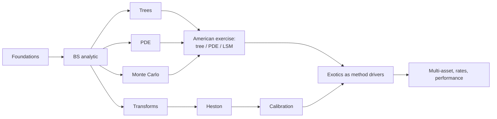

# Curriculum

`qpl` is built by Textbook-Driven Development (TDD): a textbook or literature
result is re-derived independently, turned into an executable pricing case,
cross-checked by an independent method, backed by convergence or statistical
evidence, and only then becomes a package capability. This page is the
truthful map of that process: the loop, the spine, the dependency order, the
evidence rules, the phase plan, and what each slice has actually delivered.

See also `docs/notes/` for short public derivation notes and
`docs/curriculum_provenance.md` for the per-chapter lab -> `src/` -> tests
mapping.

## The TDD loop

1. **Derive**: re-derive the result independently in a private lab notebook
   under `labs/` (gitignored, never published), citing source/page/equation
   for load-bearing formulas.
2. **Case**: turn it into an executable pricing case in `qpl.cases`, paraphrased
   in this repo's own words and data.
3. **Cross-check**: validate against an independent method (closed form,
   another engine, a published table, or an identity that must hold exactly).
4. **Evidence**: back the claim with convergence-order or statistical evidence
   using `qpl.validation`, tagged with an `EvidenceClass`.
5. **Capability**: only then does it become public `src/` surface with tests
   and, where a plot teaches better than an assertion, a notebook.

Labs are the private *drivers*; `src/`, `tests/`, `qpl.cases`, and
`docs/notes/` are the public *cargo*. No human gating on derivations (D6):
the loop above is the check, not a review queue.

## Identity decision

The project's tie-breaker (D1, 2026-09-13): `qpl` is a numerical-methods lab
with textbook provenance. Correctness and measured convergence beat
instrument breadth, API polish, and performance. Recruiting/portfolio
considerations do not reorder the curriculum (D2).

## Literature spine

| Role | Source |
|---|---|
| Heavy spine (cases) | Fusai & Roncoroni (2008), *Quantitative Finance*, Part II |
| Heavy spine (Monte Carlo) | Glasserman (2003), *Monte Carlo Methods in Financial Engineering* |
| Derivation authority | Shreve, *Stochastic Calculus for Finance II* |
| PDE rigor | Pooley, Forsyth & Vetzal papers; Tavella & Randall / Duffy |
| Instrument/concept map only | Hull, *Options, Futures, and Other Derivatives* |
| Volatility and transforms | Gatheral; Heston (1993); Lewis; Lord & Kahl; Carr & Madan |
| Rates (only if rates become serious) | Andersen & Piterbarg |
| Independent oracle (optional, `[oracle]` extra, never sole evidence) | QuantLib-Python (BSD-3) |

## Method dependency graph



Compact list form: foundations -> BS analytic -> {trees, PDE, MC} -> American
exercise (via tree / PDE / LSM) -> {transforms -> Heston -> calibration} ->
exotics as method drivers -> {multi-asset, rates, performance}.

## Evidence classes

Defined in `qpl.validation.EvidenceClass`:

- **exact identity** — a relation that holds exactly in the model (e.g. put-call
  parity); tolerance is floating-point round-off, not model error.
- **closed form** — compared against a closed-form formula evaluated in this
  repository.
- **published benchmark** — compared against a number published in a cited
  source.
- **independent engine** — compared against a different engine or library
  computing the same quantity by a different route.
- **convergence order** — the claim is about the measured rate at which error
  decays under refinement, not about a single price.
- **statistical** — the estimate carries sampling error; the tolerance is a
  stated multiple of the reported standard error.
- **negative finding** — a documented failure mode, pinned by a test so it
  cannot silently change or be mistaken for a bug elsewhere.

A fitted slope is never a theorem; Monte Carlo agreement within noise is
never exact; engine agreement is never evidence that shared assumptions are
realistic.

## Provenance rules

- Cite source/page/equation for load-bearing formulas.
- Derive independently; do not copy book code, prose, tables, or a book's
  example sequence.
- Paraphrase problem statements in this repository's own words.
- Published numbers may be used as fixtures, but only with a citation.

## Phase plan

Candidate slices, re-planned as cases expose problems. Each is phrased as "a
user can X by running Y, correct because Z" where that is already known;
unknowns stay unknown.

### Phase 1 — Discrete time (trees)
- ~~A user will be able to price a European call/put via a CRR binomial tree,
  correct because its measured convergence order to the Black-Scholes closed
  form is order 1, with the odd/even node-count oscillation documented rather
  than hidden.~~ **Delivered in Slice 1** (see below).
- ~~American exercise becomes an instrument property; CRR American call/put
  with dividends is checked by early-exercise premium >= 0 and American >=
  European.~~ **Delivered in Slice 2** (see below).
- ~~Tree Greeks are read from the lattice.~~ **Delivered in Slice 1** for
  European payoffs and **Slice 2** for American ones.
- ~~Leisen-Reimer smoothing is checked by measured order 2.~~ **Delivered in
  Slice 3** (see below): measured 1.9840 at the money and 1.9709-1.9842 off
  it, with no odd/even oscillation. The Slice 2 motivation held up -- and the
  slice also measured that Leisen-Reimer does *not* rescue the American order
  or the lattice Greeks, for reasons that are now written down.
- A Bermudan exercise schedule, if a case needs one. Slice 2 found that the
  Longstaff-Schwartz Table 1 benchmark is a 50-exercise-date Bermudan value,
  and reproduced it with a restriction applied in the test rather than by
  adding an instrument; if a second case wants it, that is when the instrument
  earns its place. **Slice 11 produced the second case** — least-squares Monte
  Carlo prices a Bermudan by construction — and the answer was *half* of one:
  the lattice helper moved out of the test and into
  `qpl.cases.bermudan_value_on_lattice`, where both callers read it, but no
  `BermudanOption` instrument was added. The exercise grid is a *config* field
  (`MCConfig.exercise_dates`) rather than a contract term, because what varies
  is the engine's discretisation of American exercise and not the option being
  priced; `meta["exercise_style"]` reports what was actually computed. An
  instrument earns its place when a *contract* specifies its own schedule,
  which is still not the case.
- **Trinomial trees: deferred, not scheduled.** Leisen-Reimer reaches order 2
  for European payoffs with no extra machinery, and a trinomial lattice would
  be a third parameterisation with no case demanding it. It comes back onto
  the plan only if a case forces it -- a barrier that needs a node on the
  barrier, most likely.

**Phase 1 is complete** apart from those two deferred items.
- ~~Forces ADR-0005: an engine registry keyed by `(instrument, model, method)`
  replacing the `isinstance` ladder in `qpl.pricing`.~~ **Delivered in
  Slice 1**; ADR-0005 accepted.

### Phase 2 — PDE rigor
- ~~Rannacher start-up, with Greeks read from the grid at measured order.~~
  **Delivered in Slice 4** (see below): `PDEConfig(time_stepping="rannacher")`
  and `greeks_method="grid"`, with delta, gamma and theta measured at order
  ~2 and the plain-Crank-Nicolson gamma divergence pinned as a negative
  finding and confirmed independently in QuantLib.
- ~~A non-uniform grid concentrated at the strike, as the second standard
  remedy for the strike-kink pathology documented in
  `docs/notes/pde_strike_alignment.md`.~~ **Delivered in Slice 13** (see
  below), and it arrived as a *barrier* mesh rather than as a strike mesh,
  which is what the deferral was waiting for. `PDEConfig(grid="sinh",
  concentration=..., grid_points=(...))` places nodes uniformly in
  `xi(S) = sum_j asinh((S - c_j)/alpha)`, with the barrier written back exactly
  as an anchor and the strike nudged to a cell midpoint. Measured order two in
  price, digital price, delta and gamma; the constant it buys is 13x-18x on a
  barrier and a *loss* on a plain vanilla at the same point, which settles what
  the mesh is for. The three motivations recorded here were all accuracy
  constants and all of them turn out to have been the weaker argument.
- ~~PSOR for American exercise, cross-checked against the Phase 1 trees.~~
  **Delivered in Slice 5** (see below): the LCP solved by red-black projected
  SOR inside each time step, measured order 1.85 against the lattice-bracketed
  limit, and three-way agreement with the CRR and Leisen-Reimer lattices and
  with QuantLib's American finite differences.
- ~~A digital (discontinuous-payoff) option, showing the pathology and the
  remedies rather than only the smooth-payoff case.~~ **Delivered in Slice 6**
  (see below). The prediction held: a jump is one derivative worse than a kink
  and the pathology does reach the *price* -- plain Crank-Nicolson on an
  unaligned grid is order 1.0012 in the price, against order 2 for a vanilla on
  the same grid. Four written expectations did not hold, and each is encoded
  rather than quietly dropped.

**The deferral, and how it closed.** The mesh was deferred three times
(decision by the orchestrator, 2026-09-13), because all three motivations then
on record -- the strike kink of Slice 0/4, the free boundary of Slice 5, the
digital's `O(cash * ds)` of Slice 6 -- were *accuracy constants* on problems
that already had a working remedy. Strike alignment, the cell-average
projection and Rannacher between them covered every measured pathology, and a
non-uniform grid would only have improved numbers that were already at the
measured order. The argument was to build the mesh against a case that needed
it rather than against three that would merely be a little more accurate with
it, and Slice 7 went ahead of it for exactly that reason.

**The barrier was that case, and Slice 13 closed the item.** Slice 12 shipped
the barrier with three engines and none of them a grid, and measured both
numerical routes at **order one half** for one reason: the barrier is displaced
by `O(sigma sqrt(dt))` and the price is locally linear in it. A grid can put a
node on the barrier for every time step at once -- by truncating the domain
there -- and Slice 13 measures what that is worth: **order 2.0668 on a node
against 0.7079 off it**, with errors 182x to 4021x apart at the same node
count. The deferral's judgement held: the mesh built against the barrier has a
design (anchors that must be nodes, a strike that must not be, and a
cell-weighted projection that makes placement irrelevant for the discrete
contract) that none of the three earlier motivations would have produced.
**Phase 2 is complete.**
- ~~`qpl.numerics.linear_systems` used where it earns its place, or a recorded
  reason why not.~~ **Answered, in two halves.** For the European theta scheme
  a direct tridiagonal solve is needed and Slice 4 measured LAPACK's banded
  solver at 7.4x-28.7x the in-repo Python loop with round-off-equal results, so
  an iterative solver would be strictly worse there. For the American LCP,
  Slice 5 could not call `sor_solve` -- it takes a dense `(n, n)` matrix, so one
  sweep is `O(n**2)` against a tridiagonal `O(n)`, and it has no hook at which
  to project an iterate onto a constraint set. What was reused is its shape (the
  relaxation update, the `0 < omega < 2` validation with the same message,
  reporting iterations and convergence) and, more usefully, its *role as the
  reference*: with the obstacle removed, the new red-black sweep reproduces
  `sor_solve` and the banded solve to 3.2e-13. That is the recorded reason why
  not, and the place it did earn.

### Phase 3 — Monte Carlo (Glasserman)
- Explicit stderr/CI discipline throughout.
- ~~Variance reduction — antithetic variates, a control variate, and
  stratification — each checked by a measured variance ratio.~~ **Delivered in
  Slice 7** (see below) for European vanillas and digitals under Black-Scholes:
  `MCConfig(variance_reduction=...)` over {`none`, `antithetic`,
  `control_variate`, `stratified`} and the combinations that compose, each with
  the standard error that belongs to it and each measured over 50 seeds at
  equal normal draws. The control variate used is the discounted terminal spot,
  a martingale with a known mean; the Kemna-Vorst geometric Asian control named
  in the original plan waits for the arithmetic Asian, which is a later slice
  and a different instrument. Stratified sampling is terminal-only;
  Brownian-bridge stratification for multi-step paths is refused with a message
  naming it.
- ~~Asian options (arithmetic and geometric averaging) with the Kemna-Vorst
  geometric control variate.~~ **Delivered in Slice 8** (see below):
  `AsianOption(kind, strike, expiry, fixing_times, averaging)` priced in closed
  form for the geometric average and by Monte Carlo for both, with the
  geometric-average payoff and its exact discrete closed form as the control.
  Measured control-variate variance factor **1433** (10 fixings) and **1196**
  (52), against `1/(1-rho^2)` predictions of 1277 and 1262 from an independent
  pilot at `rho = 0.9996` -- three orders of magnitude, against the 7.6 the
  discounted terminal spot buys on a vanilla in Slice 7. This is the control
  variate the Slice 7 entry said was waiting for the arithmetic Asian.
- ~~Euler vs Milstein strong/weak order measured against exact GBM.~~
  **Delivered in Slice 9** (see below): `qpl.engines.mc.sde.simulate(...)` over
  `{'euler', 'milstein', 'exact'}` for a scalar Ito SDE, with GBM and CIR as
  ready models and Andersen full truncation for the square-root diffusion.
  Measured strong **0.5154** / **0.9932** and weak **1.0088** / **0.9946** on a
  coupled Brownian path, plus the CIR boundary. This is the prerequisite for
  Heston Monte Carlo in Phase 4: a variance process that is simulated rather
  than sampled needs a scheme whose order and whose boundary behaviour have
  both been measured.
- ~~Pathwise and likelihood-ratio Greeks checked against the analytic engine.~~
  **Delivered in Slice 10** (see below):
  `MCConfig(greeks_estimator="bump"|"pathwise"|"likelihood_ratio")` for European
  vanillas (all three), cash-or-nothing digitals (likelihood ratio and bump;
  pathwise refused, because its almost-everywhere payoff derivative is
  identically zero and the test computes that zero) and discretely-monitored
  Asians (pathwise delta and vega, likelihood-ratio delta, the rest by bump),
  with a per-Greek standard error and a per-Greek estimator name in the result
  metadata. Checked by 95%-interval **coverage** over 40 seeds rather than by
  closeness, and compared by measured variance at equal normal draws: the
  likelihood ratio costs 6.46x on a smooth delta and buys 864.73x on a
  discontinuous one. Slice 8's analytic Asian Greeks refusal is reversed for
  the geometric average as part of the same slice, since the Monte Carlo
  estimators needed a closed form to be checked against.
- ~~Longstaff-Schwartz American put validated against Longstaff & Schwartz
  (2001) Table 1 and against the Phase 1/2 engines — the first three-way
  cross-method case.~~ **Delivered in Slice 11** (see below):
  `MCConfig(exercise_dates=, lsm_basis=, lsm_degree=, lsm_in_sample=)` and
  `method="mc"` registered for `AmericanOption`. The Slice 2 warning held and
  then some: the engine prices a **Bermudan** and says so in its metadata, the
  in-sample run reproduces the published 4.472 to 0.74 of its own standard
  error, and the out-of-sample run is compared with the 50-date lattice
  Bermudan instead. The three-way agreement cost a budget of 1.0% rather than
  the 1.5e-03 the lattice-and-grid pair gets, and the reason is measured: a
  third term the slice statement did not anticipate, the low bias of a policy
  fitted on a finite sample.
- ~~Barrier monitoring bias checked against the Reiner-Rubinstein closed
  form.~~ **Delivered in Slice 12** (see below), and the prediction held:
  Slice 11 measured `O(1/m)` for an exercise frequency and predicted
  `O(1/sqrt(m))` for a monitoring frequency; the measured bias order is
  **0.5045** against the continuous closed form, with a lower-noise paired
  estimate of 0.4603 +- 0.0125. The same one-half turns up on the lattice, as
  the Boyle-Lau sawtooth's amplitude order (0.4566), because both
  discretisations displace the barrier by `O(sigma sqrt(dt))` and the price is
  locally linear in the barrier level. **Phase 3 is complete**, and it stays
  complete: Slice 13 added no Monte Carlo capability, it used the Slice 12
  simulation as an independent check on a grid.
- QMC only if a case motivates it. Still open; nothing has motivated it.

### Phase 4 — Transforms and volatility
- ~~Fourier pricing of Black-Scholes as a sanity check.~~ **Delivered in
  Slice 14** (see below), and it was more than a sanity check: the Chapter 6
  quadrature rules finally drove a pricing integral and turned out to behave
  nothing like the smooth-function test they were built against (trapezoid
  spectral rather than order 2; Simpson six decimal orders *worse* than
  trapezoid at the same cost). See `docs/notes/fourier_pricing_methods.md`.
- ~~Heston: the characteristic function in the branch-cut-safe (Albrecher /
  Lord-Kahl) form, plus `log_return_cumulants` for the COS range.~~
  **Delivered in Slice 15** (see below), and the Slice 14 prediction held
  exactly: `HestonModel` implements two methods, `qpl.pricing` gains two
  `register(...)` lines, and **no pricer changed**. The Slice 14 instruction
  was followed and answered -- this package's cumulants carry `xi` only in
  numerators, so at `xi = 1e-06` it reproduces Black-Scholes to 1e-09 where
  QuantLib's `COSHestonEngine` diverges. See
  `docs/notes/heston_characteristic_function.md`.
- ~~Lewis and Carr-Madan pricing validated against published reference
  values and, optionally, QuantLib.~~ **Completed in Slice 15**: the six Alan
  Lewis reference values reproduce to 4.5e-05 (the published table's own
  four-decimal rounding) by all four methods, and all four are checked against
  `AnalyticHestonEngine` at `T = 1` and `T = 10` on both sides of the Feller
  condition.
- ~~Heston Monte Carlo with the QE scheme and a bias study.~~ **Delivered in
  Slice 16** (see below). Both Slice 9 warnings held: full truncation still
  does not stop the scheme going negative (54-61% of variance draws on the
  Feller-violating set) and the bias study needed a deterministic reference
  rather than a finer run -- here the Lewis transform integral, since Slice 15
  had established it as one of the two transform methods with no parameter to
  get wrong. What Slice 9 did not predict is that the *statistical* floor would
  be the binding constraint: the plain estimator's standard error at 1,000,000
  paths is 2.8e-02 against a bias of 8.4e-03 at dt = 1/16, and the slice is
  measurable only because `ln S_T` is exactly Gaussian conditional on the
  variance driver (82x in variance).
- ~~Implied-vol surface utilities.~~ **Delivered in Slice 15** as
  `qpl.engines.fourier.smile`: `implied_vol`, `implied_vol_surface`,
  `atm_implied_variance`, `smile_skew`, composing the transform price with the
  Brent inverter already in `qpl.engines.analytic.black_scholes`. The three
  shape claims (`rho` sets the sign of the skew, the smile flattens with
  maturity, at-the-forward implied variance runs from `v0` to `theta`) are
  measured, not asserted.
- ~~Synthetic-recovery calibration with identifiability diagnostics.~~
  **Delivered in Slice 17** (see below). Both prior instructions were followed
  and both turned out to be half right. Slice 15 said Lewis and Gil-Pelaez are
  the only two methods with no parameter to get wrong, so a calibrator should
  call them -- but they are **70x** slower than COS on the same quotes, and a
  calibration makes hundreds of calls, so Slice 17 used COS and paid the
  instruction's price in full: the COS *payoff leg* had to be chosen by the
  truncation range's upper end (`COS_PUT_LEG_THRESHOLD`), because the call
  overflows to `-3.2e+43` in a corner of the parameter box and the put
  truncates the fat left tail at short maturity. Slice 15 had also measured
  the call/put asymmetry twice and reported opposite answers; both were right,
  in different regimes, and the threshold is where they cross. Slice 16's
  instruction -- do not calibrate to simulated prices -- was simply obeyed:
  every quote in Slice 17 is a transform price.
- Fusai & Roncoroni Ch. 15 Laplace approach to arithmetic Asians, reusing
  `qpl.transforms`.

**Phase 4 is complete.** Five items, five slices (14, 15, 16, 17 and the
implied-vol utilities inside 15), with the Laplace-Asian item deliberately
left as a Part I loose end rather than a transform one -- it is the Fusai
chapter 15 case for `qpl.transforms`, which is still the one Part I building
block that has never priced anything, and it belongs to whichever slice picks
that up.

### Phase 5 gate

Phase 5 is **multi-asset, rates and performance**, and none of it starts until
a *case* forces it. The gate is the same one ADR-0004 sets for everything
else: a capability enters the curriculum when there is an instrument or a
measurement that cannot be made without it, not when it would round out a
feature list. Four phases of evidence say this is the right rule -- the
digital drove `payoff_projection`, the barrier drove the non-uniform mesh, the
Asian drove the control variate, Heston drove the transform interface -- and
in every case the method came out better for having a case to answer to.

Candidate forcing cases, in the order their evidence is nearest:

- **Multi-asset.** A two-asset basket or spread option under correlated
  Brownian motion is the first instrument here whose price is not a
  one-dimensional integral. It forces: a `Market` that carries more than one
  spot (which ADR-0005 explicitly flags as an interface change every engine
  must absorb, not a new dispatch axis), a correlated sampler, and a
  two-dimensional transform or PDE. `qpl.dependence` already ships the
  Gaussian copula and its Kendall/Spearman identities from Part I and has
  never priced anything either, so the basket is that module's case as well as
  the multi-asset one. The cheapest honest first step is an exchange option,
  because Margrabe gives it a closed form and therefore an error to measure.
- **Rates.** Slice 9 already ships the CIR *process* with its exact
  noncentral-chi-square transition and its moments; what a rates slice adds is
  the **term structure** built on it, not the simulation. The forcing case is
  a zero-coupon bond option or a caplet under Vasicek or Hull-White, where the
  affine bond price is closed form and the option has a Jamshidian
  decomposition -- so, like the exchange option, it arrives with its own
  reference. Until then `Market`'s flat curves are honest about what they are.
- **Performance.** Explicitly gated on reference paths existing to benchmark
  against, and they now do: every engine in Phases 1-4 has a measured
  reference. The forcing case is a calibration or a convergence study whose
  run time is the binding constraint on the *evidence*, and Slice 17 produced
  the first real candidate -- its single-maturity start sweeps take 16.5 s
  because each fit crawls along a flat valley for hundreds of residual
  evaluations, and the suite grew from 214 s to 375 s largely on that. A
  benchmark harness with reproducibility metadata (instrument, model, engine,
  grid/paths, tolerance, hardware, seed, wall time, error against reference)
  would turn that from a nuisance into a measurement.
- **The two outstanding Part I loose ends**, both cheap and both already
  cited: the Derman-Kani-Ergener-Bardhan interpolation for the lattice
  barrier (cited twice, still not implemented, and the reason QuantLib's
  binomial barrier engine has no sawtooth where this one does), and the
  Fusai chapter 15 Laplace Asian for `qpl.transforms`.

### Phase 5+ — only when forced by a case
- Multi-asset (correlated Brownian motion, baskets via existing copulas).
- Rates (Vasicek/CIR/Hull-White). Note that Slice 9 already ships the CIR
  *process* with its exact transition law and moments (`qpl.engines.mc.sde`);
  what a rates slice would add is the term structure built on it, not the
  simulation.
- Performance: profiling, vectorized kernels, and a benchmark harness with
  reproducibility metadata (instrument, model, engine, grid/paths, tolerance,
  hardware, seed, wall time, error vs reference) — only after reference paths
  exist to benchmark against.

## Delivered

### Slice 0
- Public branch without `labs/`; extras split into `dev`/`data`/`oracle`
  (`pyproject.toml`).
- `qpl.validation`: `fit_convergence_order` (least-squares slope of
  `log(err)` on `log(h)`), `refinement_errors`, and the `EvidenceClass` /
  `BenchmarkRow` taxonomy above.
- `PDEConfig(strike_alignment="midpoint")`, resolving the strike-on-a-node
  pathology. Measured on `S=K=100, r=5%, q=0, sigma=20%, T=1`, European call,
  Crank-Nicolson, `n_s = n_t = n` for `n` in `{50, 100, 200, 400, 800}`:
  - Aligned: fitted order **1.997**, log-space RMS residual **0.022**.
  - Unaligned: fitted order **1.126**, log-space RMS residual **0.860** (the
    high residual reflects a non-monotone error sequence, not just noise —
    refining `n=50 -> 100` makes the unaligned error five times worse because
    the strike lands exactly on a node at `n=100`).
  - Implicit-Euler temporal order, isolated on a fixed aligned spatial grid
    (`n_s=800`): fitted order **0.997**, residual **3e-04**.
  - Full tables and the derivation: `docs/notes/pde_strike_alignment.md`.
- `qpl.cases.european_black_scholes`: parity, degenerate-limit, closed-form
  reference-value, and comparative-statics cases, each carrying a
  `BenchmarkRow` with an explicit `EvidenceClass`; exercised by a cross-engine
  test (`tests/cases/test_european_black_scholes_cases.py`).

### Slice 1
- `qpl.engines.registry`: the `qpl.pricing` `isinstance` ladder replaced by a
  registry keyed by `(instrument type, model type, method)` plus a per-method
  `MethodSpec` holding the keyword contract (ADR-0005). Public signatures,
  error types and error messages unchanged; pinned by
  `tests/test_engine_registry.py`.
- `qpl.engines.tree`: CRR binomial lattice (`crr_parameters`,
  `crr_spot_level`, `build_recombining_spot_tree`) plus
  `TreeConfig(n_steps=200, scheme="crr")`, `price_european` and
  `greeks_european`, wired into the dispatcher as `method="tree"`. The
  American-put DP engine in `qpl.engines.dp` now consumes the same lattice
  builder; its prices are bit-identical across 45 configurations.
- **Measured** on `S = K = 100, r = 5%, q = 0, sigma = 20%, T = 1`, European
  call (and put, whose signed errors are identical because parity holds on the
  tree to round-off):
  - Odd `n` in `{25, 51, 101, 201, 401, 801}`: fitted order **1.0010**,
    log-space RMS residual **0.0005**; the tree is **above** Black-Scholes at
    every one of them, scaled constant `n·|err|` settling at **1.7529**.
  - Even `n` in `{26, 50, 100, 200, 400, 800}`: fitted order **0.9987**,
    residual **0.0007**; **below** Black-Scholes at every one, constant
    **1.9994**. The two subsequences therefore bracket the true value. At the
    money an even `n` puts a terminal node exactly on the strike; an odd `n`
    puts the strike exactly midway between two nodes.
  - Richardson extrapolation of consecutive odd pairs: fitted order **1.9590**
    (residual 0.0224) — close to 2 but not 2, because the pairs are
    `(n, 2n+1)` and the within-parity second-order coefficient is only
    asymptotically constant. Error at `n₁ = 401` falls from 4.372e-03 to
    5.710e-07.
  - Lattice Greeks: delta/gamma/theta at order **1.004 / 1.002 / 1.001** (odd)
    and **0.999 / 1.010 / 1.010** (even). Vega and rho are bump-and-revalue
    and carry the oscillation.
  - Away from the money the order-1 constant is **erratic**, not two-valued
    (fitted order 1.21-1.48 with log residuals 0.37-1.52 over even `n`);
    QuantLib's binomial engine behaves identically, so this is the scheme and
    not the implementation. Pinned as a negative finding.
  - Full tables and the derivation: `docs/notes/crr_tree_convergence.md`.
- Oracle: the expected 1e-10 agreement with QuantLib's
  `BinomialVanillaEngine<CoxRossRubinstein>` **does not exist**. QuantLib's
  `CoxRossRubinstein` uses the log-space probability
  `1/2 + (r−q−σ²/2)dt/(2σ√dt)` on the same lattice, which differs from the
  forward-matching `p = (e^{(r−q)dt}−d)/(u−d)` at `O(dt^{1.5})` per step and
  `O(1/n)` in price: `n·(qpl − QuantLib)` is constant to better than 1% over
  `n` in `{50, 200, 800}`. A twelve-line reimplementation of QuantLib's
  probability reproduces its engine to 8.3e-11, which identifies the mechanism
  rather than merely observing the gap. Where 1e-10 *is* available: our
  closed form matches `AnalyticEuropeanEngine` to 1.1e-14.
- `qpl.cases`: two `CONVERGENCE_ORDER` rows for the odd/even claims, plus
  `TREE_REFERENCE_N_STEPS = 2000` and `TREE_KNOWN_VALUE_TOLERANCE = 2.5e-3`
  (derived from the measured even-`n` constant: predicted error 1.00e-3,
  measured 9.998e-04). The cross-engine test now prices each known-value row
  four ways: analytic, PDE, Monte Carlo, tree.
- `examples/tree_convergence.py`: deterministic table plus the fitted orders;
  `--plot` for the log-log error picture.

### Slice 2
- **American exercise is an instrument property.** `qpl.instruments` gains
  `VanillaOption` (validation only) with `EuropeanOption` and `AmericanOption`
  as *siblings* under it -- deliberately not parent and child, because registry
  lookup walks the MRO and a subclass would resolve to the European closed form
  and return a plausible wrong number. The tree engine registers a second key,
  `(AmericanOption, BlackScholesModel, "tree")`, for price and Greeks; the
  analytic, MC and PDE engines stay European-only and refuse an
  `AmericanOption` through the ordinary registry lookup. No change to the
  ADR-0005 contract, so no new ADR.
- `qpl.engines.tree.price_american` / `greeks_american`: calls and puts,
  continuous dividend yield, `meta["exercise_boundary"]` per time level and
  `meta["early_exercise_node_count"]`, lattice delta/gamma/theta sharing one
  estimator with the European path and vega/rho by bump. The Slice 1
  keyword-based `engines.dp.price_american_put_binomial` is now a thin
  deprecated wrapper over it; five pinned Slice 1 values still hold with a
  **zero** tolerance.
- **Measured** on `S = K = 100, r = 5%, q = 0, sigma = 20%, T = 1`, American
  put, against this engine at `n = 8001`:
  - Odd `n` in `{25, ..., 801}`: fitted order **1.0141** (residual 0.0174),
    above the reference at every level. Even `n`: **0.9722** (0.0242), below at
    every level. The odd/even **bracketing survives early exercise**. Same
    picture for an American call with `q = 6%`: **1.0232** / **0.9674**.
  - The scaled constants do **not** settle the way the European tree's 1.7529 /
    1.9994 do; they drift (odd 1.391 -> 1.313, even 0.822 -> 0.924), partly
    because the reference carries its own 1.80e-04 error and partly because the
    exercise boundary is resolved only to the node spacing, an error with no
    parity structure.
  - **Richardson extrapolation does not restore order 2** for the American put:
    fitted order **0.2960** (residual 0.2712) on odd pairs and **0.6447**
    (0.3562) on even, with the extrapolated error flattening at ~1.5e-04
    instead of continuing to fall. It still cuts the error by a factor of 10 to
    220; both halves are asserted. Checked against a 64000/64001 reference so
    the floor is not merely the reference's own accuracy.
  - Lattice Greeks at order ~1: delta/gamma/theta **1.164/1.185/1.259** (odd)
    and **1.074/1.079/1.076** (even).
  - Full tables and the derivation: `docs/notes/american_exercise_on_trees.md`.
- **Contradicted expectation, and the most useful result of the slice.** The
  slice was specified to check that this engine's American put at the
  Longstaff & Schwartz (2001) Table 1 row-1 specification lands within 2e-03 of
  the published **4.478**. It does not: the measured value is **4.486710** at
  `n = 5000`, 8.71e-03 away, and QuantLib's finite-difference and binomial
  American engines land at ~4.4867 too. The reason is the instrument -- those
  options are exercisable **50 times per year**. Restricting exercise to 50
  dates on the same CRR lattice gives **4.477922** at `n = 5000` and 4.477826
  at `n = 40000`. Both numbers are right; they price different things. Carried
  as two rows, `PUBLISHED_BENCHMARK` (tolerance 5e-04, the published figure's
  own quoting precision) and `NEGATIVE_FINDING` (asserting the gap *exceeds*
  2e-03, pinned at 8.71e-03).
- Two further contradictions, both encoded rather than smoothed over:
  - At `sigma = 0` an American put is **not** always
    `max(intrinsic now, discounted forward intrinsic)`. That holds for
    `r >= q`; for `q > r` the objective has an interior maximum at
    `t* = log(rK/(qS0))/(r-q)`. Measured at `S0 = K = 100, r = 2%, q = 50%,
    T = 10`: 83.9506 against 81.1993 for an endpoints-only rule.
  - The extracted exercise boundary is **not** monotone level by level: it is
    monotone within each node-grid parity and zigzags between the two
    interleaved grids by at most one grid offset (measured worst drop 1.3845
    against an offset of 1.4043 at `n = 200`). At expiry it is the in-the-money
    node adjacent to `K` -- `K/u^2 = 97.2112` for the put, `K u^2 = 102.8688`
    for the call.
- Exact identities pinned with **zero** tolerance: an American call on a
  non-dividend-paying stock equals the European call bit for bit at every `n`
  (all five Greeks too), and at `r = 0` the American put equals the European
  put.
- Oracle: QuantLib's `FdBlackScholesVanillaEngine` on a fine grid agrees with
  the tree to **3.71e-04** (ATM put), 1.20e-04 (L&S row 1) and 3.10e-04 (call
  with `q = 6%`), inside a 1e-03 tolerance derived from both engines' measured
  refinements -- they approach from opposite sides, so the gap is the sum of
  their errors, not a cancellation. QuantLib's FD order, fitted on successive
  differences so no reference value is needed: **1.0856**. The Slice 1 negative
  finding survives early exercise: `n * (qpl - QuantLib CRR)` is constant to
  better than 0.5% over `n` in `{200, 800, 3200}` at -0.0264 (ATM put),
  -0.0133 (L&S row 1), +0.0071 (call with yield).
- `qpl.cases.american_black_scholes`: nine rows across the published benchmark
  and its negative twin, two exact identities, three premium bounds/orderings,
  and the in-repo reference value 6.0905564143067235 at `n = 8001` (whose
  `source` says in as many words that it is **not** a published table value).

### Slice 3
- `TreeConfig(scheme="leisen-reimer")` prices European and American vanillas,
  and their Greeks, through the same `method="tree"` dispatch. The lattice
  builder is the only place that knows the scheme; `qpl.engines.tree.lattice`
  gains `peizer_pratt_inversion`, `leisen_reimer_parameters` and the
  `lattice_parameters(scheme=...)` dispatcher, and `CRRLattice` becomes
  `BinomialLattice` with a `spot_centred` flag. CRR is **bit-for-bit
  unchanged** (168 prices and Greek tuples diffed against the previous commit).
- The construction, derived and cited rather than copied: `p = h(d2, n)`,
  `p' = h(d1, n)` from the **Peizer-Pratt method-2** inversion (the variant
  carrying the `0.1/(n+1)` term), then `u = e^{(r−q)dt} p'/p` and
  `d = (e^{(r−q)dt} − p u)/(1 − p)`. The second form is chosen so the one-step
  forward is repriced to round-off, which is what makes parity exact
  (residual <= 9.7e-12 at `n = 2001`). No-arbitrage is automatic: `d1 > d2`
  and `h` increasing give `p' > p`, which *is* `d < e^{(r−q)dt} < u`.
- **Even `n` is rejected**, with `InvalidInputError`, not rounded up. The
  binomial tail `P(Bin(n,p) > n/2)` counts a whole number of outcomes only for
  odd `n`. The decision is backed by measurement, not taste: QuantLib rounds
  up inside the tree but not inside the engine's time grid, and its even-`n`
  price is an **order-1** approximation -- ATM call error −1.330e-02 at
  `n = 800` against −5.518e-07 at `n = 801`, a factor of 24 000.
- **Measured**, European, `S = K = 100, r = 5%, q = 0, sigma = 20%, T = 1`,
  odd `n` in `{25, 51, 101, 201, 401, 801}`:
  - Fitted order **1.9840**, log-space RMS residual **0.0087**; `n²·|err|`
    settles at **0.354**. Error at `n = 801`: **5.52e-07** against CRR's
    2.188e-03, a factor of **3966** (507x at `n = 101`).
  - Off the money, at the two points where CRR's constant is erratic in both
    engines: **1.9842** (residual 0.0086) and **1.9709** (0.0154). Order 2
    survives where CRR's fit was 1.21-1.48 with residuals 0.37-1.52.
  - The orders sit consistently just *below* 2, and the residuals an order of
    magnitude above CRR's, because the Peizer-Pratt tail match is high but
    finite order. Recorded rather than rounded away.
  - **No oscillation, measured directly**: over `n = 101…121` the CRR error
    changes sign 20 times; the Leisen-Reimer error on the odd counts in the
    same range is one-signed and monotone.
  - Richardson with `n²` weights: fitted **2.9577**, error 1.465e-09 at the
    (401, 801) pair.
- **Measured**, American put, same point, against the bracketed limit
  6.090376463020103: order **1.0641** (residual 0.0176) against CRR's 0.9872.
  **Order 1, as expected** -- the dominant error is the early-exercise
  boundary, resolved only to the node spacing, which does not care how the
  terminal grid was chosen. What the scheme buys is a constant 3.79x-4.97x
  better and the *opposite sign*: Leisen-Reimer approaches from below at every
  `n`, CRR from above, so the two bracket the value at a shared `n`.
  Richardson re-measured and **still fails**: 1.3423 with residual 0.7187 and
  non-monotone extrapolated errors.
- **Three contradicted expectations, all encoded:**
  - The slice expected lattice **delta at about order 2** at the money.
    Measured **1.00** (0.996-1.000 across three points and both kinds), and so
    are gamma and theta. Delta, gamma and theta are read at time levels 1 and
    2 and used at time 0; that `O(dt)` substitution dominates the `O(1/n²)`
    price error and no lattice can fix it.
  - The fallback -- "at least the Greek *constants* improve" -- is false for
    two of the five. The Leisen-Reimer delta and gamma errors sit **between**
    CRR's odd and even errors, beating one parity and losing to the other.
    Theta improves 4x-14x, vega 3x-32x, rho 190x-5000x (vega and rho because
    they are bump-and-revalue and CRR's oscillation does not cancel between
    the two bumped prices).
  - The Leisen-Reimer **vega error is flat** at 3.06e-03 across
    `n` in {101 … 801}: it has stopped being discretisation error, and what is
    left is the `O(h²)` bias of `VEGA_BUMP = 1e-2`, previously invisible under
    CRR's oscillation.
- **One real bug, found because `u d != 1`.** The shared lattice Greek
  estimator read theta as `(V(2,1) − V(0,0))/(2 dt)`, which is a pure time
  difference only when `S(2,1) = S0`. On a Leisen-Reimer lattice the offset is
  4.6e-02 at `S=100, K=120, n=801`, and the uncorrected theta error is
  **5.235** with a fitted order of **−0.002** -- it does not converge, while
  returning a plausible number. Subtracting the second-order Taylor expansion
  in spot restores order **1.000**. Applied only when the lattice is not
  spot-centred, so CRR's theta is unchanged.
- Oracle: the expectation that QuantLib would agree "near round-off" **holds**
  this time -- worst European residual **2.71e-11** over `n` in {51, 201, 801}
  at two points and both kinds, and **7.3e-12** for the American put. Against
  `FdBlackScholesVanillaEngine(3200, 3200)` the gap is **1.52e-04**, less than
  half Slice 2's 3.71e-04 for CRR at the same `n`. Two QuantLib quirks pinned
  as negative findings: the even-`n` behaviour above, and isolated `n`
  (501, 1601, 8001) at which its American Leisen-Reimer leaves its own
  convergence curve by up to 9.5e-03 while this package's value stays on it.
- `qpl.cases`: three `CONVERGENCE_ORDER` rows for the European order-2 claim
  (ATM plus the two erratic-CRR points), three American rows (order, the
  bracketing, and the Richardson negative finding), the exported
  `AMERICAN_BRACKETED_LIMIT`, and `TREE_LR_REFERENCE_N_STEPS = 2001` with
  `TREE_LR_KNOWN_VALUE_TOLERANCE = 2.5e-7`. The cross-engine test now prices
  each known-value row **five** ways and asserts the order gap: at 2001 steps
  against CRR's 2000, the Leisen-Reimer error must be at least 1000x smaller
  (measured 11 000x).
- `examples/tree_convergence.py --scheme {crr,leisen-reimer}`; the default
  output is byte-for-byte unchanged, and the smoke harness now carries
  `(script, args, keys)` triples so one example can have several curated
  invocations.
- Full tables and the derivation: `docs/notes/leisen_reimer.md`.

### Slice 4
- `PDEConfig(time_stepping="rannacher")` replaces the first **two** nominal
  time steps by **four fully implicit steps of `dt/2`** and then continues with
  `theta`. Halving is exact in binary floating point, so the four half steps
  cover `2 dt` to the last bit and total time stays `n_t dt`; `n_t + 2` steps
  are taken and `n_t >= 2` is required. Default `"theta"` was bit-for-bit the
  previous engine when it landed (288 configurations diffed).
- `PDEConfig(greeks_method="grid")`, the new default, returns **all five**
  Greeks from `qpl.pricing.greeks(..., method="pde")`: delta and gamma from
  second-order central stencils on the finished grid, theta from the PDE
  identity `V_t = -(1/2 sigma^2 S^2 V_SS + (r-q) S V_S - r V)`, vega and rho by
  bump-and-revalue on the same grid. `meta` names the source of each. The old
  path is kept as `greeks_method="bump"`, NaN vega/theta/rho included.
- The spot is usually **not** a node -- with `strike_alignment="midpoint"` and
  `S = K` it sits exactly halfway between two, the worst case -- so the
  *Greeks* are interpolated between the two nearest nodes, not the price.
  Linear interpolation of a smooth function adds `O(ds^2)`, so second order
  survives; interpolating the price and differencing there would divide that
  error by `ds^2`.
- **Measured**, `S = K = 100, r = 5%, q = 0, sigma = 20%, T = 1`, aligned,
  `n_s = n_t = n` over `(50 ... 800)`: delta **2.001**, gamma **2.064**,
  theta **2.024** with plain Crank-Nicolson, and 2.001 / 2.067 / 2.024 with
  Rannacher (log-space residuals 0.018-0.036). Price order 1.9972 and 1.9973;
  Rannacher costs a flat **5.4%** on the price error constant (`n^2 |err|`
  19.61 -> 20.66 at `n = 800`) and nothing on the order.
- **Four contradicted expectations, all encoded:**
  1. The slice expected the gamma pathology to show at `n_s = n_t = n` and
     Rannacher to repair it there. **It does not appear on that path at all**:
     `dt` shrinks as fast as `ds`, `lambda dt` at the strike stays near one,
     and Crank-Nicolson damps the stiff modes fine. It needs `dt` large
     relative to `ds^2`. On `n_s = 80 n_t`, `T = 0.05`, unaligned, plain
     Crank-Nicolson fits gamma at order **-1.043** (residual 0.018) --
     refinement makes it *worse* -- with relative errors -25.9%, +55.7%,
     +113.4%, +227.7%; Rannacher fits **1.933**. Aligned: -0.915 against
     1.888, so alignment buys a factor of nine and not the order.
  2. **QuantLib's `FdBlackScholesVanillaEngine` does not use Rannacher damping
     by default.** The slice said it did. Its default is
     `FdmSchemeDesc.Douglas()` with `dampingSteps = 0`, bit-for-bit, and on the
     same stressed grids its gamma is wrong by factors of 180 to **1353** --
     two to three orders of magnitude worse than this package's undamped
     result, because its log-spot mesher packs more nodes near the strike and
     is therefore stiffer. `dampingSteps = 2` fixes it. Both undamped engines
     diverging is what proves the pathology is the scheme's and not ours.
  3. **Theta from the last two time levels is first order**, measured 1.054
     (residual 0.0020) with the spatial grid held fixed, 20x-200x worse than
     the identity at every level. The identity is what is reported; the
     difference is kept in `meta["theta_backward_difference"]`.
  4. "Replace the first time step by four steps of `dt/2`" does not add up:
     four half steps cover `2 dt`, i.e. the first *two* steps. That is the
     standard construction and what Giles and Carter call two half steps twice.
- **The old bump path stalls.** Delta error -8.248e-05, -8.509e-05, -8.574e-05
  at `n = 400, 800, 1600` against the grid path's -1.430e-04, -3.594e-05,
  -9.007e-06; fitted orders **0.418** (residual 0.563) against **2.001**
  (0.021). Two causes, not one: the fixed `O(h^2)` bias of the 1% bump, and the
  fact that `s_max = multiplier * spot` puts the three solves on three
  differently-aligned grids -- which is why its gamma sequence is not a power
  law at all (residual 0.73 against 0.04, three sign changes).
- **The price does not warn you.** At `n_s = 1600, n_t = 20, T = 0.05`
  unaligned, plain Crank-Nicolson's price is 0.12% out while its gamma is 113%
  out, a factor of ~900; theta, built from gamma through the identity, is 99%
  out.
- `qpl.cases`: ten `CLOSED_FORM` rows, five Greeks at the reference ATM call
  and put, on one fixed grid (Rannacher, aligned, `n_s = n_t = 400`), each
  tolerance derived from a measured error with a factor of 3.5-4.1 of headroom.
  Plus `test_pde_grid_greeks_beat_the_bump_path_on_delta`, which pins the
  *crossing*: at `n = 400` the bump path is ahead, by `n = 1600` it is 9.5x
  behind.
- Oracle: `tests/oracle/test_pde_vs_quantlib.py` (13 tests, 3.0 s). Agreement
  at `n = 800` over three points and both kinds within 6e-04 on price, 1.5e-04
  on delta and 4e-06 on gamma -- tolerances derived from both engines' measured
  errors, with each engine's own residual against the closed form asserted
  separately. Both fit order two on price and delta. Gamma is deliberately not
  fitted off the money: this package's error there is already 5.7e-09 with sign
  changes, and a slope through that measures nothing.
- `perf(pde)`: the Thomas solve moved from a Python loop to
  `scipy.linalg.solve_banded`. 7.4x to 28.7x on a price call, `pytest -q`
  109.1 s -> 60.6 s, worst price difference **7.2e-13** over 160
  configurations. Round-off, not zero: prices moved in the last bits.
- `examples/pde_greeks_demo.py` was a legacy printout; it now prints the two
  tables above with fitted orders, `--case smooth` and `--case startup`, both
  under a second and both in the curated smoke list.
- Full tables and the derivation: `docs/notes/pde_greeks_and_rannacher.md`.

### Slice 5
- **A user can price an American call or put by finite differences**:
  `qpl.pricing.price(AmericanOption(...), model, market, method="pde",
  cfg=PDEConfig(...))`, with grid Greeks and the exercise boundary. The engine
  is `qpl.engines.pde.american`, registered for `(AmericanOption,
  BlackScholesModel, "pde")` for price and Greeks; `method="pde"` no longer
  raises `NotSupportedError` for early exercise.
- The problem solved is the **linear complementarity problem** `V - g >= 0`,
  `V_t + L V <= 0`, `(V - g)(V_t + L V) = 0`, discretised with the same theta
  scheme and the same operator the European engine uses (extracted and shared,
  not copied -- European prices and Greeks are **bit-for-bit unchanged** over
  160 configurations x 6 quantities). Each step is solved by **projected SOR**:
  an SOR sweep with every updated component clipped against the payoff.
- The sweep is **red-black** (even indices, then odd), which on a tridiagonal
  matrix is exactly a Gauss-Seidel sweep in a permuted order and costs two
  vectorised numpy expressions instead of a Python loop over nodes. A
  tridiagonal matrix is consistently ordered under both orderings, so they
  share a spectral radius and a limit; the test checks against a lexicographic
  PSOR written out as a loop.
- `PSORConfig(omega=1.2, tol=1e-8, max_iter=10_000, on_max_iter="raise")`, on
  `PDEConfig.psor`. `omega = 1.2` is **measured**, not taken from a reference:
  it is the flattest column of the sweep-count table over `n_s = n_t = n` from
  100 to 1600 (11.33, 11.17, 10.65, 10.18, 12.75), where the per-grid optimum
  drifts from 1.00 to 1.30 and `omega = 1.0` degrades 3.5x. `tol` is absolute
  on the max update; at the default the price given up is 2.3e-08 to 1.5e-07
  against discretisation errors 2.1e-02 to 1.2e-04. An exhausted `max_iter`
  raises or is recorded in `meta`, never silently returned.
- **Measured price order 1.8502** (log-space residual 0.0265) over
  `n = 50 ... 800` and **1.8506** (0.0261) over the disjoint window
  `100 ... 1600`, against `AMERICAN_BRACKETED_LIMIT`. The band asserted is
  `1.85 +- 0.12`, justified by the two error terms present -- an `O(1/n^2)`
  scheme term and an `O(ds)` free-boundary term -- and backed by the measured
  local orders 1.739, 1.888, 1.895, 1.837, 1.766, 1.476, which are already
  falling toward 1. Every error is negative: the PDE approaches from below and
  the CRR lattice from above, so they bracket.
- **The LCP is checked, not assumed.** The engine measures, over the whole
  march, the constraint slack (**exactly 0.0** -- the projection assigns the
  obstacle value itself), the operator residual (down to -1.1e-07) and
  `min(slack, |residual|)` (at most 1.1e-07 at the default `tol`, and it falls
  by three orders of magnitude when `tol` falls by four).
- **Three-way agreement.** `qpl.cases` gains two INDEPENDENT_ENGINE rows: CRR,
  Leisen-Reimer and PDE/PSOR agree to 6.040e-04 at the ATM put (a *sum* of
  opposite-signed errors, tolerance 1.5e-03) and to 1.624e-04 at the
  Longstaff-Schwartz row-1 point (all three below the limit, tolerance 5e-04).
  New constant `LS2001_BRACKETED_LIMIT = 4.4866721476`.
- **Five contradicted expectations, all encoded:**
  1. The slice suggested `omega` around 1.2-1.5. The measured optimum is
     **1.00 at `n = 100`** and only reaches 1.30 by `n = 1600`; on a stiff grid
     (`n_s = 80 n_t`) it is 1.8 or beyond. There is no single optimal `omega`,
     because what sets it is `dt / ds**2`, not the grid size.
  2. The slice expected PSOR sweep counts to grow with refinement (Forsyth &
     Vetzal). On `n_s = n_t = n` they are **flat** from 100 to 1600 -- the
     stiffer matrix and the better starting iterate cancel -- and the fit is
     not a power law (residual 0.195). Isolating the stiffness on `n_s = 8 n_t`
     recovers a clean power law: exponent **0.787**, residual 0.0018.
  3. **The projection makes PSOR faster, not slower.** The no-dividend American
     call has an empty active set, so the iteration must converge the whole
     linear system: 12, 12, 16, 33, 59 sweeps over `n = 50 ... 800`, against
     11-12 flat for the put.
  4. The slice asked for the boundary to be monotone "in the sense established
     in Slice 2 (each parity/level subsequence)". On a grid there are **no
     parities**: the node set is the same at every time level, so the whole
     sequence is monotone with zero tolerance. The grid also has no NaN prefix
     -- the lattice's boundary is NaN for its first 47 of 2000 levels -- because
     it reaches `S = 0` at every level.
  5. **QuantLib's American FD engine is first order where this one is 1.85.**
     Fitted 1.0328 (residual 0.0220) against 1.8502 on a joint `tGrid = xGrid`
     refinement, so this engine at `n = 800` is within 12% of QuantLib's 1600
     error and at `n = 1600` is ahead of its 3200. `dampingSteps` is not the
     cause (1.5e-05 at grid 3200, and in the wrong direction); the candidates
     are the unaligned log-spot mesher and `FdmAmericanStepCondition`, which
     projects *between* steps rather than solving complementarity inside them.
     Slice 5 did not separate the two and says so.
- **Theta inside the exercise region** is reported as exactly 0, not from the
  PDE identity: there the PDE is a strict inequality and `V = g(S)` is constant
  in time, while the identity would return `rK - qS` (`+5.0` at `S = 40,
  K = 100`). Delta and gamma need no correction; the stencils return -1 and
  4.3e-15 of their own accord.
- **Degenerate limits are re-derived, not cross-checked.** The `sigma = 0`
  answer is imported from `qpl.engines.tree.american` because it is a fact
  about the model, so the test scans 200001 exercise dates instead of comparing
  the two engines -- including the Slice 2 `q > r` interior turning point
  (83.9505861332, 2.75 above the better endpoint).
- Oracle: `tests/oracle/test_pde_american_vs_quantlib.py` (11 tests, 5.5 s),
  `T = 1.0` with `Actual365Fixed`. Gaps 2.331e-04, 4.209e-05, 1.215e-04 against
  a budget of 8e-04 derived as the sum of both engines' measured errors.
- `examples/american_put_cross_method.py` (0.42 s, curated smoke): both
  engines' values, each one's signed error, the premium, the sweep count, the
  LCP residuals, and the boundary from both engines next to the node spacing
  that limits it.
- Suite: 679 tests, 72.6 s (from 597 / 62.2 s).
- Full tables and the derivation: `docs/notes/pde_american_psor.md`.

### Slice 6
- **A user can price a cash-or-nothing digital call or put** via
  `DigitalOption(kind, strike, expiry, cash=1.0)` with `method` in
  {`analytic`, `tree`, `pde`, `mc`}. `DigitalOption` is a new frozen dataclass
  *outside* the `VanillaOption` hierarchy -- registry lookup walks the MRO, and
  a step payoff must not resolve to the vanilla engines -- sharing validation
  through a module-level helper rather than an inheritance edge. Payoff helper:
  `qpl.instruments.payoffs.digital_payoff`, with **strict** inequalities on both
  sides, matching QuantLib's `CashOrNothingPayoff`.
- **Analytic**: `cash e^{-rT} N(+-d2)` derived from the risk-neutral probability
  in the engine docstring, citing Reiner & Rubinstein (1991), *Unscrambling the
  binary code*, Risk 4(9), with all five Greeks differentiated by hand. Evidence:
  call + put = `cash e^{-rT}` to 1e-15 (EXACT_IDENTITY, stronger than parity --
  no dependence on S, K or sigma); the digital equals `-dC/dK` of the vanilla by
  central difference, residual **1.375e-08** at `h = 1e-2` against a 5e-08 budget;
  the price equals the discounted lognormal probability from
  `scipy.integrate.quad` (INDEPENDENT_ENGINE); every Greek against central
  differences, worst relative residual 1.4e-06.
- **Trees: both halves of the written expectation were wrong.**
  Leisen-Reimer is **order 2** on a digital at all three points (1.9844, 1.9839,
  1.9836), one-signed and monotone, and the mechanism is exact rather than
  asymptotic: the strike always falls strictly between the two central terminal
  nodes, so the lattice price **is** `cash e^{-rT} P(Bin(n, p) > n/2)` (asserted
  to 1e-13 against `scipy.stats.binom.sf`), and Peizer-Pratt chose `p` to make
  that `N(d2)`. A digital is the contract that construction is *best* at.
  CRR is order 1 **only at the money on odd n** (1.0014, residual 0.0008), where
  `u d = 1` freezes the strike at the geometric mean of the two central nodes;
  off the money it is **order 1/2** (block-RMS fits 0.5020 and 0.5037 over every
  odd n from 25 to 801) with a sawtooth error -- 10 and 19 sign changes, errors
  spanning 5.11e-02 to 3.35e-06. Error ratio CRR/LR at n = 801: 4.55e+03 to
  6.34e+05.
- **PDE**: new `PDEConfig(payoff_projection="cell_average")`, read only by the
  digital engine (the arrangement `psor` has with the American one); default
  `"none"` and vanilla output bit-for-bit unchanged. `_solve_grid` gained
  `payoff`/`dirichlet` hooks so the digital marches the same grid, operator and
  banded solve. Measured at the reference ATM point, `n_s = n_t` in
  (100, 200, 400, 800):

  | configuration | price | delta | gamma |
  |---|---:|---:|---:|
  | plain CN, unaligned, no projection | 1.0012 | 0.8632 | 1.0153 |
  | CN, unaligned, `cell_average` | 2.0153 | 2.0059 | 1.9979 |
  | Rannacher, unaligned, `cell_average` | 2.0154 | 2.0061 | 1.9980 |
  | plain CN, midpoint-aligned | 1.9291 | 2.0353 | 2.0313 |
  | Rannacher, midpoint-aligned | 1.9248 | 2.0360 | 2.0315 |

- **MC**: price only, and the one method the discontinuity does not hurt --
  stderr order **0.49990** (residual 1.59e-04) over N in
  (5k, 20k, 80k, 320k), agreement within 4 stderr at 200k (|z| = 1.218), the
  reported stderr matching the closed-form Bernoulli one to 0.06%, and
  call + put exact *path by path*. `greeks` raises `NotSupportedError` naming
  the Phase 3 likelihood-ratio estimator.
- **Four contradicted expectations, all encoded:**
  1. Leisen-Reimer does **not** fail on a digital; it is the best method here,
     for a reason that is an exact identity rather than a rate.
  2. Midpoint alignment makes the cell-average projection a **no-op** (agreement
     1e-16 at n = 100, bit-for-bit at 200/400/800): alignment already puts the
     jump on a cell face, so the two are one remedy reached two ways and cannot
     be stacked. The projection is for grids that cannot be aligned.
  3. The two remedies that *do* stack are orthogonal ones. On `n_s = n_t`
     Rannacher is nearly cosmetic (2.4e-06 correction against a 3.8e-02 error).
     On `n_s = 80 n_t` plain Crank-Nicolson **diverges** whatever the jump
     representation (delta order -1.00, gamma -2.00, gamma error reaching 52.19
     against a true gamma of -3.283e-04), and only Rannacher **plus** a
     consistent jump representation reaches 2.004 / 2.058 / 2.059.
  4. On an unaligned, unprojected grid the call + put identity breaks by **3.8%**
     of the riskless value, because a node sits exactly on the strike and the
     strict convention pays nothing there in either leg. Cell averaging repairs
     it exactly. The surviving residual is the time scheme's own discounting
     error (-6.193e-10 for CN, +7.370e-08 for Rannacher's implicit half steps),
     not round-off.
- **Gamma, reported rather than claimed**: order 2.0315 at the money; at the
  sign-change spot (`d1 = 0`, true gamma -2.97e-19) the absolute error still
  falls at order 2.1226 but relative accuracy is undefined there. Both pinned.
- **Cases**: `qpl.cases.digital_black_scholes` -- `DigitalBSSpec`,
  `DigitalBSCase` and nineteen rows over three points, a third id space asserted
  disjoint from the European and American ones. Cross-engine budgets, all
  derived: Leisen-Reimer at n = 2001 within **2e-08** (worst 5.284e-09), PDE at
  n = 800 aligned + Rannacher within **8e-05** (worst 2.331e-05), MC at 200k
  within 4 stderr. The two order-2 deterministic engines are three decimal
  orders apart, and that gap is asserted, not glossed.
- **Oracle**: `tests/oracle/test_digital_vs_quantlib.py`, `T = 1.0` with
  `Actual365Fixed`. `ql.CashOrNothingPayoff` through `AnalyticEuropeanEngine`
  agrees to **2.220e-16** on the price and 3.5e-18 or better on all five
  Greeks. QuantLib's FD engine agrees at n = 800 to 3.514e-05 / 1.056e-06 /
  9.922e-08 on price/delta/gamma, but its error sequence is **not a power law**
  (residual 0.85 against this engine's 0.023, with sign changes and a
  meaningless fitted 4.85); it is *ahead* at the money at n = 800 (1.80e-07
  against 2.23e-07) and 755x behind at n = 100. The claim asserted is
  predictability under refinement, not accuracy.
- `examples/digital_option_cross_method.py` (0.52 s, curated smoke, also
  `--case pde`): all four engines, the PDE table with and without each remedy,
  and the CRR sawtooth at consecutive odd `n` off the money.
- Suite: 903 tests, 80.6 s (from 679 / 72.9 s); the six new digital files run in
  5.7 s.
- Full tables and the derivation:
  `docs/notes/digital_options_discontinuous_payoffs.md`.

### Slice 7
- **A user can select an estimator.** `MCConfig(variance_reduction=...)` takes
  `"none"` (default, and bit-for-bit the pre-slice engine), `"antithetic"`,
  `"control_variate"`, `"stratified"`, or a tuple combining a sampler with the
  control variate; `MCConfig(n_strata=64)` sets the strata. It works on
  European vanillas and on digitals through one shared entry point
  (`qpl.engines.mc.variance_reduction.price_with_variance_reduction`), the two
  differing only by the payoff callable. `PriceResult.meta` records the
  estimator, the **normal draws actually spent** (the cost axis every ratio is
  measured on), the strata and paths per stratum, and for the control variate
  the fitted beta, the sample correlation, the known mean and the predicted
  `1/(1-rho^2)`.
- **Each estimator ships with its own standard error**, recomputed from the
  realised sample in the tests and compared with `==`: the `ddof=1` one over
  antithetic *pairs* (the naive all-paths version is over 1.4x larger, so this
  is not a rounding matter), the `ddof=2` regression-residual one for the
  control variate, and the strata-weighted `sqrt(sum_i s_i^2/(K^2 m))`.
  Coverage of the reported 95% interval over 30 seeds x 5 120 draws is 519/540
  = 0.961 with a worst cell of 26/30, against a binomial floor of 24
  (`P(X <= 23) = 5.7e-04`). `|z|` against the closed form at 200 000 draws runs
  0.05 to 1.58 over all eighteen cells.
- **Measured variance factors**, 50 seeds, 20 480 normal draws, `K = 64`
  (predictions in brackets, computed from correlations measured on an
  independent 400 000-draw pilot):

  | point | antithetic | control | stratified | anti+ctrl | strat+ctrl |
  |---|---:|---:|---:|---:|---:|
  | ATM call | 4.59 (4.01) | 7.58 (6.89) | 110.40 | 90.80 | 577.80 |
  | OTM call K=120 | 3.04 (2.33) | 2.71 (2.30) | 42.41 | 92.35 | 84.61 |
  | ATM digital | 9.32 (9.38) | 2.11 (2.45) | 101.26 | 9.73 | 82.32 |

- **The same-sample control coefficient is measured, not excused.**
  `|b_same - b_pilot|` falls 0.017186 -> 0.001061 from N = 1 000 to 256 000,
  fitted order **0.4952**; the price difference it causes falls -4.830e-03 ->
  -5.848e-05 from N = 2 000 to 128 000, fitted order **1.06** -- the `O(1/N)`
  bias against an `O(N^-1/2)` standard error, consistently negative, about 1%
  of one standard error at N = 128 000.
- **Refusals with reasons.** `stratified` with `n_steps > 1` raises
  `NotSupportedError` naming Brownian-bridge stratification as the construction
  that does it; `antithetic` with `stratified` raises `InvalidInputError`,
  because reflecting a stratified draw lands it in the mirror stratum and the
  two units partition the sample differently.
- **Five contradicted expectations, all encoded:**
  1. **Antithetic is worth most on the digital** (9.32), not least. The
     mechanism is complementarity under reflection, not convexity: with the
     in-the-money boundary at `z* = -0.15`, the reflected pair sums to exactly 1
     unless `|Z| < 0.15`, so the pair average is constant on 88% of the sample
     and `rho_a = -0.7868`.
  2. **Stratification gains `O(K)`, not `O(K^2)`**, on a vanilla: fitted
     exponents **1.0157** (ATM, residual 0.065) and **1.0384** (OTM, 0.058) over
     K in 8...256. The outermost equal-probability stratum is unbounded, the
     payoff is unbounded on it, and its conditional variance sets the floor --
     the smooth-integrand argument does not apply.
  3. **For a digital the gain is `K p(1-p)/(f(1-f))` with `f = frac(K Phi(z*))`
     and is NOT monotone in `K`**: 16 strata -> 20 measures 108.82 -> 48.50
     (predicted 89.64 -> 31.73), and 320 -> 512 measures 1014.18 -> 491.01
     (predicted 1100.97 -> 505.91). More strata can buy less, and which `K` is
     good is a property of the contract.
  4. **The combinations do not compose multiplicatively, in either direction.**
     Antithetic+control on the OTM call is 92.35 against a product of 8.24
     (the control correlates +0.9643 with the pair average against +0.7522 with
     the raw payoff); stratified+control on the digital is 82.32, *worse* than
     stratification alone.
  5. **Variance reduction helps the CRN bump Greek more than the price, except
     where the fitted coefficient gets in the way.** sd of delta over 20 seeds
     at 20 480 draws, `h = 1e-2`: none 0.004481, antithetic 0.001175, control
     0.001639, stratified 0.000254 (a variance factor of **311** against the
     price's 110), antithetic+control 0.001060, stratified+control 0.000367 --
     *worse* than stratified alone, because `b` is refitted on every bumped
     sample and `b_up - b_dn` is noise common random numbers cannot cancel.
- **Cases**: `qpl.cases.mc_variance_reduction` -- a fourth id space, asserted
  disjoint from the other three, and the first keyed by an **estimator** rather
  than an instrument. Fifteen `STATISTICAL` rows whose `expected` and
  `tolerance` are in **log space** (`log(factor)`, `log(1.7)`), because an
  absolute tolerance on a quantity spanning 2.11 to 577.8 is either vacuous or
  impossible. `expected` is the theoretical factor where one exists and the
  measurement where none does, and `source` says which. The band 1.7 is derived
  from the [0.47, 2.11] 99% range of a ratio of two 49-df variance estimates.
- **The European cross-engine Monte Carlo leg is now stratified**: 12 800 paths
  instead of 200 000 plain ones, a standard error of 1.107e-02 against
  3.283e-02 -- three times tighter for one sixteenth of the work -- at the same
  four-standard-error tolerance.
- `examples/mc_variance_reduction.py` (0.27 s, curated smoke, also
  `--case digital` at 0.32 s): six estimators, paths and normals side by side,
  the stderr-based and seed-based readings of each factor, and the stratum scan
  whose `strata_gain_monotone_in_K=False` is the digital finding in one line.
- Suite: 1004 tests, 87.0 s (from 903 / 80.6 s); the two new test files run in
  3.3 s.
- Full tables and the derivation: `docs/notes/mc_variance_reduction.md`.

### Slice 8
- **A user can price a fixed-strike Asian.**
  `AsianOption(kind, strike, expiry, fixing_times=(...), averaging="arithmetic"
  | "geometric")` -- a new instrument type outside the vanilla and digital
  hierarchies, because its payoff reads the *path* rather than the terminal
  spot. `method="analytic"` prices the geometric average exactly and raises
  `NotSupportedError` on the arithmetic one, naming the approximations and
  Monte Carlo; `method="mc"` prices both, with
  `MCConfig(variance_reduction="control_variate")` using the geometric-average
  discounted payoff and its exact closed form as the control (Kemna & Vorst
  1990). `qpl.engines.analytic.asian.turnbull_wakeman_price` is reachable only
  by name, so the dispatcher never returns an approximation as if it were
  exact.
- **The discrete geometric closed form is derived, not looked up.** `log G` is
  exactly normal with `m = log S + (mu - sigma^2/2) tbar` and the collapsed
  covariance sum `v = (sigma^2/n^2) sum_i (2(n-i)+1) t_i`, so the price is
  Black (1976) in `F = E[G]`. `T` enters only through the discount, so an
  average that ends before settlement is handled by construction. Checked
  against the `O(n^2)` double sum on irregular schedules, and against
  Black-Scholes to 1e-13 in the `n = 1` limit.
- **Fixing convention**: `t_i = i T / n`, last fixing at expiry, built by
  `qpl.instruments.uniform_fixing_times` (`linspace`, so `t_n == T` exactly --
  `(i+1) * T / n` lands one ulp above at `T = 90/365, n = 2560` and the
  instrument then correctly refuses it). All three published benchmarks are
  reproduced under this convention, which is how it was chosen.
- **Three published values reproduced**: Clewlow-Strickland discrete geometric
  call 5.3425606635 to **5.8e-11**; Haug continuous geometric **put** 4.6922 to
  **3.7e-05** at 20 000 fixings; Turnbull-Wakeman 19.5152 to **9.8e-06**.
- **The discrete-to-continuous rate is order 1, derived before it was
  measured**: `tbar = (T/2)(1 + 1/n)` and
  `v = (sigma^2 T/3)(1 + 3/(2n) + 1/(2n^2))` each carry an `O(1/n)` term with
  no cancellation. Measured **1.0002** (residual 0.00017) and **1.0096**
  (0.00917) over `n` in 20...2560, and **1.0002** (0.00024) against QuantLib's
  continuous engine -- so the rate belongs to the convention, not to either
  implementation.
- **Measured variance factors**, 50 seeds at 41 600 normal draws
  (`4160 x 10 == 800 x 52`, equal cost), predictions from an independent
  40 000-path pilot:

  | fixings | antithetic | control variate | antithetic+control |
  |---|---:|---:|---:|
  | 10 | 5.54 (4.17) | **1433.0** (1276.7) | 2113.8 (2387.7) |
  | 52 | 6.31 (4.14) | **1196.2** (1262.2) | 2584.0 (2360.8) |

  `rho = 0.999608` and `0.999604` -- a difference of 4e-06, inside the pilot's
  own noise, so the control does not need retuning when the monitoring
  frequency changes. At 52 fixings the control-variate column runs **800
  paths** and still resolves the price to four decimals.
- **No time-discretisation bias.** `simulate_gbm_exact` gained an optional
  `times=` grid (the uniform `(t, n_steps)` branch untouched and pinned
  bit-for-bit, since `t_{i+1} - t_i` is not bit-for-bit `t/n_steps`), so every
  fixing is an exact draw with the correct joint law and the only error is
  statistical. There is no refinement study to run, which is why this slice has
  none.
- **Identities.** Asian put-call parity `C - P = e^{-rT}(E[A] - K)` holds **per
  sample** to 1e-11 (the same paths drive both legs), and the AM-GM ordering
  `price_arith > price_geom` for calls holds for **every seed** rather than
  within noise -- with the sign reversed for puts.
- **The Turnbull-Wakeman gap, measured with its sign**: +0.018162 (ATM 10f,
  +0.29%), +0.019331 (ATM 52f, +0.33%), +0.001823 (K=80 26f q=r, +0.009%),
  +0.092724 (ATM 52f vol 40%, +0.89%), resolved at 18 to 143 standard errors.
  Always positive -- the fitted lognormal is more right-skewed than the true
  law -- growing with `sigma^2 T` and collapsing deep in the money, where the
  first moment (matched exactly) determines the price.
- **Five contradicted expectations, all encoded:**
  1. **The Haug 4.6922 is a PUT on a 90/360 year fraction**, not a call on
     90/365. The call at that point is 0.4714, and at `T = 90/365` the exact
     value is 4.6924339 -- 2.34e-04 from the published four decimals, twice the
     tolerance such a quote deserves.
  2. **The Turnbull-Wakeman benchmark point needs `q = r = 5%`**, recovered by
     matching; at `q = 0` the same construction gives 20.7865.
  3. **The combinations DO compose -- with the right second factor.** Slice 7's
     "not multiplicative" holds for the product of the two marginal factors
     (7933 and 7543 against measured 2114 and 2584), but the combined estimator
     regresses the control on the *pair-averaged* units, and
     `factor(antithetic) x 1/(1 - rho_pair^2)` is right to 11% at both fixing
     counts. Slice 7's finding was about which correlation was measured.
  4. **The control collapses exactly where plain Monte Carlo is worst, and the
     confidence interval fails with it.** At `sigma = 10%, K = 130`, 52
     fixings, 40 000 paths, no path's geometric average is in the money: the
     control has zero sample variance, `beta = 0`, `rho = 0`, factor 1.0, no
     NaN -- and the estimator silently becomes the plain one. One arithmetic
     path pays, so the answer is 5.275e-06 +- 5.275e-06 while the geometric
     closed form (a valid lower bound by AM-GM) is 3.533e-05:
     `value + 4 stderr = 2.64e-05` does **not** reach the truth.
  5. **Antithetic sampling is not worth reaching for on an Asian**: 5.5 and 6.3
     against the control variate's 1433 and 1196 at the same cost.
- **Cases**: `qpl.cases.asian_black_scholes` -- a **fifth** id space, asserted
  disjoint from the other four, and the first whose two halves carry different
  evidence classes on purpose: geometric rows are `CLOSED_FORM` /
  `PUBLISHED_BENCHMARK` at 1e-13, arithmetic rows are `STATISTICAL` against a
  2 000 000-path control-variate reference with the tolerance set to four times
  the combined standard error, and the Turnbull-Wakeman row is a published
  benchmark **for the approximation** paired with four signed gap rows. A test
  asserts that no arithmetic row can claim `CLOSED_FORM`.
- **Oracle**: four legs against QuantLib -- the discrete geometric analytic
  engine at **2.487e-14** (four ulp), `TurnbullWakemanAsianEngine` at
  **3.055e-13** (an order looser, and the 5-fixing points agree to 1.2e-14
  while the 73-fixing ones do not, because `E[A^2]` is a 5329-term double sum
  accumulated differently), the continuous engine as an independently-supplied
  convergence limit, and `MCDiscreteArithmeticAPEngine(controlVariate=True)` --
  which uses the *same* Kemna-Vorst control -- at `|z| <= 0.72`. Day-count
  residual between the two fixing schedules: **1.11e-16**, one ulp.
- `examples/asian_option_control_variate.py` (0.67 s, curated smoke, also
  `--case fixings` at 0.21 s): two fixing counts, four estimators at equal
  normal draws, the realised correlation, both readings of each variance
  factor, the geometric closed form, a 200 000-path reference and the signed
  Turnbull-Wakeman gap.
- Suite: **1174 tests, 99.1 s** (from 1004 / 87.0 s); the five new Asian test
  files run in 7.5 s and the two new example smoke invocations in 3.4 s.
- Full tables and the derivation:
  `docs/notes/asian_options_control_variate.md`.

### Slice 9
- **A user can simulate a scalar Ito SDE.**
  `qpl.engines.mc.sde.simulate(model, x0, t_grid, n_paths, scheme=...,
  truncation=..., seed=|rng=|normals=, db_dx=...)` over
  `{"euler", "milstein", "exact"}`, with `SDEModel` carrying the drift, the
  diffusion, the diffusion derivative, an optional exact transition and an
  optional state floor. Two ready models: `gbm_sde(mu, sigma)` and
  `cir_sde(kappa, theta, xi)`. `simulate_gbm_exact` is untouched and pinned to
  1e-13 relative against the new exact scheme fed the same draws.
- **Measured orders on GBM** (`S0 = 100, mu = 0.2, sigma = 0.2, T = 1,
  K = 100`, 100 000 paths, `h = 1/8 ... 1/128`, coarse increments summed from
  the fine ones -- Higham 2001):

  | claim | Euler | Milstein |
  |---|---|---|
  | strong `E\|X^h_T - X_T\|` | **0.5154** (r 0.0062, C 2.9624) | **0.9932** (r 0.0025, C 4.2643) |
  | weak, `f(x) = x` | **1.0041** (r 0.0087, C 2.4142) | **0.9944** (r 0.0017, C 2.3916) |
  | weak, `f(x) = (x-K)^+` | **1.0088** (r 0.0109, C 2.5642) | **0.9946** (r 0.0018, C 3.1096) |

- **Why Milstein buys a strong order and no weak one, as an identity rather
  than a rate**: both the Euler diffusion term and the Milstein correction have
  conditional mean zero, so `E[X^h_T] = S0 (1 + mu h)^{T/h}` for **both**
  schemes and the weak error in `f(x) = x` is the deterministic
  `-S0 e^{mu T} mu^2 T h / 2 + O(h^2)`, constant **2.4428** against measured
  2.4142 and 2.3916.
- **European call bias from Euler paths**: order **1.0088**, constant
  **2.0994** = `e^{-rT} * 2.5642`, bias -0.2560 at `n = 8` (**-1.30%** of the
  19.6298871012 analytic price) to -0.0155 at `n = 128`, negative at every
  level. Measurable only with the coupled exact payoff as a control variate
  with its known mean: standard error 3.5e-03 -> 7.8e-04 against the plain
  estimator's flat 5.7e-02.
- **CIR exact transition, derived not quoted**: `v_{t+h} = c chi'^2(d, lambda)`
  with `c = xi^2(1 - e^{-kappa h})/(4 kappa)`, `d = 4 kappa theta / xi^2`,
  `lambda = v_t e^{-kappa h}/c`, checked against the CIR conditional moments
  written out independently and then against 200 000 sampled paths at four
  steps. `d` **is** the Feller number: `2 kappa theta >= xi^2` is exactly
  `d >= 2`. `cir_expected_excess` gives `E[(v_T - K)^+]` deterministically by
  integrating the ncx2 survival function, so the weak-error reference carries
  no Monte Carlo error of its own.
- **Full-truncation Euler weak orders** (400 000 paths, `h = 1/4 ... 1/32`,
  `v0 = theta = 0.04`): `E[v_T]` shows **no measurable bias** past the coarsest
  step with Feller satisfied (`kappa = 2, xi = 0.2`) and a **degraded 0.6834**
  (r 0.1261) with it violated (`kappa = 0.5, xi = 1.0`); `E[(v_T - 0.05)^+]`
  fits **0.9729** (r 0.0705, C 3.8638e-03) and **0.9389** (r 0.0606, C 0.1329).
  Violating Feller costs a factor of **34 in the constant** and almost nothing
  in the exponent.
- **Three contradicted expectations, all encoded:**
  1. **Milstein on GBM is not exp-of-Euler-on-log.** Euler applied to `log S`
     *is* the exact sampler -- the log SDE has state-independent coefficients,
     so the scheme is not an approximation at all (and Milstein on the log is
     bit-for-bit Euler on the log, since `db/dx = 0`). What holds is a
     truncation identity: the Milstein factor is `1 + u + sigma^2 dW^2 / 2`
     against the exact `exp(u)`, i.e. `exp(u)` cut after the quadratic term in
     `dW` only. Pinned to 3.3e-16 relative.
  2. **Full truncation does not keep CIR positive.** It produces *exactly* the
     same negative states as plain Euler -- 0.91174 of paths with Feller
     violated, 2.6e-04 with it satisfied -- and it must, because the two
     schemes are pathwise identical until the first negative state and after
     that plain Euler has no next state at all (0.90968 of paths become NaN).
     What it buys is that the recursion stays **defined**. At `h = 1/4 ... 1/32`
     **68-73% of terminal variances are negative** in the violated regime.
  3. **The coupled weak-error estimator's noise floor is the scheme's own
     STRONG error**, so signal/noise goes as
     `(C_weak/c_strong) sqrt(N) h^{p_weak - p_strong}`: flat for Milstein
     (|z| 211 -> 207) and *falling* for Euler (73 -> 20). Refining the grid
     makes the Euler measurement worse. At `mu = 0.05` -- an ordinary
     Black-Scholes drift -- the Euler weak error is unmeasurable at 100 000
     paths (|z| 5.8 down to 0.2, fitted order 1.5742 with residual 0.4231), so
     the 20% drift used in the study is load-bearing and the failure at 5% is
     pinned as a `NEGATIVE_FINDING`.
- **Validation**: `qpl.validation` gains `strong_error` and `weak_error`, each
  returning the estimate *with its own standard error*, because that number is
  the floor a fitted order has to clear; `weak_error` takes either a coupled
  reference sample (common random numbers) or a known exact mean, and the
  choice between them is the difference between a measurable bias and noise.
- **Cases**: `qpl.cases.sde_discretization` -- a **sixth** id space, asserted
  disjoint from the other five, and the second keyed by a *method* rather than
  an instrument. Fourteen rows: ten `CONVERGENCE_ORDER` and four
  `NEGATIVE_FINDING`. Every band is derived in its row's `notes` from whichever
  of two effects dominates -- the seed-to-seed spread of the fit or the
  pre-asymptotic gap to the theoretical order. The CIR exact sampler's moments
  are deliberately **not** rows: their expected values are computed from the
  parameters at test time, so a row would carry a second copy of a formula.
- `examples/sde_convergence.py` (1.1 s, curated smoke, also `--case cir` at
  1.1 s): the full error table with z-scores, the fitted orders, the price bias
  table, and -- for CIR -- the negativity table and the truncation weak orders
  on both sides of the Feller condition.
- Suite: **1224 tests, 107.7 s** (from 1174 / 99.1 s); the three new test files
  run in 4.7 s and the two new example smoke invocations in 6.7 s.
- Full tables and the derivation: `docs/notes/sde_discretization.md`.

### Slice 10
- **A user can choose a Greek estimator.**
  `greeks(instrument, model, market, method="mc",
  cfg=MCConfig(..., greeks_estimator="bump" | "pathwise" | "likelihood_ratio"))`.
  The default `"bump"` is the pre-slice central-difference common-random-numbers
  path and is **bit-for-bit** what it was (asserted with `==` over seven
  configurations including `n_steps = 4`, all three variance-reduction samplers
  and `sigma = 0`), even though the implementation moved from "call
  `price_european` eight times" to "draw the normals once, reprice the sample
  eight ways" -- which is what makes the paired per-path differences exist and a
  CRN difference reportable at all.
- **Every Greek carries its own standard error and names its own estimator.**
  `GreeksResult.meta["stderr"]` and `meta["estimator"]` are per-Greek
  dictionaries, because a result genuinely mixes families: a pathwise call
  carries a mixed LR-PW gamma (the payoff has no second derivative) and an
  Asian carries bumped rho and theta next to pathwise delta and vega.
- **Derivations** (`src/qpl/engines/mc/greeks.py`), all from the exact terminal
  lognormal law with `Z` **recovered** from the sample so the formulas hold at
  any `n_steps`: pathwise `dS_T/dS_0 = S_T/S_0`,
  `dS_T/dsigma = S_T(sqrt(T) Z - sigma T)`, `dS_T/dr = S_T T`,
  `dS_T/dT = S_T((mu - sigma^2/2) + sigma Z/(2 sqrt(T)))`, with
  `rho_pw = T e^{-rT}(f'(S_T) S_T - f(S_T))` -- whose second term is the
  discount factor's own and whose collapse to `T e^{-rT} K 1{S_T>K}` for a call
  is asserted path by path. Likelihood-ratio scores `z/(S_0 sigma sqrt(T))`,
  `(z^2 - z sigma sqrt(T) - 1)/(S_0^2 sigma^2 T)` (the **second-order** score,
  not the square of the first), `(z^2-1)/sigma - z sqrt(T)`,
  `z sqrt(T)/sigma - T` and `r - [(z^2-1)/(2T) + z(mu - sigma^2/2)/(sigma
  sqrt(T))]`. Mixed gamma
  `e^{-rT} f'(S_T) S_T (Z/(sigma sqrt(T)) - 1)/S_0^2`.
- **Unbiasedness is coverage, not closeness.** 40 seeds at 20 000 paths, count
  of nominal 95% intervals covering the closed form, against a Binomial(40,
  0.95) mean of 38. ATM call: LR 38/38/38/38/38, pathwise 35/38/38/38/34, bump
  35/37/38/38/34. ATM digital, likelihood ratio: 38/37/37/38/38. Geometric
  Asian: 35-40 of 40 for every Greek and every estimator.
- **Variance, at equal normal draws** (50 seeds, 20 480 draws, the Slice 7
  points): LR/pathwise **6.46** on the call's delta and **13.03** on its gamma
  and vega; bump/pathwise **559.64** on gamma; bump/LR **864.73** on the
  digital's delta. The first and last are the same rule in opposite directions
  -- differentiate the payoff when it is smooth, the density when it is not.
- **The digital.** `"likelihood_ratio"` is the estimator Slice 6's refusal
  message named, delivered. `"pathwise"` raises, and the test **computes** the
  exactly-zero sample it would have returned
  (`qpl.engines.mc.digital.digital_payoff_derivative`). `"bump"` is available
  and measured to be the wrong tool: coverage 36 / 39 / 36 / 26 / **0** of 40
  for delta / gamma / vega / rho / theta, with a gamma standard deviation 4666x
  the Greek. Bias/variance in `h` (24 seeds): sd order **-0.4263** (r 0.0968),
  bias order **+1.9979** (r 0.0042, exactly 2.0000 for `h <= 1`), RMSE minimum
  at `h = 3` -- **300x the package default**, and it moves like `N^{-1/5}`.
- **The Asian.** Pathwise delta (`dA/dS_0 = A/S_0`, both averagings are
  homogeneous of degree one in the spot) and vega (the Brownian path recovered
  from the fixings); LR delta from the **first-transition** score
  `Z_1/(S_0 sigma sqrt(t_1))`; gamma, rho, theta by bump. The LR penalty grows
  with the schedule: 1.567 at six fixings, 3.439 at twelve, 5.228 at
  twenty-six.
- **Analytic geometric Asian Greeks** (`discrete_geometric_greeks`), reversing
  Slice 8's blanket refusal. Arithmetic averaging now raises a *mathematical*
  reason -- a derivative of an approximation with no error control has none
  either -- and names `greeks_estimator='pathwise'`.
- **Composition** (40 seeds, equal draws, ATM call delta), variance factors for
  antithetic / control_variate / stratified: pathwise 20.43 / 3.92 / 84.42, LR
  3.35 / 4.09 / 15.24, bump 20.20 / 3.88 / 86.34. The control variate is
  **delta only** under the sample-level estimators and
  `meta["control_variate_greeks"]` says so.
- **Six contradicted expectations, all encoded:**
  1. The pre-slice bump theta was never a central difference; it is a
     **backward** one, first order in `dt`. Reproduced rather than upgraded,
     and recorded in `meta["fd_by_greek"]`.
  2. The LR vega and LR gamma are **the same estimator up to a constant**:
     their weights are proportional path by path, so `vega = S_0^2 sigma T
     gamma` holds in the sample. Equal coverage counts, equal variance ratios,
     one measurement rather than two.
  3. The digital LR delta's `1/T` blow-up is real in absolute terms (sd x4.67
     from `T = 1` to `T = 0.05`, predicted x4.47) but **does not degrade
     relative precision at the money** (0.0107 -> 0.0106), because the Greek
     grows with the noise. It degrades it 4.3-fold off the money.
  4. The digital bump's failure is not "noisy", it is "**no error bar**". Its
     theta covers 0 times in 40 -- not from bias (it is exactly unbiased for
     the difference it computes) but because the event carrying the signal has
     probability 2e-06 per path and never occurs. A single seed's z-score for
     it is meaningless: the same estimator reads -0.60 and +531 at the same
     path count.
  5. `-dV/dT` is **not** an Asian's theta: settlement enters the price only
     through the discount factor, so it is `-r V` (-0.325 against the roll
     theta's -8.028). The roll derivative is time decay, the variance weights
     sum to exactly `n^2` so `dv/ds = -sigma^2`, and at one fixing it
     reproduces Black-Scholes theta term for term (asserted to 1e-12).
  6. Moving the bump to sample level was expected to agree "to round-off"; the
     measured agreement is **bit-for-bit**, because the new sampler reproduces
     the generator's consumption pattern exactly.
- **Cases**: 50 new rows. `MC_GREEK_CASES` (30) and `DIGITAL_MC_GREEKS_CASES`
  (15) state their tolerance as a **z-score** against the estimator's own
  reported standard error -- a Monte Carlo Greek has no absolute error budget,
  it has an error bar -- and both use a 4-sigma budget, which is what makes the
  bump's pass on a vanilla and its failure on a digital comparable rather than
  asserted. `MC_GREEKS_VARIANCE_CASES` (5, `MCGreeksVarianceCase`) pins the
  estimator-cost ratios in log space with a 2.0 multiplicative band.
- `examples/mc_greeks_estimators.py` (1.8 s, curated smoke, also `--case h` at
  0.6 s): both payoffs, all applicable estimators, estimate / stderr / analytic
  / z / source, plus the spread-over-seeds table that actually decides the
  choice, plus the bump-size sweep.
- Suite: **1322 tests, 125.6 s** (from 1224 / 112.2 s); the two new Greek test
  files run in 3.9 s and the two new example smoke invocations in 2.5 s.
- Full tables and the derivation:
  `docs/notes/mc_greeks_pathwise_likelihood_ratio.md`.

### Slice 11
- **A user can price an American put or call by simulation.**
  `price(AmericanOption(...), model, market, method="mc",
  cfg=MCConfig(..., exercise_dates=50, lsm_basis="laguerre"|"polynomial",
  lsm_degree=3, lsm_in_sample=False))`. Third engine for early exercise, after
  the lattice (Slice 2) and the PSOR grid (Slice 5), and the first whose
  American answer carries a standard error. Four new `MCConfig` fields, all
  read by this engine alone, so every other engine's output is unchanged.
- **What is priced is a Bermudan**, on `t_i = i T / m`, `i = 1 ... m`, and
  `meta["exercise_style"]` says so. Simulation cannot exercise continuously;
  pretending otherwise is how an LSM value gets compared with a tree and found
  wanting for the wrong reason.
- **The Bermudan gap is first order in the exercise count.** Measured on the
  lattice, where there is no noise: gaps **4.4029e-02 / 8.750e-03 / 1.672e-03**
  at `m = 10 / 50 / 250`, fitted order **1.0176** (residual 0.0080) at the
  Longstaff-Schwartz point and **0.976** (residual 0.0007) at the money. Not
  the half order a barrier's discrete monitoring gives -- which is why it was
  measured and not assumed, and which is the prediction the barrier slice
  inherits.
- **The published row, reproduced.** Their settings (100 000 paths as 50 000
  antithetic pairs, 50 dates, constant + three weighted Laguerre functions,
  in-sample): **4.467550 with standard error 6.032e-03** against their
  4.472 ± 0.010 -- a gap of **0.74** of this run's own standard error. The same
  run out of sample gives **4.472996 ± 6.057e-03** against the 50-date lattice
  Bermudan 4.477922, **0.81** standard errors.
- **Two biases, opposite signs, both measured** -- with a **paired** design,
  because the obvious one does not work. Running in-sample and out-of-sample
  and subtracting reads `-0.0022 ± 0.0028` over 20 seeds at 50 000 paths: wrong
  sign, not significant, on an effect that is really `+0.0021`. Fitting two
  policies on two path sets and valuing **both on the same set** cancels the
  valuation noise, and then: the in-sample estimator is high by **+0.038 to
  +0.074** at 2 000 paths across six basis/degree configurations, every one at
  better than five of its own standard errors; the bias decays like **1/N**
  (fitted order **1.020**, not the `1/sqrt(N)` the standard error obeys); and it
  **grows with the number of basis functions**, +0.02827 ± 0.00680 from four
  coefficients to six (Glasserman 8.6, measured).
- **Overfitting is visible out of sample too.** At 2 000 paths degree 3 beats
  degree 5 by `+0.01470 ± 0.00544` (laguerre) and `+0.00923 ± 0.00457`
  (polynomial): the richer basis makes a **worse policy**. The penalty is gone
  at 20 000 paths (`-0.00016 ± 0.00111`).
- **The basis family does not matter; the count does.** Laguerre minus
  polynomial out of sample: `+0.00086 ± 0.00299`, `+0.00500 ± 0.00328`,
  `-0.00046 ± 0.00212` at degrees 2, 3, 5 -- not one resolved, while the degree
  contrast within a family is. QuantLib agrees from outside: its Monomial and
  Laguerre runs on the same point differ by **0.36** of a standard error.
- **Three-way cross-method, and the term that was not in the plan.** ATM
  American put: Leisen-Reimer 6.09033758, PSOR 6.08995244, LSM 6.05330
  (stderr 1.31e-02) at 250 dates and 100 000 paths. The slice statement
  expected a budget of "stderr plus the Bermudan gap"; measured, the dominant
  term is a third one --
  ```
  Bermudan gap                2.46e-03
  finite-sample low bias      1.89e-02      <- the one that was missing
  three standard errors       3.93e-02
  ```
  -- and it is **point-dependent by an order of magnitude**: -1.5e-03 at the
  Longstaff-Schwartz point against -1.88e-02 at the money, same settings. It
  decays like `N^{-1/2}`, the *same* rate as the standard error, so it does not
  vanish inside the noise as the sample grows. An LSM tolerance does not
  transfer between specifications.
- **Oracle.** QuantLib's `MCAmericanEngine` is an independent implementation of
  the same estimator, and its settings are documented rather than defaulted
  (`timeSteps` is the exercise grid, `polynomOrder=3` gives four functions,
  `nCalibrationSamples` makes it out-of-sample, `requiredSamples` counts
  antithetic **pairs**). `z = -1.11` on the Longstaff-Schwartz row, reported
  standard errors within 0.6%, and its own run 0.16 standard errors from the
  published 4.472. It shows the ATM low bias too (-9.01e-03 ± 3.50e-03 over
  five seeds) -- confirming the sign and order of magnitude and explicitly
  **not** the size, which differs from ours by 1.9 standard errors.
- **Four contradicted or corrected expectations, all encoded:**
  1. The three-way budget is not "stderr plus the Bermudan gap" (above).
  2. The exercise boundary is not "the smallest spot where intrinsic exceeds
     the fitted continuation": for a put that is the sample's lower tail. The
     rule is kind-dependent -- largest for a put, smallest for a call -- and
     matches `qpl.engines.tree.american`. Measured deviation from the PSOR
     boundary 0.65 worst case on a boundary of 33-36 (**2.0%**), biased
     **high early in the option's life**, which is the same suboptimality the
     price's low bias measures.
  3. The no-dividend American call's early-exercise fraction is ~0 at 50 dates
     (**1.9e-03**) and **0.219** at 250, while the price stays inside one
     standard error at both. Near expiry the true premium `K r dt` is the size
     of the regression's own error, so the last few comparisons are coin flips
     that cost nothing. The fraction measures the basis and the date spacing,
     not whether the policy is right.
  4. The Bermudan gap cannot be measured *through* the simulation: at
     `m = 250` it is 0.2 of a single 50 000-path run's standard error, so an
     order fitted through the three points would be a fit to the seed. The
     order is fitted on the lattice and the simulation is checked against the
     lattice frequency by frequency.
- **Refused, with reasons rather than silence:** Greeks (a bump moves the
  fitted exercise policy, so the difference quotient is not `dV/dS`); control
  variates (a control needs a known mean *under the stopping rule the
  regression produced*); stratification (no single scalar partitions a payoff
  driven by one normal per exercise date). Antithetic sampling composes,
  because the pair average is taken on the realised cashflow **after** each
  path's own exercise decision.
- **Cases**: `AMERICAN_LSM_CASES`, six rows -- PUBLISHED_BENCHMARK (4.472 with
  the paper's own 0.010), STATISTICAL (out-of-sample against the lattice
  Bermudan; the boundary; the in-sample sign), CONVERGENCE_ORDER (the `1/m`
  gap) and INDEPENDENT_ENGINE (the three-way row, with its budget decomposed
  term by term in the notes). Every statistical tolerance is
  `LSM_STDERR_MULTIPLE = 3` times a measured standard error. Slice 2's private
  Bermudan lattice helper is now `qpl.cases.bermudan_value_on_lattice`.
- `examples/american_put_cross_method.py` gains the simulation column, printed
  in the order the corrections have to be applied.
- Suite: **1387 tests, 145.3 s** (from 1322 / 125.6 s). The three new core test files run in 12.1 s together, the QuantLib oracle adds 7.3 s under the `[oracle]` extra only, and the extended example smoke adds about 1.3 s.
- Full tables and the derivation: `docs/notes/lsm_american_monte_carlo.md`.

### Slice 12
- **A user can price a single barrier, eight types, with a rebate, three ways.**
  `BarrierOption(kind, strike, expiry, barrier, barrier_type, rebate,
  monitoring)` with `barrier_type` over down/up x in/out and `monitoring` either
  `"continuous"` or a tuple of dates. `method="analytic"` prices the continuous
  contract by the Reiner-Rubinstein closed forms; `method="mc"` prices the
  discrete one on the schedule the contract names, with
  `MCConfig(barrier_correction="none"|"bgk"|"brownian_bridge")`;
  `method="tree"` approximates the continuous one by knocking out at lattice
  nodes, CRR or Leisen-Reimer.
- **The first instrument whose contract carries a monitoring convention**, and
  the reason it has to: continuous and discrete monitoring are different
  contracts whose prices differ by `O(1/sqrt(m))`, and putting the convention
  on the instrument is what lets `method="analytic"` refuse a discrete schedule
  by inspecting the contract rather than quietly answering a different question.
- **The closed forms, derived rather than copied.** The joint law of the
  terminal value and the running extremum from the reflection principle plus
  Girsanov (Shreve II ch. 7), assembled into the six `A`-`F` blocks and the
  eight types. In-out parity is exact at zero rebate (**1.42e-14** over twenty
  cells) and *false* with a rebate by exactly `E + F`; every knock-out collapses
  to its rebate at `H = S` exactly, by block cancellation for a call and by a
  difference of sums for a put. Three published Haug rows reproduce to
  **3.23e-05, 3.66e-05, 1.98e-05** against four-decimal figures, and QuantLib's
  `AnalyticBarrierEngine` agrees to **2.886e-14 over 96 cells** (eight types x
  two kinds x three strikes x two rebates).
- **The monitoring bias is order one half, as predicted.** Measured biases
  +1.1211 / +0.8164 / +0.6221 / +0.4490 / +0.2631 at `m = 25 ... 400`
  (40 000 paths, antithetic + vanilla control variate), fitted **0.5045**
  (residual 0.0687); the paired low-noise estimator gives **0.4603 +- 0.0125**
  over ten seeds, and the shortfall from 0.5 is the `o(1/sqrt(m))` term rather
  than noise. QuantLib's `MCBarrierEngine(isBiased=True)` prices the same
  discrete contract at `z = -0.202` and `-0.879`.
- **The Brownian bridge removes the bias entirely, at `m = 1`.** The estimator
  conditions on the sampled points, so its mean does not depend on how many
  there are: `z = -0.10` with a single observation at expiry, where the plain
  estimator returns the vanilla 7.849. Coverage 39/40 and 38/40 over 40 seeds.
- **The Boyle-Lau sawtooth, and what does not fix it.** Amplitude over a full
  period: 0.93510 / 0.63967 / 0.49654 at `n0 = 100 / 200 / 400`, order
  **0.4566** -- half an order, the same displacement seen from the lattice side.
  Leisen-Reimer removes **2%** of it (ratio 0.977-0.980, order 0.4542). The
  Boyle-Lau step counts `n_k = floor(k^2 sigma^2 T / log(S/H)^2)` make CRR first
  order (block-RMS **1.1258**, residual 0.0041) and do nothing at all for
  Leisen-Reimer (0.4254).
- **Five findings that contradicted the slice's written expectations**, all
  encoded as tests: (1) gamma does **not** blow up as `S -> H` -- the value
  vanishes linearly and delta/gamma converge to 0.9265 and -0.0125, with the
  barrier flipping gamma's *sign*; the singularity is at the corner
  `(S = H, t = T)` and only when the terminal payoff jumps across `H`. (2) The
  Boyle-Lau subsequence is first order but **not monotone**: `floor` leaves a
  residual misalignment spanning three decimal orders, so `|error x n|` is
  bounded in `[0.025, 1.70]` with an erratic constant. (3) BGK's *order* is not
  measurable at this cost -- inside two paired standard errors from `m = 50`,
  with a wandering sign and a fit residual of 1.02. (4) At `sigma = 0` the
  discretely monitored knock-out is worth **less**, not more (2.94060 against
  2.97022): a later knock-out preserves more option value and less rebate
  value, and there is no option value left to preserve. (5) The closed forms do
  not detect a spot beyond the barrier -- they return **-1.0394** where the true
  value is 3.00 -- so the inception guard cannot be replaced by a limit.
- **And one from the oracle, which is the argument for the next slice.**
  QuantLib's `BinomialCRRBarrierEngine` has **no sawtooth at all**: amplitude
  1.98e-03 against this package's 1.229 over `n = 200 ... 239`, a factor of
  **620**, and it beats this package's Boyle-Lau-aligned prices at the same step
  counts. That is the behaviour of the Derman-Kani-Ergener-Bardhan
  interpolation, which Slice 12 cited and deliberately did not implement so that
  one remedy could be measured properly rather than two badly.
- **Cases**: a seventh id space, `qpl.cases.barrier_black_scholes`, 18 rows --
  three PUBLISHED_BENCHMARK, four EXACT_IDENTITY, two CLOSED_FORM, three Monte
  Carlo rows (CONVERGENCE_ORDER / STATISTICAL / NEGATIVE_FINDING), three lattice
  rows and three INDEPENDENT_ENGINE rows. The lattice leg's budget is
  `BARRIER_BOYLE_LAU_ENVELOPE / n` with the envelope taken from the measured
  `max |error| x n` across the three points, not from the error at the chosen
  layer, because that would be cherry-picking an erratic constant.
- `examples/barrier_option_monitoring_bias.py` (also `--case sawtooth`).
- **Refused, with reasons**: MC and tree Greeks (a surface measure on the
  barrier; the sawtooth amplified by `1/dt`), stratified sampling, a knock-out
  rebate under the bridge (the hit *time* is unknown), `bgk` on a non-uniform
  schedule, discrete monitoring on the lattice and continuous monitoring in the
  simulation.
- Suite: **1602 tests, 161.2 s** (from 1486 / 146.8 s). The three new core test files run in 3.6 s together and the cases file in 0.6 s; the QuantLib oracle adds 2.4 s under the `[oracle]` extra only, and the two new curated example invocations add 6.3 s -- six subprocess launches, since every example is run once for its keys and twice for determinism. That example cost is the whole overshoot against the slice's ~12 s budget and is the one place a later slice could buy time back cheaply.
- Full tables and the derivation: `docs/notes/barrier_options_monitoring_bias.md`.


### Slice 13
**Phase 2's last item, and the case that forced it.** The single barrier by
finite differences, on a grid that can put a node on the barrier -- which is
the one thing neither Slice 12 discretisation could do.

- `qpl.engines.pde.grid` (new): the spot mesh and the three-point stencil,
  shared by every PDE engine. `PDEConfig(grid="sinh", concentration=...,
  grid_points=(...))` places nodes uniformly in
  `xi(S) = sum_j asinh((S - c_j) / alpha)`, `alpha = concentration * (s_max -
  s_min)`. Mesh formula: In 't Hout & Foulon (2010), IJNAM 7(2), section 3,
  cited for the mesh alone; the several-point generalisation is the density
  view of Tavella & Randall (2000) chapter 5.
- **The stencil's order, stated honestly and measured both ways.** The
  second-derivative arm is *first order pointwise* (leading term proportional
  to `h+ - h-`) and the global error is second order because a grid from a
  smooth map has `h+ - h- = O(dxi^2)`. Control: on spacings alternating
  `h, 2h` the pointwise second-derivative order is **1.0000** against the
  first derivative's **2.0000**; on the `sinh` grid both are ~2.
- **Order two on the sinh grid** for the vanilla price (1.9915), the digital
  price (1.9907), delta (1.9911) and gamma (1.9924), over `n = 50 ... 800`.
  `grid="uniform"` is bit-for-bit unchanged: construction, operator
  coefficients and Greek stencils are each compared with `==` against the
  pre-slice expressions written out in the tests.
- `qpl.engines.pde.barrier` (new), registered for `(BarrierOption,
  BlackScholesModel, "pde")` for **price and Greeks**. It is the first engine
  here that prices both monitoring conventions: continuous by truncating the
  domain at the barrier (`[H, s_max]` or `[0, H]`, so the Dirichlet condition
  sits on `S = H` with no alignment arithmetic), discrete by projecting at each
  monitoring date on a time grid built as the union of the `n_t` uniform levels
  and the `m` monitoring levels. It is also the first barrier engine with real
  Greeks.
- **On a node, order 2.0668** (residual 0.0883) against the Reiner-Rubinstein
  form. **Off a node, first order with an erratic constant**: fit 0.7079 with a
  log-space residual of 0.3068, `|error| x n` in `[85.2, 245.7]` through
  `n = 1600`, every error positive (the scheme prices a barrier further from
  the spot), and 182x to 4021x the aligned errors at the same node count. The
  requirement is Zvan, Vetzal & Forsyth (2000), JEDC 24, 1563-1590; the numbers
  are measured here, and `PDEConfig(barrier_alignment="none")` keeps the
  configuration reachable.
- **The mesh buys a factor of 13-18 in the constant, and costs on a vanilla.**
  Uniform/sinh error ratios 18.0, 13.0, 15.4, 14.5 at `n = 100 ... 800`;
  concentration scan at `n = 100` giving gains of 22.1, 18.0, 10.7 and 5.0 at
  0.02, 0.05, 0.10 and 0.20 -- and *losses* of 0.10, 0.18, 0.28 and 0.49 on the
  plain vanilla at the same point. Reported rather than tuned: the package
  default 0.05 is not the best cell.
- **Discrete monitoring.** Against the plain Monte Carlo estimator (unbiased
  for that contract) `z` = -0.57, -2.31, -1.15, -1.25, -0.32 over
  `m = 10 ... 160`. The discrete-to-continuous gap fits order **0.4431**
  (residual 0.0101) in `1/m`, and the BGK closed-form shift on the same ladder
  fits **0.4361** -- so the deficit from one half is the correction's own
  `o(1/sqrt(m))` and not the grid's, the same effect Slice 12 saw from the
  simulation side (0.4603 +- 0.0125 paired). The gap/BGK ratio is 1.0147 down
  to 0.9915: a continuity correction predicting the gap of a scheme that knows
  nothing about `beta = -zeta(1/2)/sqrt(2 pi)`.
- **In-out parity as a statement about the matrix.** The knock-in is priced by
  its own boundary problem (terminal data the rebate, the Black-Scholes value
  imposed at the barrier), and the two legs plus a third whose data is their
  sum share one grid and one matrix, so their prices add to **1.13e-16 to
  1.13e-15 relative** -- at `n = 100`, where the knock-in is still 3.96e-03
  from its own closed form.
- **Greeks.** Delta and gamma from the non-uniform stencil match central
  differences of the closed form to 2.8e-06 / 1.5e-07 at `n = 400` on the
  `sinh` grid, orders 1.9980 and 1.9558. Slice 12's finding is reproduced: gamma
  does **not** blow up as `S -> H`, it converges having changed **sign**
  (+0.002874 at `S = 110`, -0.011563 at `S = 95.5`, against a convex vanilla).
- **One contradicted expectation, and it is the interesting one.** The slice
  said "projection to the rebate at each monitoring date" and left the
  discretisation of that projection unsaid. Sampling it at *nodes* costs a full
  order and biases the price **low**, because observing a barrier makes the
  value function discontinuous -- the Slice 6 digital pathology, once per date
  -- and on a grid where `H` is a node, half that node's cell is alive while the
  node is set to the rebate. Measured on one grid: order **0.9619** node-sampled
  against **2.2844** cell-weighted, errors -6.34e-01 -> -8.60e-02 against
  +3.64e-02 -> +3.26e-04. The implemented projection is the `L2` one, weighted
  by the cell fraction, which needs no node placement at all.
- **Oracle.** QuantLib's `FdBlackScholesBarrierEngine` over 24 cells at
  `T = 1.0`: worst error 2.663e-03 against this engine's 2.958e-05, a factor of
  90, and agreement to the coarser engine's accuracy (budget 5.0e-3, derived).
  The finding: QuantLib's engine is **order one** on exactly the contracts whose
  terminal payoff jumps across the barrier (0.9502 on a down-and-out put with
  `K = 110 > H`) and order two on the rest (1.8767) -- which is what carrying the
  dead region costs. `dampingSteps` is ruled out (zero beats twenty on both
  cells), the same shape of finding Slice 4 recorded for the vanilla FD engine.
  QuantLib has no FD engine that accepts a monitoring schedule, so the discrete
  half has no FD oracle and a test records that.
- **Cases**: `qpl.cases.barrier_black_scholes` grows to 26 rows -- five PDE
  order rows and three discrete cross-engine rows -- and the continuous
  cross-engine rows become **four**-engine agreement (closed form, Boyle-Lau
  lattice, Brownian-bridge Monte Carlo, finite differences; grid errors
  -1.665e-05, -3.588e-06, -3.836e-05 against a flat 2.0e-4).
- `examples/barrier_pde_grid.py` (also `--case mesh`, `--case discrete`).
- **Refused / out of scope**: double barriers, moving barriers, a rebate paid
  at a discretely observed touch time with more care than "the date it was seen
  at", and ADI / two-factor grids.
- **Harness**: the example smoke test ran every curated invocation three times
  (once for its keys, twice against each other for determinism). It now runs
  each twice and asserts both from the same pair, cutting that file from
  **42.2 s to 28.2 s**; the three new invocations bring it to 36.6 s, so the
  slice leaves the harness 5.6 s cheaper than it found it.
- Suite: **1668 tests, 166-173 s** across repeated runs on this machine (from 1602 / 157 s). The growth is 66 tests for about 11 s net: the new core test files run in 15.2 s together (10.6 s barrier, 4.7 s grid), the cases file is unchanged at 1.4 s, the QuantLib oracle adds 3.8 s under the `[oracle]` extra only, and the example harness is **5.6 s cheaper** than before the slice despite three new curated invocations.
- Full derivation and tables: `docs/notes/pde_nonuniform_grids_and_barriers.md`.

### Slice 14
**Phase 4's first item, and the slice where the Chapter 6 toolkit finally
reached the pricing core.** Four Fourier methods for European vanillas and
cash-or-nothing digitals under Black-Scholes, through a characteristic-function
interface built so that Heston can satisfy it without touching a pricer.

- `qpl.engines.fourier` (new package), registered as `method="fourier"` for
  `(EuropeanOption, BlackScholesModel)` and `(DigitalOption, BlackScholesModel)`,
  price **and** Greeks. `FourierConfig(method="cos"|"carr_madan"|"lewis"|
  "gil_pelaez", ...)`.
- **The interface is two functions**: `characteristic_function(u, expiry, *,
  rate, dividend)` for the **log return** `ln(S_T/S_0)` at complex `u`, and
  `log_return_cumulants(...)` returning `c1, c2, c4`. Keeping the spot out of
  `phi` is what keeps the COS truncation range independent of `S_0`, and that is
  what makes the COS delta and gamma closed forms rather than bumps. `c4` is
  zero for Black-Scholes and is carried because it is the slot Heston fills.
- **COS converges like `exp(-pi^2 N^2 / (8 L^2))`** -- a *Gaussian* decay in the
  term count, derived from the coefficient damping and confirmed against the
  measured slope at `L = 10 / 20 / 40` (ratios 1.085, 1.071, 1.037). The slice
  statement's proposed fit window {16, 32, 64, 128} straddles the floating-point
  floor (the error is 1e-13 by `N = 48`, and the value at 256 is the same double
  as at 64); the fit is done on {8 ... 32} and the contradiction is recorded.
- **The L valley**: 4.98e-01 / 6.25e-04 / 2.04e-08 / ~1e-14 / ~1e-14 / ~1e-14 /
  7.90e-13 / 5.88e-13 at `L = 2 / 4 / 6 / 8 / 10 / 12 / 14 / 20`. Too narrow
  floors in `N` (the same double for `N = 32 ... 1024` at `L = 4`); too wide
  slows the decay by `L^2` and raises the round-off floor (2.7e-14 / 5.9e-13 /
  5.5e-11 at `L = 10 / 20 / 40`).
- **The jump costs a transform method nothing.** Slice 6 measured a full order
  lost to the digital's discontinuity on a finite-difference grid. COS expands
  the *density*, so the digital converges **26x to 54x faster** than the vanilla
  at the same `N`, and its floor is 100x tighter.
- **COS Greeks in closed form**: delta worst 1.74e-14 and gamma worst 9.54e-18
  against the analytic Greeks, four orders inside the 1e-10 asked for. vega,
  theta and rho are central differences at `h = 1e-05` (chosen from a scan whose
  `h^2` regime and round-off floor cross there) and land at ~1e-08.
- **Carr-Madan's FFT error is interpolation, not integration.** The same FFT
  output read on a grid node is 2.2e-07 and interpolated between two nodes is
  6.3e-04, a factor of 2900. `eta` trades the two at fixed `N` and no setting
  makes both small. `meta["on_grid"]` tells the caller which they got.
- **The predicted alpha failure does not happen.** Over the slice statement's
  {0.5, 1, 1.5, 3, 10} every cell is below 5.5e-10 at every moneyness -- under
  Black-Scholes `E[S^{alpha+1}]` is finite for all alpha, so integrability never
  binds. The two real failures are outside that range and are different
  failures: *small* alpha is a resolution failure (7.4e+00 at 0.05, 1.5e-04 at
  0.25) because the integrand grows a spike of width `~alpha` at `v = 0`, and
  *large* alpha is catastrophic cancellation bounded by
  `(S_0/K)^alpha exp(alpha^2 c2/2) S_0/price x eps` -- moneyness-dependent, so
  the `S/K = 1.333` point is unusable at alpha = 20 while the ATM one is exact.
- **The Chapter 6 rules on a pricing integral.** The integrand is *even* (the
  damped price is real), so every Euler-Maclaurin boundary term vanishes and the
  trapezoid rule is spectrally accurate rather than order 2. Composite Simpson
  is exactly `(4 T_n - T_{n/2}) / 3`, so with the trapezoid error already
  negligible its own error is `-(T_{n/2} - I)/3`: it throws away the accurate
  rule and keeps a third of the inaccurate one. At `n = 256`: trapezoid
  1.60e-14, Simpson 6.18e-08, Gauss-Legendre 9.68e-13, at identical evaluation
  counts. Fitted "orders" 6.49 / 4.86 / 9.31, every one with a log-space
  residual above 2.4. `quadrature` defaults to `"trapezoid"` on that evidence,
  and the same mechanism explains why Carr and Madan's own Simpson-weighted FFT
  is up to 8.4e+06 times worse than a trapezoid-weighted one.
- **Lewis and Gil-Pelaez** land at the floating-point floor: worst 2.13e-14 and
  1.42e-14 on vanillas, 1.11e-16 on the Gil-Pelaez digital, with `Pi_1`/`Pi_2`
  reproducing `N(d1)`/`N(d2)` to 1.67e-16 -- three orders better than the
  `~1e-10` expected. QUADPACK's *reported* error bound is at least 1.19e+03
  times the error actually made, and is carried as `reported_abserr` rather than
  as an accuracy claim.
- **Parity is evidence for exactly one of the four.** COS computes its put from
  its own payoff coefficients (residual 2.4e-14 to 2.9e-12); the other three
  transform the call, so their put is parity by construction and the tests say
  so instead of claiming a check.
- **Oracle**: `AnalyticEuropeanEngine` for prices, digitals and all five Greeks.
  And the slice statement's "QuantLib has no BS Fourier engine" is wrong:
  `AnalyticHestonEngine` on a degenerate Heston (`v0 = theta = sigma^2`,
  vol-of-vol 1e-08) reproduces it to **0.0**, giving a real
  transform-against-transform oracle. `COSHestonEngine` cannot: pushed to the
  same limit it *diverges* (-3.8e-04 / -5.0e-08 / +7.1e-05 / +8.9e-02 at
  vol-of-vol 1e-02 / 1e-04 / 1e-06 / 1e-08) and 200, 1000 and 4000 terms give
  the same price to 1e-15 -- a range error, not a series error.
- **Cases**: the vanilla and digital cross-engine rows grow a transform leg,
  labelled **CLOSED_FORM and not INDEPENDENT_ENGINE** (the transform reads the
  same law the closed form integrates), with the ratio against the lattice and
  the grid asserted rather than left to two tolerances.
- `examples/fourier_methods_bs.py` (`--case methods | cos | alpha | fft |
  quadrature`), four invocations curated in the example smoke list.
- **Refused / out of scope**: Heston, Levy models, Fourier-based
  American/Bermudan pricing, and the saddlepoint / Lord-Kahl optimal-alpha
  machinery (the alpha study measures the failure modes instead of automating
  around them).
- Suite: **1958 tests, 179.1 s** (from 1749 / 171.9 s), with the `[oracle]`
  extra installed. 209 new tests for 7.2 s, and essentially all of that time is
  the example harness: the three new core test files run in **1.0 s** together
  (0.25 s COS, 0.23 s Carr-Madan, 0.44 s Lewis/Gil-Pelaez), the 97 QuantLib
  oracle tests add 0.5 s, the cases files are unchanged, and the example smoke
  goes from 36.6 s to 42.3 s for four curated invocations run twice each.
  Transform methods are cheap: 200 cosine terms is 200 evaluations of a closed
  form.
- Full derivation and tables: `docs/notes/fourier_pricing_methods.md`.

### Slice 15
**The second model, and the test of whether Slice 14's interface was real.**
`HestonModel(v0, kappa, theta, xi, rho)` implements `characteristic_function`
and `log_return_cumulants` and nothing else; `qpl.pricing` gains two
`register(...)` lines; **no pricer changed**. Everything below is about the
model, and all of it is about the three places a Heston transform goes wrong:
the branch of a complex logarithm, the cumulants that set a truncation range,
and the moment explosion that bounds a damping parameter.

- `qpl.models.heston` (new), exported from `qpl.models`. Registered as
  `method="fourier"` for `(EuropeanOption, HestonModel)` and
  `(DigitalOption, HestonModel)`, **price and Greeks**; analytic, mc, pde and
  tree are registered with callables that refuse and name the transform route
  and the later MC slice.
- **The stable form, in two sentences.** `d` on the principal branch, so
  `Re(d) >= 0`, which makes `|g| <= 1` and `|g e^{-dT}| <= 1`, which keeps
  `arg(1 - g e^{-dT})` inside `(-pi/2, pi/2)` -- worst measured **0.0852**
  against `pi/2` -- so the principal branch of the logarithm is the continuous
  one and the cut is never crossed. `beta - d` and the logarithm are further
  rewritten through `beta^2 - d^2 = -xi^2 (u^2 + i u)` and `log1p`, which
  removes the `kappa theta / xi^2` prefactor: the literal transcription bottoms
  out at `xi = 1e-04` and is wrong by 0.135 at `xi = 1e-08`, while this form
  converges monotonically for six decades.
- **The little Heston trap cannot be shown on the reference parameters.** A
  branch jump multiplies the transform by `exp(-4 pi i kappa theta / xi^2)`,
  which is **1 whenever `2 kappa theta / xi^2` is an integer** -- and on the
  Alan Lewis set it is exactly 2. Demonstrated instead on a set differing in
  `theta` alone (so `d`, `g` and the windings are identical): relative error
  1.6e-08 at `T = 1`, 2.2e-03 at `T = 1.2`, **8.6e-01 at `T = 2`**, 8.6e+07 at
  `T = 30`, against 1.1e-14 to 4.9e-07 on the reference set at the same
  maturities. First crossing at `u T ~ 5.04`.
- **The cumulants are derived from the variance dynamics, not from `ln phi`**
  (Itô isometry on `int v` and `int sqrt(v) dW1`), so the finite-difference
  check is a real cross-check. `xi` appears only in numerators, which is the
  direct repair of Slice 14's `COSHestonEngine` finding: at `xi = 1e-06` this
  package reproduces Black-Scholes to 1e-09.
- **`c4 = 0` is a lie with a measured price.** Measured `sqrt(c4)/c2` is 1.05 on
  the reference set and **6.85** on a Feller-violating one, so the range is too
  narrow by 1.43x and **2.80x**. The consequence is a range error -- flat in the
  term count at 9.13e-04 (`L = 10`), 2.75e-05 (14), 1.28e-07 (20) and 1.22e-10
  (28) -- and the repair is the derived factor, published as
  `HESTON_TRUNCATION_L_FELLER_VIOLATED = 28`. QuantLib's own `COSHestonEngine`
  has the same failure on the same set, so it is the Fang-Oosterlee rule and not
  this implementation.
- **The COS call and the COS put are not the same problem.** The call's payoff
  coefficient carries `e^b` with `b ~ L sqrt(c2)`; the put's carries only
  `e^{z*} = K/S_0`. So a wide range amplifies round-off in the call and costs
  the put nothing, and a narrow one costs the put left-tail mass. Under
  Black-Scholes the asymmetry was invisible (Slice 14's parity residual
  2.4e-14); under Heston the parity residual is **2.70e-08**, identical at every
  strike. At `v0 = 0.04, kappa = 0.5, theta = 0.04, xi = 1, rho = -0.9, T = 10`
  the window between the two errors is **empty**: the call runs 7.2e+00 /
  1.3e+01 / 4.9e+01 / 4.1e+02 / 1.6e+05 / 9.4e+08 / 4.4e+15 over `L = 8 ... 50`,
  monotone upward, while the put falls to 2.1e-06. Recipe recorded (price the
  put, take the call by parity: worst 7.66e-07 over the 24 oracle cells); the
  engine is deliberately **not** changed, because COS building its put from its
  own coefficients is the only reason parity is a check here rather than an
  identity of the implementation.
- **The Black-Scholes limit is first order, not second.** Order **1.99 in `xi`
  at `rho = 0`** and **1.00 at `rho = -0.5`**: the leading correction is the
  covariance term `rho xi`. It is odd in log-moneyness, so it changes sign
  across the strike and vanishes near the money -- where a fitted order is 0.32
  with a log-space residual of 0.33 and is pinned as meaningless. At `xi = 0`
  exactly the formula reduces to the Gaussian transform of the integrated
  deterministic variance, and at `v0 = theta` to the Black-Scholes transform at
  `sigma = sqrt(theta)`, to 1.1e-16 over 4001 values of `u`.
- **Carr-Madan's damping is now bounded, and by the right bound.**
  `critical_moment(T)` is derived from this package's own `d` and `g` (the
  Andersen-Piterbarg criterion, re-derived): `alpha_max = 10.6905` at `T = 1` on
  the reference set. Measured error 3.1e-08 at `alpha = 10.60`
  (`T* = 1.0233`) and **2.7e+02 at 10.65** (`T* = 1.0103`), at all three strikes
  alike -- unlike Slice 14's moneyness-dependent cancellation failure, because a
  moment explosion is a property of the law. Separately, the default reach
  `12/sqrt(c2)` is a statement about a Gaussian and is 4.9e-02 wrong on a
  fat-tailed law; `u_max = 1000` takes it to 1.0e-13.
- **The smile**, through `qpl.engines.fourier.smile` (`implied_vol`,
  `implied_vol_surface`, `atm_implied_variance`, `smile_skew`): skew -0.2235 /
  -0.0943 / -0.0231 at `T = 0.25 / 1 / 5` with `rho = -0.5` against +0.2248 /
  +0.0972 / +0.0245 at `rho = +0.5` (same magnitudes within 6%, sign reversed)
  and **exactly 0.0** at `rho = 0`; |skew| falls with maturity at fitted
  exponent 0.804 (log-space residual 0.097, so a summary rather than a theorem);
  at-the-forward implied variance runs 0.0434 -> 0.2326 with `v0 = 0.04,
  theta = 0.25` and 0.2448 -> 0.0387 with the two swapped, monotone in both
  directions and **undershooting `theta` from both sides**.
- **Oracle**: `AnalyticHestonEngine` with adaptive Gauss-Lobatto at 1e-13, two
  parameter sets either side of Feller, `T = 1` and `T = 10` exact under
  `Actual365Fixed`, 24 cells. Worst residual **Lewis 2.38e-10, Gil-Pelaez
  1.24e-11, Carr-Madan 1.00e-13, COS put+parity 7.66e-07**; on the
  Feller-satisfying set every method is at 1e-13 or better. The slice statement
  hoped for 1e-08. Practical conclusion: **Lewis and Gil-Pelaez are the only two
  methods here with no parameter to get wrong.** Two findings about QuantLib
  itself: its `Gatheral` and `BranchCorrection` formulations agree to 4.2e-14 at
  matched quadrature (so its default is already branch-safe and the trap needs a
  deliberately unstable implementation to show), and its default
  `AnalyticHestonEngine(model, 144)` is 2.9e-08 off on the Feller-violating set
  and is not used as a reference.
- **Cases**: `qpl.cases.heston`, 28 rows. The published family is this
  repository's first `PUBLISHED_BENCHMARK` whose model has no closed form to
  fall back on; its tolerance is the source's four-decimal resolution and says
  so. Shape claims are carried as indicator rows (`SHAPE_HOLDS`) so that they
  keep an evidence class and a citation instead of living in a test body.
- `examples/heston_smile.py` (`--case smile | cos | trap | alpha`), four
  invocations curated in the example smoke list.
- **Refused / out of scope**: Heston Monte Carlo and the QE scheme, calibration,
  the two-dimensional Heston PDE, Bates and any jump component, and automating
  the COS put-then-parity recipe inside the engine.
- Suite: **2320 tests, 188.8 s** (from 1958 / 180.9 s), with the `[oracle]`
  extra installed. 362 new tests for **7.9 s**, and more than a third of that is
  the example harness: the three core test files run in **1.5 s** together (0.34
  s model, 0.78 s fourier, 0.35 s smile), the cases file is 0.6 s, the 105
  QuantLib oracle tests are 2.9 s, and the four new curated example invocations
  (run twice each) are 2.9 s. A transform method is cheap: 256 cosine terms is
  256 evaluations of a closed form, and the expensive cells here are the
  adaptive-quadrature oracle and the subprocess launches.
- Full derivation and tables: `docs/notes/heston_characteristic_function.md`.

### Slice 16
**Heston by simulation, and the first model in this package whose engines
choose a sampler rather than only parameters.** `qpl.engines.mc.heston`
discretises `(ln S, v)` by Andersen's quadratic-exponential scheme, with
full-truncation Euler and an exact-variance hybrid as comparisons;
`qpl.engines.mc.heston_pricers` registers four instrument types on
`method="mc"`. The Black-Scholes Monte Carlo engines are **untouched** and
pinned bit-for-bit.

- `src/qpl/engines/mc/heston.py` (new): `simulate_heston`, `HestonPaths`,
  `qe_variance_step`, `qe_branch_moments`, `heston_variance_moments`,
  `log_spot_coefficients`, `ConditionalTerminalLaw`,
  `conditional_vanilla_values`, `conditional_digital_values`,
  `conditional_forward`, `HESTON_SCHEMES`, `QE_PSI_C`, `QE_GAMMA_1/2`.
- `src/qpl/engines/mc/heston_pricers.py` (new): `price_european`,
  `price_digital`, `price_asian`, `price_barrier`, `greeks_european`, the three
  registered-and-raising Greeks callables, and the `PathSampler` seam
  (`heston_path_sample`, `heston_time_grid`, `HestonPathSample`).
- `MCConfig` gains `heston_scheme` and `heston_conditional`, both read by the
  Heston engines alone. `n_steps` becomes the **time discretisation** under
  Heston and `n_steps = 1` -- the Black-Scholes default -- is refused.
- **The QE derivation is in the module docstring, from the CIR moments.** The
  conditional mean and variance agree with
  `qpl.engines.mc.sde.cir_moments` (a completely different route, through the
  noncentral chi-square's degrees of freedom) to **1e-16 relative** on both
  branches, which is the slice's EXACT_IDENTITY. The quadratic branch needs
  `psi <= 2` and the exponential one `psi >= 1`, so any switching level in
  `[1, 2]` works; `psi_c = 1.5` is Andersen's and the midpoint.
- **QE matches two moments and nothing else, measured.** Skewness **1.103
  against 1.421** and kurtosis **4.620 against 6.183** versus the exact
  noncentral chi-square on the reference set (4% and 7% low on the
  Feller-violating one, where the exponential branch's own tail is already
  close). Reported, not repaired.
- **The martingale correction is the slice's pinned NEGATIVE_FINDING.**
  Without it, `E[e^{-(r-q)T} S_T] - S_0` is **+1.1206 on a spot of 100** at
  `dt = 1/4` (64 stderrs), +0.2784 at 1/8, +0.0883 at 1/16 -- the forward
  mispriced by 1.1% before anything else is priced. With it the defect is
  inside its own sampling error at every step size, because each step's
  conditional expectation is exactly `e^{(r-q)dt}` by construction.
- **The bias ladder, reference set (Feller number 4.0), 1,000,000 antithetic
  conditional paths against the Lewis integral 16.070155:** QE -1.017e-01 /
  -2.557e-02 / -8.40e-03 / -4.92e-03 / +4.17e-03 at `dt = 1/4 ... 1/64`
  (stderr 3.2e-03); full-truncation Euler +2.601e-01 / +3.693e-02 / -5.9e-03 /
  -7.9e-03 / +5e-04; the exact-variance hybrid -1.465e-01 / -4.189e-02 /
  -9.7e-03 / +4.2e-03 / +8.3e-03. **Only the two coarsest levels clear their
  own noise** for any scheme, which the example prints per row and which is why
  no five-level order is quoted without its log-space residual (0.36-0.58).
  Coarse-pair decay ratios: QE **3.98** (implied order 1.99), Euler **7.04**
  (2.82), hybrid **3.50** (1.81).
- **Three slice-statement expectations contradicted.** (i) QE's bias is
  **2.56x** smaller than Euler's at `dt = 1/4`, not orders of magnitude -- on a
  set where Feller *holds*, and with opposite signs. (ii) The exact-variance
  hybrid is **not** in between: at `dt = 1/4` it is worse than QE (-0.147
  against -0.102), because QE's variance-law error partially cancels the
  trapezoidal integrated-variance error and removing the first exposes the
  second. (iii) At `rho = 0` the price does **not** agree within noise at
  coarse `dt`: the bias is **-0.2439**, *larger* than the `rho = -0.5` one,
  because the step degenerates to the bare trapezoidal rule for `int v ds`. The
  correlation claim is carried instead by `corr(dX, dv)` measured directly
  against `rho in {-0.9, -0.5, 0, +0.5}` with a 2e-05 sampling stderr, whose
  residual falls at measured order ~1 in `dt`.
- **The Feller-violating set is where the two schemes actually separate.**
  `v0 = 0.04, kappa = 0.5, theta = 0.04, xi = 1, rho = -0.9`, number 0.08,
  reference 3.591838: QE -2.14e-02 at `dt = 1/4` against Euler **+3.4076**, i.e.
  **95% of the price**, ratio **158.9**. Euler's is the one fully resolved
  ladder in the slice -- five levels, order **+0.974**, constant **15.0**,
  log-residual 0.106 -- and 54-61% of its variance draws are negative. QE's
  variance is non-negative *by construction* (measured frequency exactly 0) and
  its own ladder resolves three levels at order **+0.893** with residual 0.015.
- **Conditioning on the variance driver is what makes the slice measurable.**
  `ln S_T` is exactly Gaussian given the variance path in all three schemes, so
  a terminal payoff has a closed-form conditional expectation: measured
  variance factors **1.49** (antithetic), **10.27** (conditional), **82.07**
  (both). And the terminal-spot control variate is then nearly worthless
  (correlation 0.797 plain, **0.486** conditional): the two reductions are
  substitutes, because conditioning already integrated out what the control was
  correlated with. Its mean is also the *model's* forward and not the
  *scheme's*, so it removes part of the bias being measured (-5.2e-03 on Euler
  at `dt = 1/4`) -- every bias number here is measured without it.
- **The smile from simulated prices**, with the standard error propagated
  through vega: five strikes agree with the transform smile to -5.50e-04 ...
  -2.97e-04 at `dt = 1/32`, each inside 1.9 propagated standard errors, both
  smiles strictly decreasing with slopes matching to 2%. **Every difference is
  negative** and halves at `dt = 1/64`, so the agreement is statistical at
  these settings and is a discretisation bias a calibrator would inherit.
- **Both path-dependent engines lose what they relied on.** The Asian's
  Kemna-Vorst control has no Heston analogue (the geometric average is
  lognormal only conditional on the variance path), so the fallback is the
  terminal spot: correlation **0.63**, factor **1.7**, against 0.9996 and 1277
  under Black-Scholes. The Brownian-bridge barrier estimator is **no longer
  unbiased**: the bridge assumes constant volatility over the step and is given
  the trapezoidal integrated variance, and at `H = 95` the price runs 4.63838
  -> 4.31367 over `n_steps = 25 ... 800` -- a residual of **+0.325**, 7.5% of
  the price and thirteen standard errors, falling at roughly first order.
  Pinned; the caveat travels on every result that uses the route.
- **Greeks**: all five by common-random-numbers bump with vega in
  `d/d sqrt(v0)`, measured against the COS closed forms (delta 0.5997/0.5995,
  gamma 9.288e-03 both, vega 4.079/4.072, theta -9.409/-9.433, rho
  43.90/43.88); plus a pathwise **delta**, exact because `S_T` is homogeneous
  of degree one in `S_0`. Likelihood ratio is **refused**: the model's
  transition density is what Broadie-Kaya reach only by numerical inversion,
  and the QE step's own score differentiates the discretisation.
- **Oracle**: QuantLib's `MCEuropeanHestonEngine` on a `HestonProcess` carrying
  `QuadraticExponentialMartingale`, eight cells, worst `|z|` against the
  combined standard error **2.04**; and the sharper check that both
  implementations miss the transform price in the **same direction** at the
  same step size. At matched sample counts QuantLib's standard error is 5.1e-02
  where this package's is 7.0e-03 -- and this package's *plain* estimator is
  also 5.1e-02, so the whole factor is one config flag.
- **Cases**: `qpl.cases.heston.HESTON_MC_CASES`, 10 rows, the first
  STATISTICAL / CONVERGENCE_ORDER family in that module; each carries its path
  count, seed and estimator.
- `examples/heston_mc_qe.py` (`--case bias | feller`, `--paths N`), two
  invocations curated in the example smoke list.
- **Refused / out of scope**: calibration, the two-dimensional Heston PDE,
  Bates and any jump component, LSM under Heston, Broadie-Kaya exact
  simulation, and multi-level Monte Carlo.
- Suite: **2434 tests, 217.4 s** (from 2320 / 188.8 s), with the `[oracle]`
  extra installed. 114 new tests for **28.6 s**, of which about a quarter is the
  example harness (two curated invocations, run twice each, 7.6 s): the four
  core test files run in **7.9 s** together (2.5 s scheme, 1.4 s registry and
  bias, 1.0 s smile, 3.0 s path-dependent), the Heston cases file grows by
  1.4 s and the QuantLib MC oracle is 2.6 s. Simulation is the expensive
  method here in a way a transform never was -- every number in the slice is a
  path count times a step count -- and the path counts in the suite are chosen
  so that each claim's signal clears its own noise and no further: the bias
  tables that need 1,000,000 paths live in the example, behind `--paths`.
- Full derivation and tables: `docs/notes/heston_monte_carlo_qe.md`.

### Slice 17
**Calibration, and the difference between a fit and an answer.** Phase 4's last
item and the phase's completion. `qpl.calibration.calibrate_heston(quotes,
market, initial=..., objective=..., weights=..., bounds=..., method=...)` fits
the five Heston parameters by bounded trust-region or unconstrained
Levenberg-Marquardt least squares and returns a `CalibrationResult` carrying
the Jacobian at the optimum, its singular values, the Gauss-Newton covariance,
the condition number and the Feller flag -- because those, and not the fitted
`kappa`, are what say whether the fitted `kappa` means anything.

- `src/qpl/calibration/heston.py` (new): `OptionQuote`, `CalibrationResult`,
  `StartSummary`, `CosSettings`, `calibrate_heston`, `heston_charfn_gradient`,
  `cos_call_prices`, `heston_quote_values`, `residual_jacobian`,
  `parameter_covariance`, `vega_weights`, `default_cos_settings`,
  `DEFAULT_BOUNDS`, `COS_PUT_LEG_THRESHOLD`, `DOMAIN_PENALTY`, `VEGA_FLOOR`,
  `RANK_TOLERANCE`, `MULTISTART_SEED`.
- `src/qpl/cases/heston_calibration.py` (new): the eighth id space, 49 rows in
  six families, the first keyed by an **inverse** problem.
- `tests/test_heston_calibration.py`, `tests/cases/test_heston_calibration_cases.py`,
  `tests/oracle/test_heston_calibration_vs_quantlib.py`,
  `examples/heston_calibration.py`,
  `docs/notes/heston_calibration_identifiability.md`.
- Also `chore(test)`: a `slow` marker registered in `pyproject.toml` and applied
  by a measured rule, so `pytest -q -m "not slow"` is a 139 s inner loop
  against the full suite's 375 s. `pytest -q` still runs everything; the CI
  contract is unchanged.

**The analytic gradient.** `heston_charfn_gradient` differentiates the affine
solution rather than the price (Cui, del Bano Rollin and Germano (2017) EJOR
263(2) section 3 for the strategy; the five derivatives are re-derived here for
this repository's arrangement, which has no `g` in theirs). `phi` reproduces
`qpl.models.heston` to 2.5e-16, the derivatives match central differences to
1.3e-09 -- 4.6e-08 relative, the price Jacobian matches central differences of
the **full** pricer to 6.8e-07, and it is **9.4x** faster than a five-parameter
central-difference Jacobian and **3.4x** end to end. A 5 x 6 calibration takes
41 ms.

**The headline.** At one maturity the residual Jacobian's condition number is
**6.7e+07** and its flat direction is `kappa -0.926` with `v0 +0.276` and
`xi -0.247`. Six starts fit that one smile to a worst implied-volatility RMSE
of **2.88e-06** -- three hundredths of a basis point -- and land on `kappa`
from **2.918 to 7.288** (true 4.0) and `xi` from 0.806 to 1.573 (true 1.0),
with two of them driving `v0` to its lower bound; `rho` and `theta` are
recovered from every start. The same six starts on three maturities all return
`kappa = 4.00000`. The condition number says this before any fit is run; no
convergence criterion says it afterwards.

**Five slice-statement expectations contradicted and encoded.**
(i) The plan named the COS *put* as the reliable leg. Neither leg is: a call's
payoff coefficient carries `e^b` and a put's carries `K / S_0`, they cross over
at a range endpoint of about 7.5, and the first commit of this slice picked the
wrong half before the oracle showed the other. Choosing by `b` cut the worst
pricer error over eight cells from 6.45e+03 (call only) and 3.61e-07 (put only)
to **1.85e-07** and made the residual function total -- before it, a search in
a corner of `DEFAULT_BOUNDS` priced a 100-strike call at **-3.2e+43**.
(ii) The plan asked to assert that the condition number falls with more
maturities. It does under the implied-volatility objective (6.71e+07 -> 566 ->
478) and does **not** under the price objective (6.48e+07 -> 782 -> 952), for a
reason that is an exact identity: a vega-weighted price Jacobian *is* the
implied-volatility Jacobian, to 2.2e-16.
(iii) The plan asked which objective wins on which metric, presuming the metric
decides. Each wins on its own metric by a few percent, stably; the *parameter*
accuracy does not separate them at all, with the price/implied-vol error ratio
running 1.48/1.76/1.17/1.18/1.27 on one block of eight seeds and
0.92/0.84/0.79/0.71/1.18 on the next.
(iv) The plan expected a measured start-grid failure rate that multi-start
rescues. The rate was **11/14** and it was the *pricer*: all three failures sat
where the fixed call leg was wrong by three decimal orders and the residual was
flat. After the leg rule it is **14/14**, and multi-start ties the best single
start instead of rescuing anything -- which is the honest result and is
reported as one.
(v) Clean recovery was five decimal orders better under the implied-volatility
objective (7.0e-12) than under the price objective (5.4e-07), which looked like
an objective effect. It is not: the synthetic quotes are implied volatilities
from a Brent inversion at `xtol = 1e-07`, so converting them back to prices
displaces the price objective's minimum. Fed prices directly the same objective
recovers `kappa` to 4.45e-12.

**The honest identifiability statement** is statistical, not algebraic. Over 20
noise draws the empirical spread of each fitted parameter matches the
Jacobian's own standard error to **0.99-1.23** at 5 bp and 20 bp, consistently
on the small side (Gauss-Newton drops the second-order term). At 20 bp the fit
pins `theta` to 0.65% of its value and `kappa` only to **4.7%**, `xi` to 8.6%
and `v0` to 9.5%.

**Oracle.** QuantLib's `HestonModel` + `HestonModelHelper` +
`LevenbergMarquardt` recovers both study sets to 3.7e-07 and 5.9e-07. The
sharpest result is that on the price objective the two fitted vectors differ by
**1.30e-10** while both sit -5.41e-07 from the truth with the same sign, which
is what identified (v) above. Both libraries also fail to identify `kappa` at
one maturity and fail *differently* ([2.918, 7.288] against [3.930, 10.956]),
and on twenty starts this package reaches the optimum from twenty and QuantLib
from **eleven** -- pinned as a finding about the measurement, not as a ranking,
because three things differ between the two solvers at once.

- **Refused / out of scope**: local volatility and Dupire, SABR, Bates, market
  data of any kind (the `[data]` extra stays frozen), regularisation or a
  Tikhonov prior (it would hide the flat direction this slice exists to
  measure), a global optimiser, and calibration to simulated prices (Slice 16's
  instruction, obeyed).
- Suite: **2585 tests, 374.6 s** (from 2434 / 214.0 s), with the `[oracle]`
  extra installed; quick loop `pytest -q -m "not slow"` **139.2 s**. 151 new
  tests. The cost is concentrated and it is the finding: the single-maturity
  start sweeps take 16.5 s in-repo and 18.6 s against QuantLib because each fit
  crawls along a flat valley for hundreds of residual evaluations, which is
  exactly what "not identified" looks like from inside a solver.
- Full derivation and tables:
  `docs/notes/heston_calibration_identifiability.md`.

## Reconciled old roadmap

`docs/ROADMAP.md` is superseded by this page. Mapping of the old roadmap
items to their actual status:

| Old roadmap item | Status |
|---|---|
| Implied-volatility solver | Done: `qpl.engines.analytic.black_scholes.implied_volatility`. |
| Implied-vol teaching notebook | Exists as a legacy notebook (`notebooks/02_implied_vol_teaching.ipynb`). |
| Historical vol / market data / implied-vs-realized / return-model fit | Done, but frozen behind the `[data]` extra (D9) — outside this curriculum. |
| `BinaryOption` | **Delivered in Slice 6** as `DigitalOption` (cash-or-nothing, `kind`/`strike`/`expiry`/`cash`), registered for all four methods. It drove the method rather than being added for its own sake: it forced `PDEConfig(payoff_projection="cell_average")`, a payoff-callable hook in the tree and MC engines, and the first `NotSupportedError` raised for a *quantity* (MC Greeks) rather than for an instrument/method pair. |
| Antithetic variates | **Delivered in Slice 7** as one of three estimators behind `MCConfig(variance_reduction=...)`, measured at equal normal draws over 50 seeds: factor 4.59 (ATM call), 3.04 (OTM call), 9.32 (digital), against the `2/(1+rho_a)` predictions 4.01, 2.33, 9.38. |
| Benchmark harness | Phase 5, only after reference paths exist to benchmark against. |

## Out of scope for this campaign

- Market-data expansion beyond the frozen `[data]` extra.
- A production trading framework.
- A universal pricing ontology built ahead of the cases that would justify it.
- Performance work before reference paths exist (Phase 5+ only).
- Reordering the curriculum for recruiting/portfolio purposes (D2).
