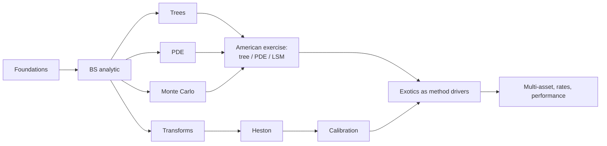

# Curriculum

`qpl` is built by Textbook-Driven Development (TDD): a textbook or literature
result is re-derived independently, turned into an executable pricing case,
cross-checked by an independent method, backed by convergence or statistical
evidence, and only then becomes a package capability. This page is the
truthful map of that process: the loop, the spine, the dependency order, the
evidence rules, the phase plan, and what each slice has actually delivered.

See also `docs/notes/` for short public derivation notes and
`docs/curriculum_provenance.md` for the per-chapter lab -> `src/` -> tests
mapping.

## The TDD loop

1. **Derive**: re-derive the result independently in a private lab notebook
   under `labs/` (gitignored, never published), citing source/page/equation
   for load-bearing formulas.
2. **Case**: turn it into an executable pricing case in `qpl.cases`, paraphrased
   in this repo's own words and data.
3. **Cross-check**: validate against an independent method (closed form,
   another engine, a published table, or an identity that must hold exactly).
4. **Evidence**: back the claim with convergence-order or statistical evidence
   using `qpl.validation`, tagged with an `EvidenceClass`.
5. **Capability**: only then does it become public `src/` surface with tests
   and, where a plot teaches better than an assertion, a notebook.

Labs are the private *drivers*; `src/`, `tests/`, `qpl.cases`, and
`docs/notes/` are the public *cargo*. No human gating on derivations (D6):
the loop above is the check, not a review queue.

## Identity decision

The project's tie-breaker (D1, 2026-09-13): `qpl` is a numerical-methods lab
with textbook provenance. Correctness and measured convergence beat
instrument breadth, API polish, and performance. Recruiting/portfolio
considerations do not reorder the curriculum (D2).

## Literature spine

| Role | Source |
|---|---|
| Heavy spine (cases) | Fusai & Roncoroni (2008), *Quantitative Finance*, Part II |
| Heavy spine (Monte Carlo) | Glasserman (2003), *Monte Carlo Methods in Financial Engineering* |
| Derivation authority | Shreve, *Stochastic Calculus for Finance II* |
| PDE rigor | Pooley, Forsyth & Vetzal papers; Tavella & Randall / Duffy |
| Instrument/concept map only | Hull, *Options, Futures, and Other Derivatives* |
| Volatility and transforms | Gatheral; Heston (1993); Lewis; Lord & Kahl; Carr & Madan |
| Rates (only if rates become serious) | Andersen & Piterbarg |
| Independent oracle (optional, `[oracle]` extra, never sole evidence) | QuantLib-Python (BSD-3) |

## Method dependency graph

Compact list form: foundations -> BS analytic -> {trees, PDE, MC} -> American
exercise (via tree / PDE / LSM) -> {transforms -> Heston -> calibration} ->
exotics as method drivers -> {multi-asset, rates, performance}.

## Evidence classes

Defined in `qpl.validation.EvidenceClass`:

- **exact identity** — a relation that holds exactly in the model (e.g. put-call
  parity); tolerance is floating-point round-off, not model error.
- **closed form** — compared against a closed-form formula evaluated in this
  repository.
- **published benchmark** — compared against a number published in a cited
  source.
- **independent engine** — compared against a different engine or library
  computing the same quantity by a different route.
- **convergence order** — the claim is about the measured rate at which error
  decays under refinement, not about a single price.
- **statistical** — the estimate carries sampling error; the tolerance is a
  stated multiple of the reported standard error.
- **negative finding** — a documented failure mode, pinned by a test so it
  cannot silently change or be mistaken for a bug elsewhere.

A fitted slope is never a theorem; Monte Carlo agreement within noise is
never exact; engine agreement is never evidence that shared assumptions are
realistic.

## Provenance rules

- Cite source/page/equation for load-bearing formulas.
- Derive independently; do not copy book code, prose, tables, or a book's
  example sequence.
- Paraphrase problem statements in this repository's own words.
- Published numbers may be used as fixtures, but only with a citation.

## Phase plan

Candidate slices, re-planned as cases expose problems. Each is phrased as "a
user can X by running Y, correct because Z" where that is already known;
unknowns stay unknown.

### Phase 1 — Discrete time (trees)
- ~~A user will be able to price a European call/put via a CRR binomial tree,
  correct because its measured convergence order to the Black-Scholes closed
  form is order 1, with the odd/even node-count oscillation documented rather
  than hidden.~~ **Delivered in Slice 1** (see below).
- American exercise becomes an instrument property; CRR American call/put
  with dividends is checked by early-exercise premium >= 0 and American >=
  European.
- Leisen-Reimer smoothing is checked by measured order 2.
- Tree Greeks are read from the lattice.
- ~~Forces ADR-0005: an engine registry keyed by `(instrument, model, method)`
  replacing the `isinstance` ladder in `qpl.pricing`.~~ **Delivered in
  Slice 1**; ADR-0005 accepted.

### Phase 2 — PDE rigor
- Rannacher start-up, with Greeks read from the grid at measured order.
- A non-uniform grid concentrated at the strike, as the second standard
  remedy for the strike-kink pathology documented in
  `docs/notes/pde_strike_alignment.md`.
- PSOR for American exercise, cross-checked against the Phase 1 trees.
- A digital (discontinuous-payoff) option, showing the pathology and the
  remedies rather than only the smooth-payoff case.
- `qpl.numerics.linear_systems` used where it earns its place, or a recorded
  reason why not.

### Phase 3 — Monte Carlo (Glasserman)
- Explicit stderr/CI discipline throughout.
- Variance reduction — antithetic variates, a control variate (Kemna-Vorst
  geometric Asian as control for arithmetic Asian), and stratification — each
  checked by a measured variance ratio.
- Euler vs Milstein strong/weak order measured against exact GBM.
- Pathwise and likelihood-ratio Greeks checked against the analytic engine.
- Longstaff-Schwartz American put validated against Longstaff & Schwartz
  (2001) Table 1 and against the Phase 1/2 engines — the first three-way
  cross-method case.
- Barrier monitoring bias checked against the Reiner-Rubinstein closed form.
- QMC only if a case motivates it.

### Phase 4 — Transforms and volatility
- Fourier pricing of Black-Scholes as a sanity check.
- The Heston characteristic function in the branch-cut-safe (Lewis / Lord-Kahl)
  form.
- Lewis and Carr-Madan pricing validated against published reference values
  and, optionally, QuantLib.
- Heston Monte Carlo with the QE scheme and a bias study.
- Implied-vol surface utilities.
- Synthetic-recovery calibration with identifiability diagnostics.
- Fusai & Roncoroni Ch. 15 Laplace approach to arithmetic Asians, reusing
  `qpl.transforms`.

### Phase 5+ — only when forced by a case
- Multi-asset (correlated Brownian motion, baskets via existing copulas).
- Rates (Vasicek/CIR/Hull-White).
- Performance: profiling, vectorized kernels, and a benchmark harness with
  reproducibility metadata (instrument, model, engine, grid/paths, tolerance,
  hardware, seed, wall time, error vs reference) — only after reference paths
  exist to benchmark against.

## Delivered

### Slice 0
- Public branch without `labs/`; extras split into `dev`/`data`/`oracle`
  (`pyproject.toml`).
- `qpl.validation`: `fit_convergence_order` (least-squares slope of
  `log(err)` on `log(h)`), `refinement_errors`, and the `EvidenceClass` /
  `BenchmarkRow` taxonomy above.
- `PDEConfig(strike_alignment="midpoint")`, resolving the strike-on-a-node
  pathology. Measured on `S=K=100, r=5%, q=0, sigma=20%, T=1`, European call,
  Crank-Nicolson, `n_s = n_t = n` for `n` in `{50, 100, 200, 400, 800}`:
  - Aligned: fitted order **1.997**, log-space RMS residual **0.022**.
  - Unaligned: fitted order **1.126**, log-space RMS residual **0.860** (the
    high residual reflects a non-monotone error sequence, not just noise —
    refining `n=50 -> 100` makes the unaligned error five times worse because
    the strike lands exactly on a node at `n=100`).
  - Implicit-Euler temporal order, isolated on a fixed aligned spatial grid
    (`n_s=800`): fitted order **0.997**, residual **3e-04**.
  - Full tables and the derivation: `docs/notes/pde_strike_alignment.md`.
- `qpl.cases.european_black_scholes`: parity, degenerate-limit, closed-form
  reference-value, and comparative-statics cases, each carrying a
  `BenchmarkRow` with an explicit `EvidenceClass`; exercised by a cross-engine
  test (`tests/cases/test_european_black_scholes_cases.py`).

### Slice 1
- `qpl.engines.registry`: the `qpl.pricing` `isinstance` ladder replaced by a
  registry keyed by `(instrument type, model type, method)` plus a per-method
  `MethodSpec` holding the keyword contract (ADR-0005). Public signatures,
  error types and error messages unchanged; pinned by
  `tests/test_engine_registry.py`.
- `qpl.engines.tree`: CRR binomial lattice (`crr_parameters`,
  `crr_spot_level`, `build_recombining_spot_tree`) plus
  `TreeConfig(n_steps=200, scheme="crr")`, `price_european` and
  `greeks_european`, wired into the dispatcher as `method="tree"`. The
  American-put DP engine in `qpl.engines.dp` now consumes the same lattice
  builder; its prices are bit-identical across 45 configurations.
- **Measured** on `S = K = 100, r = 5%, q = 0, sigma = 20%, T = 1`, European
  call (and put, whose signed errors are identical because parity holds on the
  tree to round-off):
  - Odd `n` in `{25, 51, 101, 201, 401, 801}`: fitted order **1.0010**,
    log-space RMS residual **0.0005**; the tree is **above** Black-Scholes at
    every one of them, scaled constant `n·|err|` settling at **1.7529**.
  - Even `n` in `{26, 50, 100, 200, 400, 800}`: fitted order **0.9987**,
    residual **0.0007**; **below** Black-Scholes at every one, constant
    **1.9994**. The two subsequences therefore bracket the true value. At the
    money an even `n` puts a terminal node exactly on the strike; an odd `n`
    puts the strike exactly midway between two nodes.
  - Richardson extrapolation of consecutive odd pairs: fitted order **1.9590**
    (residual 0.0224) — close to 2 but not 2, because the pairs are
    `(n, 2n+1)` and the within-parity second-order coefficient is only
    asymptotically constant. Error at `n₁ = 401` falls from 4.372e-03 to
    5.710e-07.
  - Lattice Greeks: delta/gamma/theta at order **1.004 / 1.002 / 1.001** (odd)
    and **0.999 / 1.010 / 1.010** (even). Vega and rho are bump-and-revalue
    and carry the oscillation.
  - Away from the money the order-1 constant is **erratic**, not two-valued
    (fitted order 1.21-1.48 with log residuals 0.37-1.52 over even `n`);
    QuantLib's binomial engine behaves identically, so this is the scheme and
    not the implementation. Pinned as a negative finding.
  - Full tables and the derivation: `docs/notes/crr_tree_convergence.md`.
- Oracle: the expected 1e-10 agreement with QuantLib's
  `BinomialVanillaEngine<CoxRossRubinstein>` **does not exist**. QuantLib's
  `CoxRossRubinstein` uses the log-space probability
  `1/2 + (r−q−σ²/2)dt/(2σ√dt)` on the same lattice, which differs from the
  forward-matching `p = (e^{(r−q)dt}−d)/(u−d)` at `O(dt^{1.5})` per step and
  `O(1/n)` in price: `n·(qpl − QuantLib)` is constant to better than 1% over
  `n` in `{50, 200, 800}`. A twelve-line reimplementation of QuantLib's
  probability reproduces its engine to 8.3e-11, which identifies the mechanism
  rather than merely observing the gap. Where 1e-10 *is* available: our
  closed form matches `AnalyticEuropeanEngine` to 1.1e-14.
- `qpl.cases`: two `CONVERGENCE_ORDER` rows for the odd/even claims, plus
  `TREE_REFERENCE_N_STEPS = 2000` and `TREE_KNOWN_VALUE_TOLERANCE = 2.5e-3`
  (derived from the measured even-`n` constant: predicted error 1.00e-3,
  measured 9.998e-04). The cross-engine test now prices each known-value row
  four ways: analytic, PDE, Monte Carlo, tree.
- `examples/tree_convergence.py`: deterministic table plus the fitted orders;
  `--plot` for the log-log error picture.

## Reconciled old roadmap

`docs/ROADMAP.md` is superseded by this page. Mapping of the old roadmap
items to their actual status:

| Old roadmap item | Status |
|---|---|
| Implied-volatility solver | Done: `qpl.engines.analytic.black_scholes.implied_volatility`. |
| Implied-vol teaching notebook | Exists as a legacy notebook (`notebooks/02_implied_vol_teaching.ipynb`). |
| Historical vol / market data / implied-vs-realized / return-model fit | Done, but frozen behind the `[data]` extra (D9) — outside this curriculum. |
| `BinaryOption` | Deferred to the Phase 2 discontinuous-payoff PDE/MC slice, where it drives a method rather than being added for its own sake. |
| Antithetic variates | Phase 3, first variance-reduction slice, measured by variance ratio. |
| Benchmark harness | Phase 5, only after reference paths exist to benchmark against. |

## Out of scope for this campaign

- Market-data expansion beyond the frozen `[data]` extra.
- A production trading framework.
- A universal pricing ontology built ahead of the cases that would justify it.
- Performance work before reference paths exist (Phase 5+ only).
- Reordering the curriculum for recruiting/portfolio purposes (D2).
